# 知识图谱

旨在描述客观世界的概念、实体、事件 及其之间的关系，知识图谱把信息表达成更接近人类认知世界的形式，把互联网内容转化成计算机可理解和深度关联的语义。

**核心**：将数据转化成知识，为数据添加语义信息以获得决策支持等智能服务

# 知识图谱落地应用

例如，

* 阿里巴巴借助知识图谱推理技术增强了商品分类、对齐、推荐 以及假货识别等任务以提升商品数据的管理和维护，
* 华为将其应用于故障诊断、 异常检测等任务以快速响应客户需求，
* 字节跳动将该推理技术来辅助“用户意图” 的识别上，从而进一步提高知识库问答、知识搜索的效果；
* 腾讯则利用补全的信 息来提升实体链接和实体推荐的精度；
* 小米公司同样利用这些推理模型的结果提 升了实体链接、实体推荐的效果，从而更好的为小爱同学等一系列产品进行赋能。

知识图谱在金融行业应用广泛。金融数据增速迅猛且包含各行业的数据信息， 这些信息又以文字、表格、图形等形式存储在大量文档中，格式非标准统一且以 碎片化存在，传统风控方法难以满足应用需要。凭借知识图谱强大的统一知识表 示及数据存储的能力，通过构建如企业图谱、专利图谱、产业链图谱等金融领域 知识图谱，实现多源异构数据的知识化整合。

* 文因互联用深度语义分析技术，将 非结构化金融文档转为知识图谱，并基于推理机和知识库管理系统技术，实现大 规模金融知识建模和流程机器人，在上交所、北交所、投行、评级、资管多个场 景成功落地。 知识图谱应用可拓展至传统制造业领域。
* 在汽车行业设备故障维修流程中， 存在高度依赖人工、缺乏辅助工具、排查周期长、故障重复发生等问题，通过解 析汽车故障维修手册、产品手册、维修记录、FMEA 等资料，构建百万级设备故 障图谱，利用自然语言处理、语义检索、事理推理等技术，形成一套汽车生产制 造过程中多个环节的故障辅助诊断系统，系统支持根据故障描述，结合往期案例 分析，自动定位故障位置、故障原因、推理排查措施，可有效提升故障维修效率， 沉淀经验形成企业财富和核心竞争力
* 随着电网信息化、智能化水平的不断提升，电力设备的功能较以往更加复杂， 其日常的运行维护，包括故障诊断，也更加依赖于专门的电力知识。由于缺乏有 效的电力知识提取、组织、管理、展示等技术，运维人员不得不依靠自身经验去 诊断电力设备故障，不仅效率低，准确率也难以保障。
* PlantData 知识资源服务 平台将知识图谱技术应用于电力能源领域，从已有电力技术文献中提取知识并建 知识图谱 平 台 通 用 立知识库，辅助运维人员开展电力设备故障诊断，最终大幅提高其工作效率，保 障电网安全。 
* 在医药大健康行业，需时刻了解国内外行业最新动态、情报和技术等，但行 业存在大量的医学文献、医学论文、医学指南和企业内部的幻灯资料等都没有结 构化，无法实现高效的检索和关联这些非结构化文档，也无法智能的发现一些关 键知识来辅助医学人员做出决策。在产品销售阶段，学术营销、提供学术咨询目 前也都是通过电话、邮件、会议等方式，效率低下，无法满足为患者服务的时效 性。基于柯基数据的行业知识图谱认知智能引擎技术，可快速构建复杂的全科或 者领域内知识图谱，实现医药大健康智能专家虚拟助理，辅助医学人员在医药情 报发现、专家智能推荐、医学信息推广、患者健康管理和疾病用药专业知识咨询 等领域，大幅度提升工作效率和智能化水平，最终实现企业的数字化转型。 
* 美团点评 NLP 中心构建了大规模的餐饮娱乐知识图谱 —— 美团大脑。美团点评作为中国最大的在线本地生活服务平台，覆盖了餐饮娱乐领域的众多生活 场景，连接了数亿用户和数千万商户，积累了宝贵的业务数据，蕴含着丰富的日 常生活的相关知识。在建的美团大脑知识图谱已有数十类概念、数十亿实体和数 百亿三元组。目前，美团大脑已经在搜索、金融等场景中初步验证了知识图谱的 有效性，包括智能搜索、商户赋能以及金融风险管理和反欺诈。

## 阿里

基于

​         阿里巴巴内部知识引擎的最底层是知识构建技术，包括知识获取、知识建模、知识融合、知识表示、工程技术、画像技术等，产生知识网络，例如商品知识图谱、神马知识图谱、客服知识图谱、文娱知识图谱、多语言知识图谱等。这些知识网络与知识服务技术例如逻辑推理技术等相结合，从而成为智能应用的发动机。

​         你与智能音箱进行对话，背后就是基于知识引擎形成的问答系统在发挥作用；你在网上购物，或当你准备生小孩的待产包时，需要买什么，背后也是知识引擎利用百科在辅助推荐；另外，商业智能决策也是基于知识的判断……诸如此类的例子比比皆是。在人工智能可以发挥作用的各种应用场景、各个行业中，知识引擎都是那个关键的技术内核。

## 星环科技

* [星环](https://www.transwarp.cn/subproduct/sophon-kg)

### 交易反欺诈

#### 客户需求

1. 银行帮助商户做收单结算业务期间，发现有些商户存在通过收单系统的二维码进行刷信用卡套利套现的行为
1. 存在部分客户经理为完成业绩考核指标，内外勾结准入存在大量虚假交易的商户

#### 解决方案

* 建立商户交易分析图谱，运用商户群体的聚类、分类模型，基于商户群的行为数据结合业务规则进行分析并挖掘出存在信用卡套利套现行为的商户个体及商户团伙

* 基于商户的知识图谱，通过商户间关联的共同消费者与历史交易数据等业务特征，挖掘出存在异常交易的商户个体及商户团伙

#### 项目成果

* 系统上线后，连续四个月性能稳定

* 系统输出异常名单的Top 50%覆盖到当月上报案例的95%

### 舆情监测

#### 客户需求

○ 新闻中体现的市场情绪一方面影响中短期的估值水平，一方面也反应了市场对公司未来业绩的预判，因而把握舆情对预测整个产业链收益均有重要影响。

○ 利用NLP技术从新闻中抽取的舆情信息无法传导到下游相关的公司实体

#### 解决方案

○ 通过星环提供的Sophon KG+StellarDB解决方案，可以从海量新闻资讯文本中完成实体-关系-事件的智能抽取

○ 以指定事件为中心提取相关舆情信息，配置舆情传播规则并基于图结构完成计算，分析获得舆情的传播结果，结果辅助业务决策输出

#### 项目成果

* 通过交叉验证的模型训练，实现模型精度达0.84，召回率达0.63

* 支持主流的图查询语言openCypher，并融合星环自研舆情传播算法，实现高效的舆情传导可视化分析

### 金融审计分析

#### 客户需求

*  生产上审计涉及的最大转帐表达100多亿行，日增量几百万行，因此需要满足日常海量数据的高并发处理与统一管理
* 审计涵盖数据具备多结构化状态，除需进行非结构化数据与结构化数据的统一管理外，多维数据及其之间关联的查询与分析的效率急需提高
* 审计整体流程上既要满足一般审计人员简单灵活的查询分析需求，又要满足高级审计人员的复杂搜索和算法分析需求

解决方案

* 基于底层的分布式图数据库StellarDB，运用Sophon KG完成审计场景中图谱模式定义、知识抽取、知识融合、知识存储与检索及知识推理

#### 项目成果

* 高性能：实现百亿级边数据的快速图查询与图分析

* 高并发：完成支持两百业务人员的日常查询应用，毫秒级快速响应

* 高协作：实现不同用户角色分别使用交互式查询与openCypher语句查询实现协作高效率分析

## 美团

* [技术文章](https://tech.meituan.com/2021/11/03/knowledge-based-question-answering-in-meituan.html)

### 智能问答

* XX景点什么时候开门
* 染发要多久
* 故宫能带水和食物吗

## 顺丰

知识图谱将原本没有联系的数据连通，将离散的数据整合在一起，从而提供更有价值的决策支持。

在理想的情况下，知识变得互联互通，计算机在处理数据时更像是模仿人类的认知，通过类比、联系理解这个世界

基于知识图谱的交互探索式分析，可以模拟人的思考过程去发现、求证、推理，业务人员自己就可以完成全部过程，不需要专业人员的协助。

知识融合，发现不同来源、不同形式的知识之间的联系本身就是很有价值的研究课题，对于知识去重、治理也有重大意义

知识存储密度大，以三元组形式存放的知识能克服数据稀疏问题

### 智能客服

1. 问题解析
2. 实体发现
3. 知识图谱中相关知识的整理、组织、与反馈
4. 智能回答与推荐，与答案有关的知识以推荐的形式反馈

# 研究内容和关键科学问题

随着知识图谱研究的深入，研究人员发现知识图谱在各种应用中存在以下质 量问题： 

​          第一个问题是知识图谱的不完备性，即知识图谱中的关系缺失或者属性缺失， 例如人物的职业信息缺失。这个问题可能是因为构建知识图谱的数据本身就是不完备的，也可能是信息抽取算法无法识别到一些关系或者抽取到属性值。

​         第二个问题是知识图谱中存在错误的关系，如人物知识图谱中可能包含错误 的人物关系。这个问题可能是因为构建知识图谱的数据有错误，也可能是因为知 识图谱构建时采用了统计方法，而统计方法很难保证学习的知识是绝对正确的。

​     知识图谱之所以被认为是实现人工智能的一个重要研究方向，是因为知识图谱上的推理使之能够支撑人工智能的很多应用，而这也是知识图谱区别于传统关系数据模型的关键所在。

* 知识图谱的表示
* 基于符号的并行知识推理
* 实体关系学习方法
* 模式归纳方法

##  实体关系学习方法

### 基于表示学习

​    知识图谱表示学习旨在于将知识图谱中的实体与关系统一映射至低维连续 向量空间，以刻画它们的潜在语义特征。

模型

* TransE
* RESCAL  双线性匹配
* 。。。

### 基于图特征

基于图特征的方法借助从知识图谱中抽取出的图特征来预测两个实体间可 能存在的不同类型的边（关系）。

随着预训练+微调这一技术路线的流行，将多种模态的信息纳入知识推理的考虑范围是否比单纯考虑三元组的嵌入效果更好

**传统推理**

h + r ≈ t

考虑多种模态数据

h1 + h2 + h2 + r1 + r2 ≈ t1 + t2

1 2 3指各种模态的数据

包括 

* 三元组
* 图片
* 图文对
* 文本（嵌入）

# 知识图谱嵌入

## 损失函数

### pair-wise

如果正例三元组的打分小于负例三元组打分，给一个惩罚

## 生成负例

# 超参数

【1】超参数的“学院派”定义： 

> 在机器学习的过程中，
> 超参= 在开始机器学习之前，就人为设置好的参数。
> 模型参数=通过训练得到的参数数据。
> 通常情况下，需要对超参数进行优化，给学习机选择一组最优超参数，以提高学习的性能和效果

【2】怎么决定超参数？

> 1. 定义关于模型的更高层次的概念，如复杂性或学习能力。
> 2. 能直接从[标准模型](https://www.zhihu.com/search?q=标准模型&search_source=Entity&hybrid_search_source=Entity&hybrid_search_extra={"sourceType"%3A"article"%2C"sourceId"%3A"78137628"})培训过程中的数据中学习，需要预先定义。、
> 3. 可以通过设置不同的值，训练不同的模型和选择更好的测试值来决定

【3】超参数的“通俗”定义：

> 超参数也是一种参数，它具有参数的特性，比如未知，也就是它不是一个已知常量。
> 是一种手工可配置的设置，需要为它根据已有或现有的经验，指定“正确”的值，也就是人为为它设定一个值，它不是通过系统学习得到的。

【4】超参数的一些示例：

> 1. 聚类中类的个数
> 2. 话题模型中话题的数量
> 3. 模型的学习率
> 4. [深层神经网络](https://www.zhihu.com/search?q=深层神经网络&search_source=Entity&hybrid_search_source=Entity&hybrid_search_extra={"sourceType"%3A"article"%2C"sourceId"%3A"78137628"})隐藏层数  
> 5. 树的数量或树的深度
> 6. 矩阵分解中潜在因素的数量
> 7. k[均值聚类](https://www.zhihu.com/search?q=均值聚类&search_source=Entity&hybrid_search_source=Entity&hybrid_search_extra={"sourceType"%3A"article"%2C"sourceId"%3A"78137628"})中的簇数

# 时空知识图谱文章   2021-12-28

## Context-Aware Temporal Knowledge Graph Embedding

### 背景   

   现有的方法将相关事实视为时不变的，忽略了相应的有效时段。实际上，许多关系是随着时间的推移而变化和涉及的，也就是说，它们只在一定的时间内有效。例如，关系实例  **配偶(“布拉德皮特”，“安吉丽娜朱莉”)**仅在时间间隔“[2014,2016]”内成立。

### 模型

​     在这项工作中，我们提出了一个时间感知的KGE模型，该模型可以衡量一个事实的两个方面:事实的可信性和时间的一致性。我们的主要思想

### 定义四元组

（h,r,t, τ）

其中τ = （τs,τe） 比如（2003,2006）

### 评估方法

遮罩法打乱四元组，

### 实验

数据集

**YAGO11k and Wikidata12k**

### baseline

* TransE
* HoIE
* ComplEx
* pRotatE 
* t-TransE
* HyTE

 后两个是时间知识图谱嵌入模型

## HyTE: Hyperplane-based Temporally aware Knowledge Graph Embedding

# 结构描述文章2021-2-11

## Representation Learning of Knowledge Graphs with Entity  Descriptions

### 摘要

针对问题：事实上，在大多数知识图中，通常存在对实体的简明描述，这是现有方法无法很好地利用的。在本文中，我们提出了一种新的基于实体描述的知识图RL方法。

* 提出两种编码器：连续词袋和CNN用来编码实体描述
* 在知识补全和实体分类两个任务上评估模型
* 可以处理零样本问题，即可以根据实体描述表示知识图谱中没有出现过的实体

### 介绍

写一些问题背景，即随着知识图谱规模的不断增大，由于计算效率和数据稀疏的限制，以往的知识图谱应用方法不再可行，因此提出了知识图谱表示学习。

### 相关工作

* 基于翻译的模型
* 考虑文本信息的模型-----NTN，

### 问题公式化

### 定义一：基于结构的表示

使用TransE模型得到hs和ts

### 定义二：基于描述的表示

根据头实体和尾实体的描述得到hd和td

### 方法

为了利用事实三元组和实体描述，并能够处理零样本场景，提出两种实体表示

基于结构的表示捕获三元组信息，基于描述的的表示捕获实体描述的信息。

将两种表示学习到同一连续向量空间，能量函数定义为

E=ES+ED （2）

其中

 ED= EDD+EDS+ESD  （3）

EDD=|hd+r-td|

EDS=|hd+r-ts|

ESD=|hd+r-td|

能量函数将两种类型的实体表示投射到同一个向量空间中，四种能量函数共享关系表示，从而使两种类型的表示相互促进。

本文提出了两种编码器构建基于描述的表示

### 连续词袋模型

​       从每个简短的描述中，我们可以生成一组关键字，这些关键字通常能够捕捉实体的主要思想。我们假设相似的实体应该有相似的描述，相应的有相似的关键字。那些不能通过结构信息直接检测到的关系，可以在关键词的内部联系中找到

​    首先利用TF—IDF等方法给实体描述中的词语排序，选取前n个词语作为编码器输入

**ed = x1+x2+......+xk,**（4）

### CNN编码器

### 总体框架

### 预处理和词表示

使用Word2Vec作为卷积层的输入

### 训练

参数集设置为θ=（X，W1，W2，E，R）

X，E，R分别是词向量，实体、关系嵌入

W1,W2是不同层的卷积核

### 初始化

W1，W2随机初始化

### 优化

随机梯度下降

### 实验

### 数据集

* FB15K，
* 针对零样本，自建立FB20K

# How Does Knowledge Graph Embedding Extrapolate to Unseen Data: a Semantic Evidence View 
### 摘要

现有的工作主要关注如何构建更精妙的三元组建模函数，这只能得到已观察到的三元组的概率，难以解释为什么能泛化到未知数据，也无法得出哪些是帮助KGE推理的重要因素。

因此，这篇工作有关KGE推理的两个问题

1.   KGE如何推理未知数据
2. 如何设计具有更强推理能力的KGE

### introduction

对于问题1，从（h,r,?） 到t的匹配必须获得一些语义相似度，本文从三种级别进行关联

1. **关系级别**   r和t的关系
2. **实体级别**：h和t的关系
3. **三元组级别**：（h,r,?）和t的关系

将这三种因素命名为Se-mantic Evidence (SE)，并分别使用三种相关矩阵来量化这三个因素

| 关系级别               | 实体级别         | 三元组级别           |
| ---------------------- | ---------------- | -------------------- |
| 训练集中r和t的共现次数 | 从h到t的路径连接 | （h,r,?）和t的相似度 |

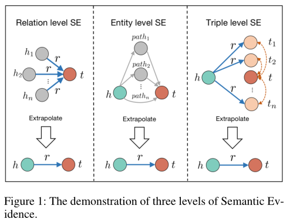

对于问题2,提出了一种新的基于KGE的图神经网络，叫做SemanticEvidence awareGraph NeuralNetwork (SE-GNN)

总的来说，本文贡献如下

* 率先探索KGE外推问题
* 提出一种新的基于GNN的KGE方法
* 在FB15k-237 和WN18RR上的拓展试验验证了模型

### ralated work

#### KGE 

分为三种模型

* 基于平移距离的模型
* 基于语义匹配的模型DistMult  ComplEx   ConvE   InteractE  
* 基于GNN的模型R-GCN  CompGCN 

#### 外推能力研究

### 3 Knowledge Graph Embedding Extrapolation
#### 3.1 Problem Definition

#### 3.2 Extrapolate with Semantic Evidences

* 关系级别

如果r 和t频繁的共同出现在三元组中，证明r可能包含预测t所需的信息，根据直觉，这可能是一种实体类型信息，比如（hi,born_in）很可能是要预测一个地名类型的实体而非电影

* 实体级别

  h和t的相关程度：如果有从h到t的间接路径，证明两者的语义信息相近。如（h,is mother,e） 和（e,is father,t)可以为预测（h,grandmother of,t）提供一些置信度

* 三元组级别

如果已知（卡梅隆，职业，导演）（卡梅隆，职业，编剧）不难推断出（卡梅隆，职业，制片人）

#### 3.3 Experiment Verification

提出三种相关矩阵去验证每个SE的证据强度

* Srel对应关系级别，它是训练集中满足（hi,r,t）的三元组个数
* Sent对应实体级别，从h到t的路径个数，限制路径长度小于等于2
* Stri对应三元组级别，量化查询（h,r）与实体h'的相似度

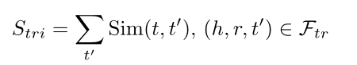

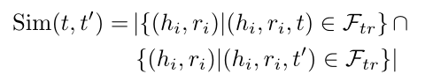

### 4 Semantic Evidence aware GNN

为了更好的利用外推知识表示中的语义证据信息，提出了一种SE-GNN模型

#### 4.1 Modeling SEs with Neighbor Pattern

1. 通过聚合所有相连的关系，得到关系级别SE表示，实体ei的表示为

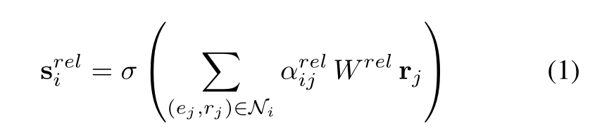

Wrel表示线性变换矩阵，rj为与ei连接的关系表示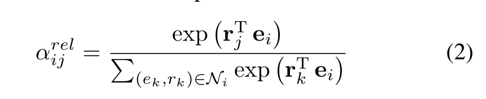

2. 对于实体级别的SE，实体ei的表示为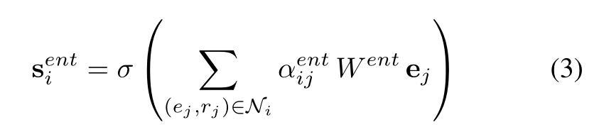

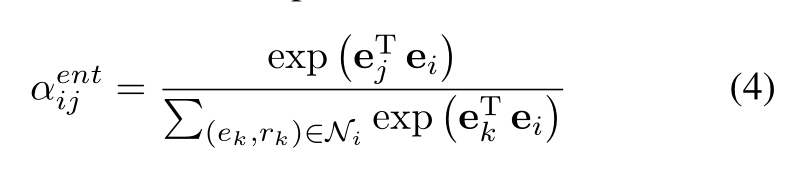

3. 对于三元组级别的SE，实体ei的表示为
4. 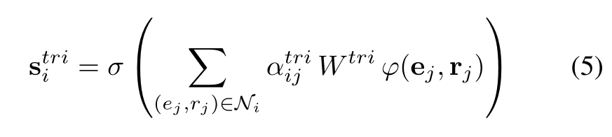

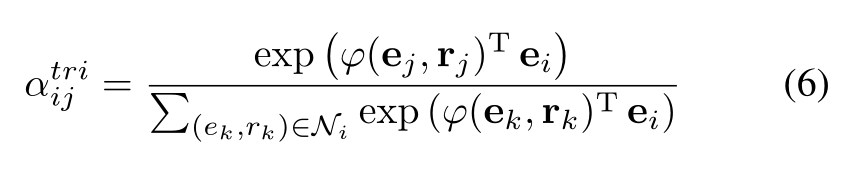

#### 4.2 Model Architecture

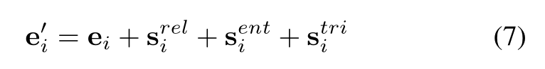

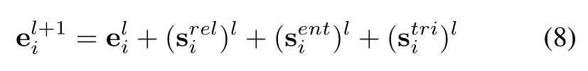

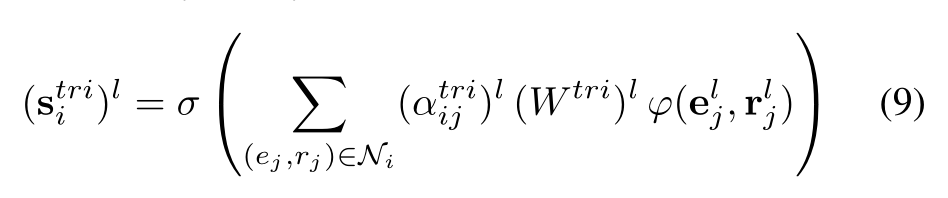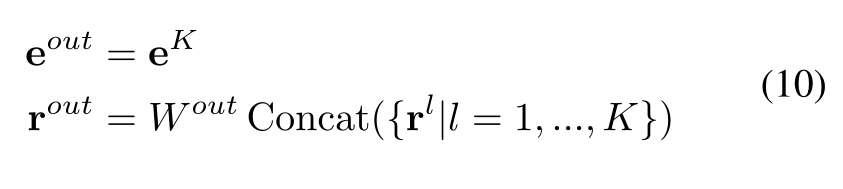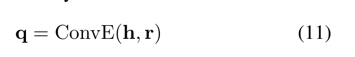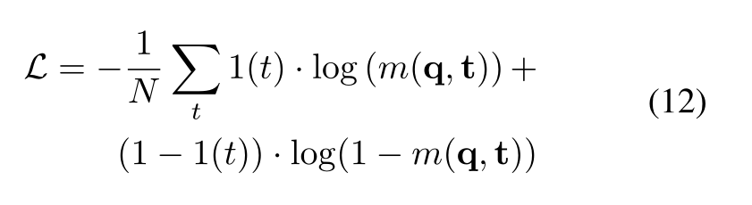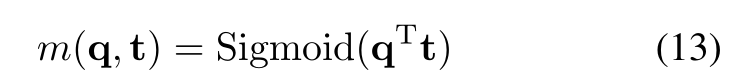

### 5 Experiments

数据集

* FB15k-237
* WN18RR

评估矩阵

* MR
* MRR
* hit@1/3/10

实验结果

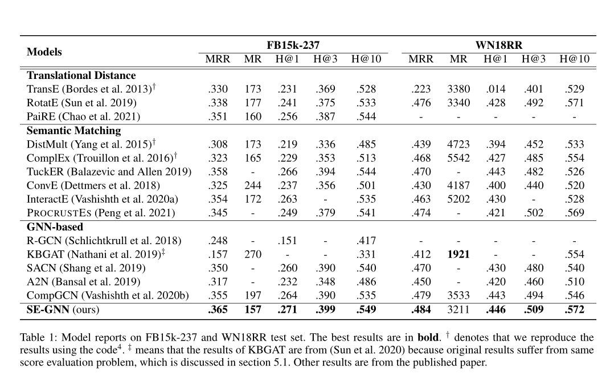

# Improving Knowledge Graph Embedding Using Simple Constraints

## 1. introduction

研究通过添加非常简单的约束来改善知识图谱嵌入任务。主要关注两种约束

1. 实体表示的非负约束   ----对应知识图的紧凑表示----稀疏性和可解释性的诱因
2. 关系表示的近似蕴含约束     将关系之间的逻辑蕴涵转化为他们的分布式表示

此工作与一些逻辑嵌入相似，但那些工作大多数需要一阶逻辑规则。这一过程可能在时间和空间上效率低下

与先前工作主要的不同包括

1. 直接在实体和关系上施加约束，无需grounding,并且容易应用到大规模知识图上
2. 约束，即从统计特性自动导出的非负性和近似蕴涵，是非常普遍的，不需要人工操作，几乎适用于所有KG；
3. 它学习每个实体的单独表示，并能成功地在未配对的实体之间进行预测。

## 3. Our Approach

### 3.2 Non-negativity of Entity Representations

**在ComplEX的基础上添加约束**

ComplEX和大多数先前的方法对于特征值的范围没有约束，这意味着有用没用的属性都会被编码进实体的表示，可是找出实体或概念所有的负面属性在经济上是不可行的

以毛为例，正面属性包括

* 哺乳动物
* 吃鱼
* 四条腿
* 。。。

但负面属性很难完全总结

* 没有四个轮子
* 不是汽车
* 不能用来通信
* 。。。

基于此，本文提出

`0<=Re(e),Im(e)<=1.` 

Re(e),Im(e)分别表示实体e真实的和虚拟的嵌入

**0**和**１**是ｄ维向量，意思是把嵌入表示约束在０－１之间

###  3.3 Approximate Entailment for Relations

# EDGE: Enriching Knowledge Graph Embeddings with External Text

（使用外部文本丰富知识图谱嵌入）

引入外部文本构建一个知识图谱超图（即知识图谱是其子图）----增强知识图谱，学习超图中的实体嵌入，将此嵌入与原图谱中的实体嵌入对齐，用来做链路预测以及实体分类任务

## 增强知识图谱构建

​     	增强是指向知识图谱中添加新实体的过程，新添加的实体叫做文本实体或文本节点。这些新的实体有一个重要的属性-----它们包含原知识图谱中的实体。这些实体的存在建立给出两个图之间的关系，并且这种关系将被用来学习共享图嵌入。

​        为了构建这个增强图，需要搜集一些关键字来查询对应的文本。具体过程：

1. 找到一批具有相似语义和结构的实体集εe,这一集合用来从WordNet或Wikipedia中查找外部文本S （使用API wikipedia）
2. 从S中提取实体并连接到εe,通过发现新实体连接到旧实体，加强了KG并产生了增强知识图谱

**问题**：由于一段文本中可能出现不同实体，故没有连接的文本实体距离也会很小，这会产生一些噪声，稍后的对齐一步可以处理这一问题

## 联合嵌入空间中的知识图对齐

​       在扩充知识图aKG的帮助下，我们的目标是丰富知识图的嵌入。然而，不可避免的是，一部分新添加的实体是嘈杂的，甚至可能是错误的。为了缓解这个问题，受到了Hinton等人的启发。

​         特别地，我们提出利用图自动编码器提取两个知识图的低维节点嵌入

## 实验设置

通过实验需要回答的三个问题

* 模型与链路预测当前最佳模型性能差距
* 生成的嵌入与类似方法比较如何
* 增强和对齐各自对模型整体性能的影响

### 任务1 链路预测

### 任务2 节点分类

### 任务3 嵌入效果

# 

