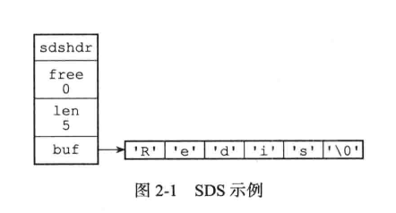

# Redis设计与实现

## 2.简单动态字符串

Redis构建了一种名为简单动态字符串（Simple Dynamic String ,SDS）的抽象类型，并将SDS作为默认字符串表示

### 2.1 定义

```c
struct sdshdr{
    int len; //记录buf数组已使用的长度,忽略空字符
    int free;// 记录buf未使用的字节数
    char buf[];//保存字符串
}
```




### 2.2 与c字符串的区别

#### 2.2.1. 常数复杂度获取字符长度

根据len获取字符串长度   o(1)

c字符串需要遍历字符数组 o(n)

#### 2.2.2 杜绝缓存区溢出

c语言字符串在修改时不会判断数组长度

SDS先计算数组剩余空间是否够用，不够则另外分配一段，保证不会溢出

#### 2.2.3 减少修改字符带来的内存重分配次数

程序的局部性原理

SDS在重新分配空间时会预留一段多余空间

1. SDS的长度小于1MB时，预留一个与len相同的空间
2. 大于 1MB时预留预留1MB

惰性空间释放

### 重点

比起C语言字符串，SDS优点

* 常数复杂度获取字符串长度
* 杜绝缓存区溢出
* 减少修改字符串长度时带来的内存重分配次数
* 二进制安全
* 兼容部分C语言字符串函数

## 3.链表

## zset的两种实现方式

**ziplist**：满足以下两个条件的时候

1. 元素数量少于128的时候
2. 每个元素的长度小于64字节

**skiplist**：不满足上述两个条件就会使用跳表，具体来说是组合了map和skiplist

map用来存储member到score的映射，这样就可以在O(1)时间内找到member对应的分数
skiplist按从小到大的顺序存储分数
skiplist每个元素的值都是[score,value]对


# Redis面试题

* 帅地玩编程

## 1. 谈下你对Redis的了解

Redis(全程：remote dictionary server，远程字典服务)是一个开源的使用ANSIC语言编写，支持网络、基于内存亦可持久化的日志型、key-value数据库，并提供多种语言的API

## 2. Redis数据结构、使用场景

适合的场景

| 基本数据类型 | 常用操作 | 应用场景                                            |
| ------------ | -------- | --------------------------------------------------- |
| String       | set、get | 缓存功能、计数器、统计多单位的数量、共享用户session |
| List（列表） |          | 消息队列、文章列表或者数据分页                      |
| Set（集合）  |          | 标签、共同好友、独立网站ip                          |
|              |          |                                                     |
|              |          |                                                     |

### String

```
1.String类型是redis的最基础的数据结构，也是最经常使用到的类型。  而且其他的四种类型多多少少都是在字符串类型的基础上构建的，所以String类型是redis的基础。
2.String 类型的值最大能存储 512MB，这里的String类型可以是简单字符串、  复杂的xml/json的字符串、二进制图像或者音频的字符串、以及可以是数字的字符串
```

1. 缓存功能：String字符串是最常用的数据类型，不仅仅是redis，各个语言都是最基本类型，因此，利用redis作为缓存，配合其它数据库作为存储层，利用redis支持高并发的特点，可以大大加快系统的读写速度、以及降低后端数据库的压力。

* 例如：热点数据缓存（例如报表、明星出轨），对象缓存、全页缓存、可以提升热点数据的访问数据

* String字符串是最常用的数据类型，不仅仅是redis，各个语言都是最基本类型，因此，利用redis作为缓存，配合其它数据库作为存储层，利用redis支持高并发的特点，可以大大加快系统的读写速度、以及降低后端数据库的压力。

2. 计数器：许多系统都会使用redis作为系统的实时计数器，可以快速实现计数和查询的功能。而且最终的数据结果可以按照特定的时间落地到数据库或者其它存储介质当中进行永久保存。

int类型  ，incr方法

*  例如：文章的阅读量、微博点赞数、允许一定的延迟，先写入Redis再同步到数据库

*  许多系统都会使用redis作为系统的实时计数器，可以快速实现计数和查询的功能。而且最终的数据结果可以按照特定的时间落地到数据库或者其它存储介质当中进行永久保存。

3、统计多单位的数量：eg，uid：gongming  count：0  根据不同的uid更新count数量。

4、共享用户session：用户重新刷新一次界面，可能需要访问一下数据进行重新登录，或者访问页面缓存cookie，这两种方式做有一定弊端，1）每次都重新登录效率低下 2）cookie保存在客户端，有安全隐患。这时可以利用redis将用户的session集中管理，在这种模式只需要保证redis的高可用，每次用户session的更新和获取都可以快速完成。大大提高效率。

5、数据共享分布式

String 类型，因为 Redis 是分布式的独立服务，可以在多个应用之间共享

例如：分布式Session

```xml
<dependency> 
 <groupId>org.springframework.session</groupId> 
 <artifactId>spring-session-data-redis</artifactId> 
</dependency>
```

6.分布式锁

String类型setnx方法，只有不存在是才能添加成功，返回true

```java
public static boolean getLock(String key) {
    Long flag = jedis.setnx(key, "1");
    if (flag == 1) {
        jedis.expire(key, 10);
    }
    return flag == 1;
}

public static void releaseLock(String key) {
    jedis.del(key);
}
```


### hash（哈希）

```
  Redis hash数据结构 是一个键值对（key-value）集合,它是一个 string 类型的 field 和 value 的映射表，redis本身就是一个key-value型数据库，因此hash数据结构相当于在value中又套了一层key-value型数据。所以redis中hash数据结构特别适合存储关系型对象
```

#### **应用场景**

1、由于hash数据类型的key-value的特性，用来存储关系型数据库中表记录，是redis中哈希类型最常用的场景。一条记录作为一个key-value，把每列属性值对应成field-value存储在哈希表当中，然后通过key值来区分表当中的主键。

2、经常被用来存储用户相关信息。优化用户信息的获取，不需要重复从数据库当中读取，提高系统性能。

### List

```
1. list类型是用来存储多个有序的字符串的，列表当中的每一个字符看做一个元素
2. 一个列表当中可以存储有一个或者多个元素，redis的list支持存储2^32次方-1个元素。
3. redis可以从列表的两端进行插入（pubsh）和弹出（pop）元素，支持读取指定范围的元素集，  或者读取指定下标的元素等操作。redis列表是一种比较灵活的链表数据结构，它可以充当队列或者栈的角色。
4. redis列表是链表型的数据结构，所以它的元素是有序的，而且列表内的元素是可以重复的。  意味着它可以根据链表的下标获取指定的元素和某个范围内的元素集。
```

#### 应用场景

1、消息队列：reids的链表结构，可以轻松实现阻塞队列，可以使用左进右出的命令组成来完成队列的设计。比如：数据的生产者可以通过Lpush命令从左边插入数据，多个数据消费者，可以使用BRpop命令阻塞的“抢”列表尾部的数据。

List提供了两个阻塞的弹出操作:blpop/brpop,可以设置超时时间

* blpop

```shell
blpop key1 timeout# 移除并获取列表的第一个元素，如果列表没有元素会阻塞列表直到等待超时会发现可弹出元素为止
```

* brpop

```shell
brpop key timeout # 移除并获取列表的最后一个元素
```

上面的操作实际上就是java的阻塞队列。

2、文章列表或者数据分页展示的应用。比如，我们常用的博客网站的文章列表，当用户量越来越多时，而且每一个用户都有自己的文章列表，而且当文章多时，都需要分页展示，这时可以考虑使用redis的列表，列表不但有序同时还支持按照范围内获取元素，可以完美解决分页查询功能。大大提高查询效率。

#### 常见操作

##### 插入

```
lpush 
```

##### 列表长度

```
LLen
```

##### 批量查询

```
lrange listname start end 
```

### Set（集合）

```
1.redis集合（set）类型和list列表类型类似，都可以用来存储多个字符串元素的集合。2.但是和list不同的是set集合当中不允许重复的元素。而且set集合当中元素是没有顺序的，不存在元素下标。3.redis的set类型是使用哈希表构造的，因此复杂度是O(1)，它支持集合内的增删改查，  并且支持多个集合间的交集、并集、差集操作。可以利用这些集合操作，解决程序开发过程当中很多数据集合间的问题。
```

#### 应用场景

1、标签：比如我们博客网站常常使用到的兴趣标签，把一个个有着相同爱好，关注类似内容的用户利用一个标签把他们进行归并。

2、共同好友功能，共同喜好，或者可以引申到二度好友之类的扩展应用。

3、统计网站的独立IP。利用set集合当中元素不唯一性，可以快速实时统计访问网站的独立IP。

#### 常见操作

##### 插入

```redis
sadd setname setvalue
```

##### 删除集合

```redis
del setname
```

##### 返回集合所有元素

```
smembers setname
```

##### 删除指定元素

```redis
srem setname itemname
```

##### 集合成员数

```redis
scard setname
```


###  Sorted Set（有序集合）

```
redis有序集合也是集合类型的一部分，所以它保留了集合中元素不能重复的特性，
但是不同的是，有序集合给每个元素多设置了一个分数，利用该分数作为排序的依据。
```

#### **应用场景**

1、 排行榜：有序集合经典使用场景。例如视频网站需要对用户上传的视频做排行榜，榜单维护可能是多方面：按照时间、按照播放量、按照获得的赞数等。

id 为6001 的新闻点击数加1：

```
zincrby hotNews:20190926 1 n6001
```

获取今天点击最多的15条：

```
zrevrange hotNews:20190926 0 15 withscores
```

2、用Sorted Sets来做带权重的队列，比如普通消息的score为1，重要消息的score为2，然后工作线程可以选择按score的倒序来获取工作任务。让重要的任务优先执行。


### geospatial（地理位置）

```
1.geospatial将指定的地理空间位置（纬度、经度、名称）添加到指定的key中。  这些数据将会存储到sorted set这样的目的是为了方便使用GEORADIUS或者GEORADIUSBYMEMBER命令对数据进行半径查询等操作。2.sorted set使用一种称为Geohash的技术进行填充。经度和纬度的位是交错的，以形成一个独特的52位整数。  sorted set的double score可以代表一个52位的整数，而不会失去精度。（有兴趣的同学可以学习一下Geohash技术，使用二分法构建唯一的二进制串）3.有效的经度是-180度到180度  有效的纬度是-85.05112878度到85.05112878度
```

#### **应用场景**

1. 查看附近的人
2. 微信位置共享
3. 地图上直线距离的展示

### Hyperloglog（基数）

什么是基数？ 不重复的元素

```
hyperloglog 是用来做基数统计的，其优点是：输入的提及无论多么大，hyperloglog使用的空间总是固定的12KB ，利用12KB，它可以计算2^64个不同元素的基数！非常节省空间！但缺点是估算的值，可能存在误差
```

#### **应用场景**

1. 网页统计UV （浏览用户数量，同一天同一个ip多次访问算一次访问，目的是计数，而不是保存用户）

传统的方式，set保存用户的id，可以统计set中元素数量作为标准判断。

但如果这种方式保存大量用户id，会占用大量内存，我们的目的是为了计数，而不是去保存id。

### Bitmaps（位存储）

```
Redis提供的Bitmaps这个“数据结构”可以实现对位的操作。Bitmaps本身不是一种数据结构，实际上就是字符串，但是它可以对字符串的位进行操作。可以把Bitmaps想象成一个以位为单位数组，数组中的每个单元只能存0或者1，数组的下标在bitmaps中叫做偏移量。单个bitmaps的最大长度是512MB，即2^32个比特位。
```

#### **应用场景**

两种状态的统计都可以使用bitmaps，例如：统计用户活跃与非活跃数量、登录与非登录、上班打卡等等。

### 其他场景

位统计

String类型的bitcount

字符是以8位二进制存储的

```bash
set k1 a
setbit k1 6 1
setbit k1 7 0
get k1 
/* 6 7 代表的a的二进制位的修改
a 对应的ASCII码是97，转换为二进制数据是01100001
b 对应的ASCII码是98，转换为二进制数据是01100010

因为bit非常节省空间（1 MB=8388608 bit），可以用来做大数据量的统计。
*/
```

例如：在线用户统计，留存用户统计

```bash
setbit onlineusers 01 
setbit onlineusers 11 
setbit onlineusers 20
```

支持按位与、按位或等等操作

```bash
BITOPANDdestkeykey[key...] ，对一个或多个 key 求逻辑并，并将结果保存到 destkey 。       
BITOPORdestkeykey[key...] ，对一个或多个 key 求逻辑或，并将结果保存到 destkey 。 
BITOPXORdestkeykey[key...] ，对一个或多个 key 求逻辑异或，并将结果保存到 destkey 。 
BITOPNOTdestkeykey ，对给定 key 求逻辑非，并将结果保存到 destkey 。
```

计算出7天都在线的用户

```bash
BITOP "AND" "7_days_both_online_users" "day_1_online_users" "day_2_online_users" ...  "day_7_online_users"
```

eg，uid：gongming  count：0  根据不同的uid更新count数量。

#### 购物车

String或hash,所有String可以做的hash都可以做

#### 用户消息时间线timeline

list 双向链表，直接作为timeline就好，插入有序

#### 抽奖

自带一个随机获得值

```
spop myset
```

#### 点赞 签到 打卡

假如上面的微博ID是t1001，用户ID是u3001

* 用 like:t1001 来维护 t1001 这条微博的所有点赞用户
* 点赞了这条微博：```sadd like:t1001 u3001```
* 取消点赞：```srem like:t1001 u3001```

- 是否点赞：```sismember like:t1001 u3001```
- 点赞的所有用户：```smembers like:t1001```
- 点赞数：```scard like:t1001```

是不是比数据库简单多了。

#### 商品标签

老规矩，用 tags:i5001 来维护商品所有的标签。

- ```sadd tags:i5001``` 画面清晰细腻
- ```sadd tags:i5001``` 真彩清晰显示屏
- ```sadd tags:i5001``` 流程至极

#### 商品筛选

```
// 获取差集
sdiff set1 set2
// 获取交集（intersection ）
sinter set1 set2
// 获取并集
sunion set1 set2
```

假如：iPhone11 上市了

```
sadd brand:apple iPhone11

sadd brand:ios iPhone11

sad screensize:6.0-6.24 iPhone11

sad screentype:lcd iPhone 11
```

赛选商品，苹果的、ios的、屏幕在6.0-6.24之间的，屏幕材质是LCD屏幕

```
sinter brand:apple brand:ios screensize:6.0-6.24 screentype:lcd
```


### 不适合的场景

* 数据访问频率低
* 数据量大

## 3. 常见功能

1. 数据缓存功能
2. 分布式锁的功能
3. 支持数据持久化
4. 支持事务
5. 支持消息队列
5. 发布与订阅


## 5. Redis为什么这么快

1. 完全基于内存，绝大部分请求是存粹的内存操作，非常快速
2. 数据结构简单，对数据操作也简单
3. 采用单线程，避免了不必要的上下文切换和竞争条件，也不存在多进程或者多线程切换导致的CPU消耗，不用考虑各种锁的问题，不存在加锁放锁操作，没有因为可能出现死锁而导致的性能消耗
4. 使用多路I/o复用模型，非阻塞IO

## 6. 什么是缓存穿透，怎么解决

缓存穿透是指查询一个一定不存在的数据，由于缓存是不命中时需要从数据库查询，查不到数据则不写入缓存，这将导致这个不存在的数据每次请求都要到数据库去查询，造成缓存穿透

### 解决办法

1. 缓存空对象：如果一个查询返回的数据为空（不管是数据不存在，还是系统故障），我们仍然把这个空结果进行缓存，但它的过期时间会很短，最长不超过五分钟

### 缓存空对象带来的问题
1. 空值做了缓存，意味着缓存中存了更多的键，需要更多的内存空间，比较有效的方法是针对这类数据设置一个较短的过期时间，让其自动剔除
2. 缓存和存储的数据会有一段时间窗口的不一致，可能会对业务有一定影响。例如：过期时间设置为5分钟，如果此时存储添加了这个数据，那此段时间就会出现缓存和存储数据的不一致，此时可以利用消息系统或其他方式清除掉缓存层中的空对象
3. 布隆过滤器：将所有可能存在的数据哈希到一个足够大的bitmap中，一个一定不存在的数据会被这个bitmap拦截掉，从而避免了对底层存储系统的查询压力。

## 7.什么是缓存雪崩，该如何解决

如果缓存集中在一段时间内失效，发生大量的缓存穿透，所有的查询都落在数据库上，造成了缓存雪崩

### 解决办法

1. 加锁排队：在缓存失效后，通过加锁或者队列来控制读数据写缓存的线程数量。比如对某个key只允许一个线程查询数据和写缓存，其他线程等待
2. 数据加热：可以通过缓存reload机制，预先去更新缓存，在即将发生大并发访问前手动触发加载缓存不同的key，设置不同的过期时间，让缓存失效的时间点尽量均匀
3. 做二级缓存，或者双缓存策略：cache1为原始缓存，cache2为拷贝缓存，cache1失效时，可以访问cache2，cache1缓存失效时间设置为短期，cache2设置为长期
4. 在缓存的时候给过期时间加上一个随机值，这样就会大幅度的减少缓存在同一时间过期

##  8. 怎么保证缓存和数据库数据的一致性

1. 从理论上说，只要设置了合理的键的过期时间就能保证一致。因为只要缓存数据过期了就会被删除。随后读的时候，因为缓存里没有，就可以查数据库的数据，然后将数据库查出来的数据写入缓存中。除了设置过期时间，我们还需要做更多的措施来避免数据库与缓存处于不一致的情况发生
2. 新增、更改、删除数据库操作时同步更新Redis，
2. 可以使用事务机制来保证数据的一致性

## 9. Redis持久化有几种方式

Redis是一种内存型数据库，一旦服务器进程退出，数据库的数据就会丢失，为了解决这个问题Redis供了两种持久化的方案，将内存中的数据保存到磁盘中，避免数据的丢失

两种持久化方式：快照（RDB文件）和追加式文件（AOF文件），下面分别为大家介绍两种方式的原理。

- RDB持久化方式会在一个特定的间隔保存那个时间点的数据快照。

- AOF持久化方式则会记录每一个服务器收到的写操作。在服务启动时，这些记录的操作会逐条执行从而重建出原来的数据。写操作命令记录的格式跟Redis协议一致，以追加的方式进行保存。

- Redis的持久化是可以禁用的，就是说你可以让数据的生命周期只存在于服务器的运行时间里。

- 两种方式的持久化是可以同时存在的，但是当Redis重启时，AOF文件会被优先用于重建数据。

### 1 RDB持久化

RDB持久化产生的文件是一个经过压缩的二进制文件，这个文件可以被保存到硬盘中，可以通过这个文件还原数据库的状态，它可以手动执行，也可以在redis.conf配置文件中配置，定时执行。

#### **工作原理**

在进行RDB时，redis的主进程不会做io操作，会fork一个子进程来完成该操作：

1. Redis 调用forks。同时拥有父进程和子进程。
2. 子进程将数据集写入到一个临时 RDB 文件中。
3. 当子进程完成对新 RDB 文件的写入时，Redis 用新 RDB 文件替换原来的 RDB 文件，并删除旧的 RDB 文件。

这种工作方式使得 Redis 可以从写时复制（copy-on-write）机制中获益(因为是使用子进程进行写操作，而父进程依然可以接收来自客户端的请求)

#### **触发机制**

在Redis中RDB持久化的触发分为两种：自己手动触发与自动触发。

主动触发

1. save命令是同步的命令，会占用主进程，会造成阻塞，阻塞所有客户端的请求
2. bgsave

bgsave是异步进行，进行持久化的时候，redis还可以将继续响应客户端请求 

优点：

1. RDB 的内容为二进制的数据，占用内存更小，更紧凑，更适合做为备份文件；
2. RDB 对灾难恢复非常有用，它是一个紧凑的文件，可以更快的传输到远程服务器进行 Redis 服务恢复；
3. RDB 可以更大程度的提高 Redis 的运行速度，因为每次持久化时 Redis 主进程都会 fork() 一个子进程，进行数据持久化到磁盘，Redis 主进程并不会执行磁盘 I/O 等操作；
4. 与 AOF 格式的文件相比，RDB 文件可以更快的重启。

缺点：

1. 因为 RDB 只能保存某个时间间隔的数据，如果中途 Redis 服务被意外终止了，则会丢失一段时间内的 Redis 数据。
2. RDB 需要经常 fork() 才能使用子进程将其持久化在磁盘上。如果数据集很大，fork() 可能很耗时，并且如果数据集很大且 CPU 性能不佳，则可能导致 Redis 停止为客户端服务几毫秒甚至一秒钟。

### 2 AOF（Append Only File）


* 以日志的形式来记录每个写的操作，
* 将Redis执行过的所有指令记录下来（读操作不记录），
* 只许追加文件但不可以改写文件，
* redis启动之初会读取该文件重新构建数据，
* 换言之，redis重启的话就根据日志文件的内容将写指令从前到后执行一次以完成数据的恢复工作。

AOF的整个流程大体来看可以分为两步，

1. 一步是命令的实时写入（如果是appendfsync everysec 配置，会有1s损耗），
2. 第二步是对aof文件的重写。


#### **AOF 重写机制**

随着Redis的运行，AOF的日志会越来越长，如果实例宕机重启，那么重放整个AOF将会变得十分耗时，而在日志记录中，又有很多无意义的记录，比如我现在将一个数据 incr一千次，那么就不需要去记录这1000次修改，只需要记录最后的值即可。所以就需要进行 AOF 重写。

Redis 提供了bgrewriteaof指令用于对AOF日志进行重写，该指令运行时会开辟一个子进程对内存进行遍历，然后将其转换为一系列的 Redis 的操作指令，再序列化到一个日志文件中。完成后再替换原有的AOF文件，至此完成。

同样的也可以在redis.config中对重写机制的触发进行配置：

通过将no-appendfsync-on-rewrite设置为yes，开启重写机制；auto-aof-rewrite-percentage 100意为比上次从写后文件大小增长了100%再次触发重写；

auto-aof-rewrite-min-size 64mb意为当文件至少要达到64mb才会触发制动重写。

#### **触发方式**

1. 手动触发：bgrewriteaof  
2. 自动触发 就是根据配置规则来触发，当然自动触发的整体时间还跟Redis的定时任务频率有关系。

**优点**

1、数据安全，aof 持久化可以配置 appendfsync 属性，有 always，每进行一次 命令操作就记录到 aof 文件中一次。

2、通过 append 模式写文件，即使中途服务器宕机，可以通过 redis-check-aof 工具解决数据一致性问题。

3、AOF 机制的 rewrite 模式。AOF 文件没被 rewrite 之前（文件过大时会对命令 进行合并重写），可以删除其中的某些命令（比如误操作的 flushall）)

缺点

1、AOF 文件比 RDB 文件大，且恢复速度慢。

2、数据集大的时候，比 rdb 启动效率低。

### 3 rdb与aof对比


| 比较项     | RDB    | AOF          |
| ---------- | ------ | ------------ |
| 启动优先级 | 低     | 高           |
| 体积       | 小     | 大           |
| 恢复速度   | 快     | 慢           |
| 数据安全性 | 丢数据 | 根据策略决定 |

## 10  为什么 Redis 需要把所有数据放到内存中？

1. 那就是可以实现最快的对数据读取，
2. 如果数据存储在硬盘中，磁盘 I/O 会严重影响 Redis 的性能。
3. 而且 Redis 还提供了数据持久化功能，不用担心服务器重启对内存中数据的影响。
4. 其次现在硬件越来越便宜的情况下，Redis 的使用也被应用得越来越多，使得它拥有很大的优势。

## 11 **redis事务**

redis事务提供了一种“将多个命令打包， 然后一次性、按顺序地执行”的机制， 并且事务在执行的期间不会主动中断 —— 服务器在执行完事务中的所有命令之后， 才会继续处理其他客户端的其他命令。

**Redis中一个事务从开始到执行会经历开始事务（muiti）、命令入队和执行事务(exec)三个阶段，事务中的命令在加入时都没有被执行，直到提交时才会开始执行(Exec)一次性完成。**

一组命令中存在两种错误不同处理方式

1. 代码语法错误（编译时异常）所有命令都不执行

2. 代码逻辑错误（运行时错误），其他命令可以正常执行 （该点不保证事务的原子性）

为什么redis不支持回滚来保证原子性

这种做法的优点：

- Redis 命令只会因为错误的语法而失败（并且这些问题不能在入队时发现），或是命令用在了错误类型的键上面：这也就是说，从实用性的角度来说，失败的命令是由编程错误造成的，而这些错误应该在开发的过程中被发现，而不应该出现在生产环境中。

- 因为不需要对回滚进行支持，所以 Redis 的内部可以保持简单且快速。

鉴于没有任何机制能避免程序员自己造成的错误， 并且这类错误通常不会在生产环境中出现， 所以 Redis 选择了更简单、更快速的无回滚方式来处理事务。

### LUA

Redis 从 2.6 版本开始支持执行 Lua 脚本，它的功能和事务非常类似。我们可以利用 Lua 脚本来批量执行多条 Redis 命令，这些 Redis 命令会被提交到 Redis 服务器一次性执行完成，大幅减小了网络开销。

一段 Lua 脚本可以视作一条命令执行，一段 Lua 脚本执行过程中不会有其他脚本或 Redis 命令同时执行，保证了操作不会被其他指令插入或打扰。

如果 Lua 脚本运行时出错并中途结束，出错之后的命令是不会被执行的。并且，出错之前执行的命令是无法被撤销的。因此，严格来说，通过 Lua 脚本来批量执行 Redis 命令也是不满足原子性的。


### 事务监控

悲观锁：认为什么时候都会出现问题，无论做什么操作都会加锁。

乐观锁：认为什么时候都不会出现问题，所以不会上锁！更新数据的时候去判断一下，在此期间是否有人修改过这个数据。

使用cas实现乐观锁

redis使用watch key监控指定数据，相当于加乐观锁

watch保证事务只能在所有被监视键都没有被修改的前提下执行， 如果这个前提不能满足的话，事务就不会被执行。

watch执行流程

 


## 12 

## 分布式锁

分布式锁是用于分布式环境下并发控制的一种机制，用于控制某个资源在同一时刻只能被一个应用所使用。如下图所示：

**举例**：秒杀系统中秒杀库存同一时刻只能被一个应用使用

## Redis高可用

防止某台服务器挂掉整个项目挂掉

**主从模式，**

**哨兵模式，**

**集群模式**

### 主从复制

**什么是主从复制**

1. 主从复制，是指将一台Redis服务器的数据，复制到其他的Redis服务器。
2. 前者称为主节点(master)，后者称为从节点(slave)；
3. 数据的复制是单向的，只能由主节点到从节点.
4. 默认情况下，每台redis服务器都是主节点；且一个主节点可以有多个从节点（或者没有），但一个从节点只有一个主节点。

**作用**

- 数据冗余：主从复制实现了数据的热备份，是持久化之外的一种数据冗余方式。

- 故障恢复：当主节点出现问题时，可以由从节点提供服务，实现快速的故障恢复；实际上是一种服务的冗余。

- 负载均衡：在主从复制的基础上，配合读写分离，可以由主节点提供写服务，由从节点提供读服务（即写Redis数据时应用连接主节点，读Redis数据时应用连接从节点），分担服务器负载；尤其是在写少读多的场景下，通过多个从节点分担读负载，可以大大提高Redis服务器的并发量。

- 高可用基石：除了上述作用以外，主从复制还是哨兵和集群能够实施的基础，因此说主从复制是Redis高可用的基础。

主从库采用的是读写分离的方式


###  

**1 原理**

分为全量复制与增量复制

全量复制：发生在第一次复制时

增量复制：只会把主从库网络断连期间主库收到的命令，同步给从库

2 **全量复制的三个阶段**

第一阶段是主从库间建立连接、协商同步的过程。

主要是为全量复制做准备。从库和主库建立起连接，并告诉主库即将进行同步，主库确认回复后，主从库间就可以开始同步了。

具体来说，从库给主库发送 psync 命令，表示要进行数据同步，主库根据这个命令的参数来启动复制。psync 命令包含了主库的 runID 和复制进度 offset 两个参数。runID，是每个 Redis 实例启动时都会自动生成的一个随机 ID，用来唯一标记这个实例。当从库和主库第一次复制时，因为不知道主库的 runID，所以将 runID 设为“？”。offset，此时设为 -1，表示第一次复制。主库收到 psync 命令后，会用 FULLRESYNC 响应命令带上两个参数：主库 runID 和主库目前的复制进度 offset，返回给从库。从库收到响应后，会记录下这两个参数。这里有个地方需要注意，FULLRESYNC 响应表示第一次复制采用的全量复制，也就是说，主库会把当前所有的数据都复制给从库。


第二阶段，主库将所有数据同步给从库。

从库收到数据后，在本地完成数据加载。这个过程依赖于内存快照生成的 RDB 文件。

具体来说，主库执行 bgsave 命令，生成 RDB 文件，接着将文件发给从库。从库接收到 RDB 文件后，会先清空当前数据库，然后加载 RDB 文件。这是因为从库在通过 replicaof 命令开始和主库同步前，可能保存了其他数据。为了避免之前数据的影响，从库需要先把当前数据库清空。在主库将数据同步给从库的过程中，主库不会被阻塞，仍然可以正常接收请求。否则，Redis 的服务就被中断了。但是，这些请求中的写操作并没有记录到刚刚生成的 RDB 文件中。为了保证主从库的数据一致性，主库会在内存中用专门的 replication buffer，记录 RDB 文件生成后收到的所有写操作。


第三个阶段，主库会把第二阶段执行过程中新收到的写命令，再发送给从库。

具体的操作是，当主库完成 RDB 文件发送后，就会把此时 replication buffer 中的修改操作发给从库，从库再重新执行这些操作。这样一来，主从库就实现同步了。


### 哨兵机制

哨兵的核心功能是主节点的自动故障转移

下图是一个典型的哨兵集群监控的逻辑图


 

Redis Sentinel包含了若个Sentinel节点，这样做也带来了两个好处：

1. 对于节点的故障判断是由多个Sentinel节点共同完成，这样可以有效地防止误判
2. 即使个别Sentinel节点不可用，整个Sentinel集群依然是可用的。

哨兵实现了一下功能

1. 监控：每个Sentinel节点会对数据节点（Redis master/slave 节点）和其余Sentinel节点进行监控
2. 通知：Sentinel节点会将故障转移的结果通知给应用方
3. 故障转移：实现slave晋升为master，并维护后续正确的主从关系
4. 配置中心：在Redis Sentinel模式中，客户端在初始化的时候连接的是Sentinel节点集合，从中获取主节点信息

其中，监控和自动故障转移功能，使得哨兵可以及时发现主节点故障并完成转移；而配置中心和通知功能，则需要在与客户端的交互中才能体现。

#### 1 原理

#### **监控**

Sentinel节点需要监控master、slave以及其它Sentinel节点的状态。这一过程是通过Redis的pub/sub系统实现的。Redis Sentinel一共有三个定时监控任务，完成对各个节点发现和监控：

1. 监控主从拓扑信息：每隔10秒，每个Sentinel节点，会向master和slave发送INFO命令获取最新的拓扑结构
2. Sentinel节点信息交换：每隔2秒，每个Sentinel节点，会向Redis数据节点的__sentinel__:hello频道上，发送自身的信息，以及对主节点的判断信息。这样，Sentinel节点之间就可以交换信息
3. 节点状态监控：每隔1秒，每个Sentinel节点，会向master、slave、其余Sentinel节点发送PING命令做心跳检测，来确认这些节点当前是否可达

#### **主观/客观下线**

主观下线

每个Sentinel节点，每隔1秒会对数据节点发送ping命令做心跳检测，当这些节点超过down-after-milliseconds没有进行有效回复时，Sentinel节点会对该节点做失败判定，这个行为叫做主观下线。

客观下线

客观下线，是指当大多数Sentinel节点，都认为master节点宕机了，那么这个判定就是客观的，叫做客观下线。


那么这个大多数是指多少呢？这其实就是分布式协调中的quorum判定了，大多数就是过半数，比如哨兵数量是5，那么大多数就是5/2+1=3个，哨兵数量是10大多数就是10/2+1=6个。

注：Sentinel节点的数量至少为3个，否则不满足quorum判定条件。


#### **哨兵选举**

如果发生了客观下线，那么哨兵节点会选举出一个Leader来进行实际的故障转移工作。Redis使用了Raft算法来实现哨兵领导者选举，大致思路如下：

1. 每个Sentinel节点都有资格成为领导者，当它主观认为某个数据节点宕机后，会向其他Sentinel节点发送sentinel is-master-down-by-addr命令，要求自己成为领导者；
2. 收到命令的Sentinel节点，如果没有同意过其他Sentinel节点的sentinelis-master-down-by-addr命令，将同意该请求，否则拒绝（每个Sentinel节点只有1票）；
3. 如果该Sentinel节点发现自己的票数已经大于等于MAX(quorum, num(sentinels)/2+1)，那么它将成为领导者；
4. 如果此过程没有选举出领导者，将进入下一次选举。

#### **故障转移**

选举出的Leader Sentinel节点将负责故障转移，也就是进行master/slave节点的主从切换。故障转移，首先要从slave节点中筛选出一个作为新的master，主要考虑以下slave信息：

1. 跟master断开连接的时长：如果一个slave跟master的断开连接时长已经超过了down-after-milliseconds的10倍，外加master宕机的时长，那么该slave就被认为不适合选举为master；
2. slave的优先级配置：slave priority参数值越小，优先级就越高；
3. 复制offset：当优先级相同时，哪个slave复制了越多的数据（offset越靠后），优先级越高；
4. run id：如果offset和优先级都相同，则哪个slave的run id越小，优先级越高。

接着，筛选完slave后， 会对它执行slaveof no one命令，让其成为主节点。

最后，Sentinel领导者节点会向剩余的slave节点发送命令，让它们成为新的master节点的从节点，复制规则与parallel-syncs参数有关。

Sentinel节点集合会将原来的master节点更新为slave节点，并保持着对其关注，当其恢复后命令它去复制新的主节点。

注：Leader Sentinel节点，会从新的master节点那里得到一个configuration epoch，本质是个version版本号，每次主从切换的version号都必须是唯一的。其他的哨兵都是根据version来更新自己的master配置。

##  [redis](https://www.nowcoder.com/jump/super-jump/word?word=redis)为什么可以承载那么高的并发量

* Redis 对于 I/O 多路复用模块的设计非常简洁，通过宏保证了 I/O 多路复用模块在不同平台上都有着优异的性能，将不同的 I/O 多路复用函数封装成相同的 API 提供给上层使用。
* 整个模块使 Redis 能以单进程运行的同时服务成千上万个文件描述符，避免了由于多进程应用的引入导致代码实现复杂度的提升，减少了出错的可能性。

## 过期策略

**定期删除**：每隔100ms随机选取一部分键判断是否过期，过期删除

**惰性删除**：用户访问某个键时，判断是否过期，过期删除，没过期则返回

这两种方式不能保证过期的键一定被删除，因此引入内存淘汰机制

**内存淘汰机制**：8种

当内存不足以容纳新数据时

1. 报错，无法写入数据
2. 移除最近最少使用
3. 随机移除key
4. 移除最少使用
5. 在设置过期时间的key中移除lru
6. 在设置过期时间的key随机移除
7. 在设置过期时间的key移除剩余存活时间最短
8. 设置过期时间的键中移除最少使用

