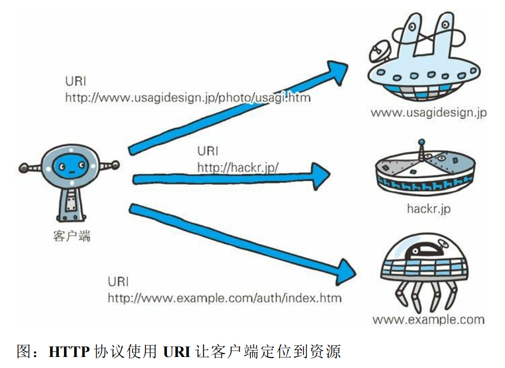
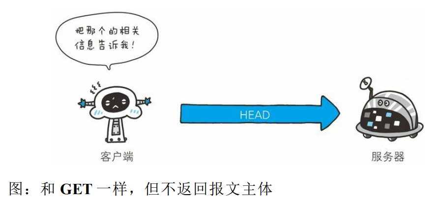
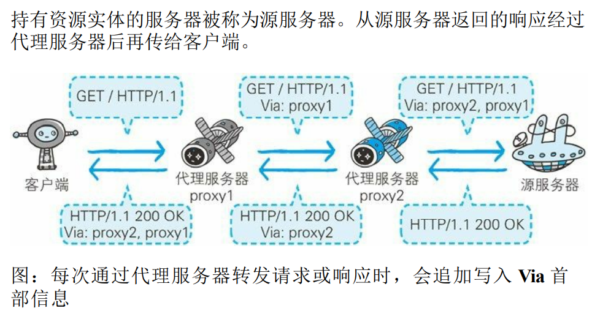
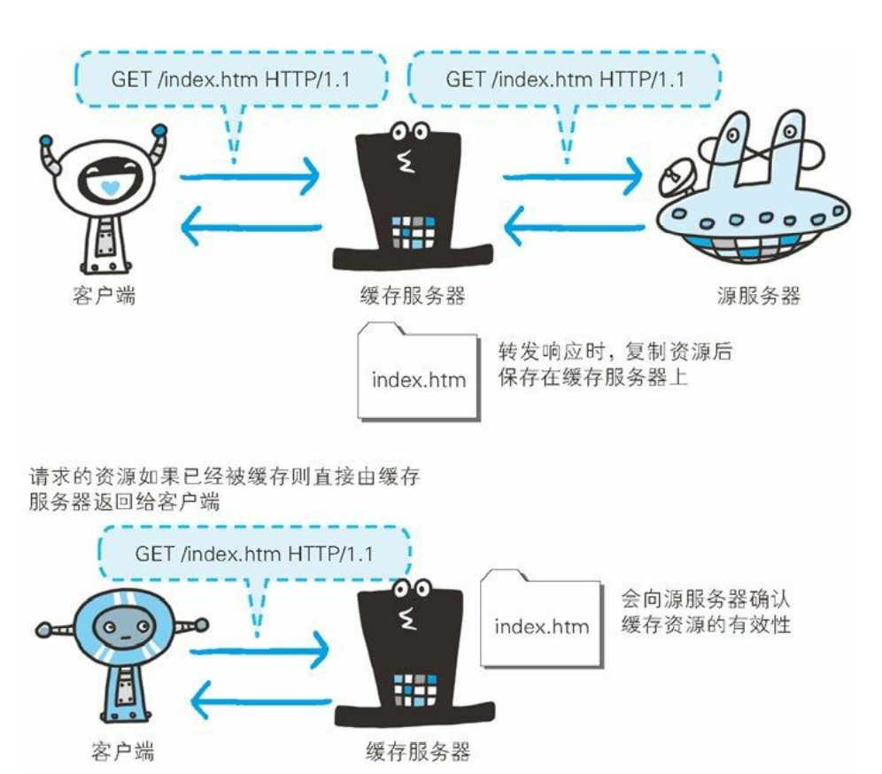

# Http

## Http/Https

[参考](https://juejin.cn/post/6994629873985650696#heading-23)

### 区别

* HTTP是`明文传输`，不安全的，HTTPS是`加密传输`，安全的多
* HTTP标准端口是`80`，HTTPS标准端口是`443`
* HTTP不用认证证书`免费`，HTTPS需要认证证书`要钱`
* `连接方式不同`，HTTP三次握手，HTTPS中TLS1.2版本7次，TLS1.3版本6次
* HTTP在OSI网络模型中是在`应用层`，而HTTPS的TLS是在`传输层`
* HTTP是`无状态`的，HTTPS是`有状态`的

### HTTP 2.0(2015年)

说出http2中至少三个新特性？

- 使用新的`二进制协议`，不再是纯文本，避免文本歧义，缩小了请求体积
- `多路复用`，同域名下所有通信都是在单链接(双向数据流)完成，提高连接的复用率，在拥塞控制方面有更好的能力提升
- 使用`HPACK算法将头部压缩`，用`哈夫曼编码`建立索表，传送索引大大节约了带宽
- 允许`服务端主动推送`数据给客户端
- 增加了安全性，使用HTTP 2.0，要求必须至少TLS 1.2
- 使用虚拟的流传输消息，解决了应用层的队头阻塞问题

**缺点**

- TCP以及TCP+TLS建立连接的延时，HTTP2使用TCP协议来传输的，而如果使用HTTPS的话，还需要TLS协议进行安全传输，而使用TLS也需要一个握手过程，在传输数据之前，导致我们花掉3~4个RTT
- TCP的队头阻塞并没有彻底解决。在HTTP2中，多个请求跑在一个TCP管道中，但当HTTP2出现丢包时，整个TCP都要开始等待重传，那么就会阻塞该TCP连接中的所有请求

作者：沐华
链接：https://juejin.cn/post/6994629873985650696
来源：稀土掘金
著作权归作者所有。商业转载请联系作者获得授权，非商业转载请注明出处。

## 一次Http请求

1. 域名解析
   * 浏览器缓存，如果有，得到IP，解析结束
   * 系统缓存
   * 检查Hosts文件是否有DNS缓存
   * 以上都没没有，发起远程DNS解析请求
2. TCP3次握手
   * 发起TCP连接请求
3. 发起Http连接请求
4. 浏览器响应连接请求，浏览器得到html代码
5. 浏览器解析代码，渲染页面

## 版本

| 版本 | 特点                                                         | 缺点                                      |
| ---- | ------------------------------------------------------------ | ----------------------------------------- |
| 1.0  | 短连接，每次请求都重新建立TCP连接，无状态，服务器不知道客户端状态 |                                           |
| 1.1  | 长连接，避免频繁建立连接的开销（Http keep-alive）            | 高延迟;无状态；明文传输；不支持服务器推送 |
| 2.0  | 二进制传输；header压缩；多路复用；服务端推送                 | 握手延迟；队头阻塞                        |
| 3.0  | **基于UDP协议的“QUIC”协议**；多路复用彻底解决队头阻塞；集成TLS加密 |                                           |

## Http报文

### 请求行

1. 请求方法
2. 目标地址
3. 版本号

### 请求头

客户端向服务器传递请求的附加信息和客户端自身的信息。

Accept, Accept-Encoding, Accept-Language, Cache-Control, Connection, Cookie等字段。

* **Accept**用于指定客户端用于接受哪些类型的信息，
* **Accept-Encoding**与Accept类似，它用于指定接受的编码方式。
* **Connection**设置为Keep-alive用于告诉客户端本次HTTP请求结束之后并不需要关闭TCP连接，这样可以使下次HTTP请求使用相同的TCP通道，节省TCP连接建立的时间。

### 请求正文

* 当使用POST, PUT等方法时，通常需要客户端向服务器传递数据。
* 这些数据就储存在请求正文中。
* 在请求包头中有一些与请求正文相关的信息，例如: 现在的Web应用通常采用Rest架构，请求的数据格式一般为json。
* 这时就需要设置`Content-Type: application/json`。

# Https

**HTTP 加上加密处理和认证以及完整性保护后即是 HTTPS**

## SSL&TLS

**对称密钥加密**：加密和解密使用同一套密钥

## 一次Https请求

1. 客户端发送ClientHello开始SSL通信
2. 服务端回应Server Hello
3. 服务器发送 Certificate 报文
4. 服务器发送 Server Hello Done 报文通知客户端，第一次握手结束
5. SSL第一次握手结束之后，客户端以 Client Key Exchange 报 文作为回应
6. 接着客户端继续发送 Change Cipher Spec 报文
7. 客户端发送 Finished 报文
8. 服务器同样发送 Change Cipher Spec 报文。
9. 服务器同样发送 Finished 报文。SSL连接建立完成
10. 发送 HTTP 请求。
11. 应用层协议通信，即发送 HTTP 响应。
12. 最后由客户端断开连接。
13. 发送TCP FIN

|      | Http       | Https                     |
| ---- | ---------- | ------------------------- |
| 速度 | 快         | 加密耗费CPU、内存资源，慢 |
| 适用 | 非敏感信息 | 敏感信息                  |
| 成本 | 低         | 证书收费                  |
| 端口 | 80         | 443                       |
|      |            |                           |

# 5. HttpServlet容器响应Web客户请求流程如下：

1）Web客户向Servlet容器发出Http请求；

2）Servlet容器解析Web客户的Http请求；

3）Servlet容器创建一个HttpRequest对象，在这个对象中封装Http请求信息；

4）Servlet容器创建一个HttpResponse对象；

5）Servlet容器调用HttpServlet的service方法，这个方法中会根据request的Method来判断具体是执行doGet还是doPost，把HttpRequest和HttpResponse对象作为service方法的参数传给HttpServlet对象；

6）HttpServlet调用HttpRequest的有关方法，获取HTTP请求信息；

7）HttpServlet调用HttpResponse的有关方法，生成响应数据；

8）Servlet容器把HttpServlet的响应结果传给Web客户。

doGet() 或 doPost() 是创建HttpServlet时需要覆盖的方法.

## 1.4 与 HTTP 关系密切的协议 : IP、TCP 和 DNS

### 1.4.1 负责传输的 IP 协议

* 全称：Internet Protocol

* 位置：网络层

* 作用：是把各种数据包传送给对方。

  IP 间的通信依赖 MAC 地址。在网络上，通信的双方在同一局域网 （LAN）内的情况是很少的，通常是经过多台计算机和网络设备中转 才能连接到对方。而在进行中转时，会利用下一站中转设备的 MAC 地址来搜索下一个中转目标。这时，会采用 ARP 协议（Address Resolution Protocol）。ARP 是一种用以解析地址的协议，根据通信方 的 IP 地址就可以反查出对应的 MAC 地址。

  

## 1.6 各种协议与 HTTP 协议的关系

## 2.3 HTTP 是不保存状态的协议

​         **使用 HTTP 协议，每当有新的请求发送时，就会有对应的新响应产 生。协议本身并不保留之前一切的请求或响应报文的信息。这是为了 更快地处理大量事务，确保协议的可伸缩性，而特意把 HTTP 协议设 计成如此简单的。**

​            可是，随着 Web 的不断发展，因无状态而导致业务处理变得棘手的 情况增多了。比如，用户登录到一家购物网站，即使他跳转到该站的其他页面后，也需要能继续保持登录状态。针对这个实例，网站为了 能够掌握是谁送出的请求，需要保存用户的状态。

​          HTTP/1.1 虽然是无状态协议，但为了实现期望的保持状态功能，于 是引入了 Cookie 技术。有了 Cookie 再用 HTTP 协议通信，就可以管 理状态了。有关 Cookie 的详细内容稍后讲解。

## 2.4 请求 URI 定位资源

## 2.5 告知服务器意图的 HTTP 方法

### GET ：获取资源

GET 方法用来请求访问已被 URI 识别的资源。指定的资源经服务器 端解析后返回响应内容。也就是说，如果请求的资源是文本，那就保 持原样返回；如果是像 CGI（Common Gateway Interface，通用网关接 口）那样的程序，则返回经过执行后的输出结果。

| 请求 | GET /index.html HTTP/1.1 Host: www.hackr.jp  If-Modified-Since: Thu, 12 Jul 2012 07:30:00 GMT |
| ---- | ------------------------------------------------------------ |
| 响应 | 仅返回2012年7 月12日7 点30分以后更新过的index.html页面资源。如果未 有内容更新，则以状态码304 Not Modified作为响应返回 |

### POST：传输实体主体

​       POST 方法用来传输实体的主体。 虽然用 GET 方法也可以传输实体的主体，但一般不用 GET 方法进行 传输，而是用 POST 方法。虽说 POST 的功能与 GET 很相似，但 POST 的主要目的并不是获取响应的主体内容。

| 请求 | OST /submit.cgi HTTP/1.1  Host: www.hackr.jp  Content-Length: 1560（1560字节的数据） |
| ---- | ------------------------------------------------------------ |
| 响应 | 返回 submit.cgi 接收数据的处理结果                           |

### PUT：传输文件

PUT 方法用来传输文件。就像 FTP 协议的文件上传一样，要求在请 求报文的主体中包含文件内容，然后保存到请求 URI 指定的位置。

​         但是，鉴于 HTTP/1.1 的 PUT 方法自身不带验证机制，任何人都可以 上传文件 , 存在安全性问题，因此一般的 Web 网站不使用该方法。若 配合 Web 应用程序的验证机制，或架构设计采用 REST（REpresentational State Transfer，表征状态转移）标准的同类 Web 网站，就可能会开放使用 PUT 方法。

更多操作请求OST /submit.cgi HTTP/1.1  Host: www.hackr.jp  Content-Length: 1560（1560字节的数据）响应返回 submit.cgi 接收数据的处理结果

| 请求 | PUT /example.html HTTP/1.1 Host: www.hackr.jp         Content-Type: text/html   Content-Length: 1560（1560 字节的数据） |
| ---- | ------------------------------------------------------------ |
| 响应 | 响应返回状态码 204 No   Content（比如 ：该 html 已存在于服务器上 |

### HEAD：获得报文首部

| 请求 | HEAD /index.html HTTP/1.1 Host: www.hackr.jp |
| ---- | -------------------------------------------- |
| 响应 | 返回index.html有关的响应首部                 |

### DELETE：删除文件

DELETE 方法用来删除文件，是与 PUT 相反的方法。DELETE 方法按 请求 URI 删除指定的资源。

但是，HTTP/1.1 的 DELETE 方法本身和 PUT 方法一样不带验证机 制，所以一般的 Web 网站也不使用 DELETE 方法。当配合 Web 应用 程序的验证机制，或遵守 REST 标准时还是有可能会开放使用的。

### OPTIONS：询问支持的方法

OPTIONS 方法用来查询针对请求 URI 指定的资源支持的方法。

### TRACE：追踪路径 

TRACE 方法是让 Web 服务器端将之前的请求通信环回给客户端的方 法。

### CONNECT：要求用隧道协议连接代理

​        CONNECT 方法要求在与代理服务器通信时建立隧道，实现用隧道协 议进行 TCP 通信。主要使用 SSL（Secure Sockets Layer，安全套接层）和 TLS（Transport Layer Security，传输层安全）协议把通信内容 加 密后经网络隧道传输。

## 2.6 使用方法下达命令

## 2.7 持久连接节省通信量

HTTP 协议的初始版本中，每进行一次 HTTP 通信就要断开一次 TCP 连接。

​        以当年的通信情况来说，因为都是些容量很小的文本传输，所以即使 这样也没有多大问题。可随着 HTTP 的普及，文档中包含大量图片的 情况多了起来。 比如，使用浏览器浏览一个包含多张图片的 HTML页面时，在发送 请求访问 HTML页面资源的同时，也会请求该 HTML页面里包含的 其他资源。因此，每次的请求都会造成无谓的 TCP 连接建立和断 开，增加通信量的开销。

## 2.8 使用 Cookie 的状态管理

保留无状态协议这个特征的同时又要解决类似的矛盾问题，于是引入 了 Cookie 技术。Cookie 技术通过在请求和响应报文中写入 Cookie 信 息来控制客户端的状态。 

Cookie 会根据从服务器端发送的响应报文内的一个叫做 Set-Cookie 的 首部字段信息，通知客户端保存 Cookie。当下次客户端再往该服务器 发送请求时，客户端会自动在请求报文中加入 Cookie 值后发送出 去。

 服务器端发现客户端发送过来的 Cookie 后，会去检查究竟是从哪一 个客户端发来的连接请求，然后对比服务器上的记录，最后得到之前 的状态信息。

## 5.2 通信数据转发程序 ：代理、网关、隧 道

### 5.2.1 代理

​      使用代理服务器的理由有：利用缓存技术（稍后讲解）减少网络带宽 的流量，组织内部针对特定网站的访问控制，以获取访问日志为主要目的，等等。

使用代理服务器的理由有：利用缓存技术（稍后讲解）减少网络带宽 的流量，组织内部针对特定网站的访问控制，以获取访问日志为主要 目的，等等。

**缓存代理** 代理转发响应时，缓存代理（Caching Proxy）会预先将资源的副本 （缓存）保存在代理服务器上。 当代理再次接收到对相同资源的请求时，就可以不从源服务器那里获 取资源，而是将之前缓存的资源作为响应返回。 

**透明代理** 转发请求或响应时，不对报文做任何加工的代理类型被称为透明代理 （Transparent Proxy）。反之，对报文内容进行加工的代理被称为非透明代理。

### 5.2.2 网关

​       利用网关能提高通信的安全性，因为可以在客户端与网关之间的通信 线路上加密以确保连接的安全。比如，网关可以连接数据库，使用 SQL语句查询数据。另外，在 Web 购物网站上进行信用卡结算时， 网关可以和信用卡结算系统联动。

### 5.2.3 隧道

​       隧道可按要求建立起一条与其他服务器的通信线路，届时使用 SSL等 加密手段进行通信。隧道的目的是确保客户端能与服务器进行安全的 通信。 

​       隧道本身不会去解析 HTTP 请求。也就是说，请求保持原样中转给之后的服务器。隧道会在通信双方断开连接时结束。

## 5.3 保存资源的缓存

​      隧道可按要求建立起一条与其他服务器的通信线路，届时使用 SSL等 加密手段进行通信。隧道的目的是确保客户端能与服务器进行安全的 通信。 隧道本身不会去解析 HTTP 请求。也就是说，请求保持原样中转给之 后的服务器。隧道会在通信双方断开连接时结束。

### 5.3.1 缓存的有效期限

### 5.3.2 客户端的缓存

缓存不仅可以存在于缓存服务器内，还可以存在客户端浏览器中。以 Internet Explorer 程序为例，把客户端缓存称为临时网络文件 （Temporary Internet File）。

 浏览器缓存如果有效，就不必再向服务器请求相同的资源了，可以直 接从本地磁盘内读取。

另外，和缓存服务器相同的一点是，当判定缓存过期后，会向源服务器确认资源的有效性。若判断浏览器缓存失效，浏览器会再次请求新 资源。
