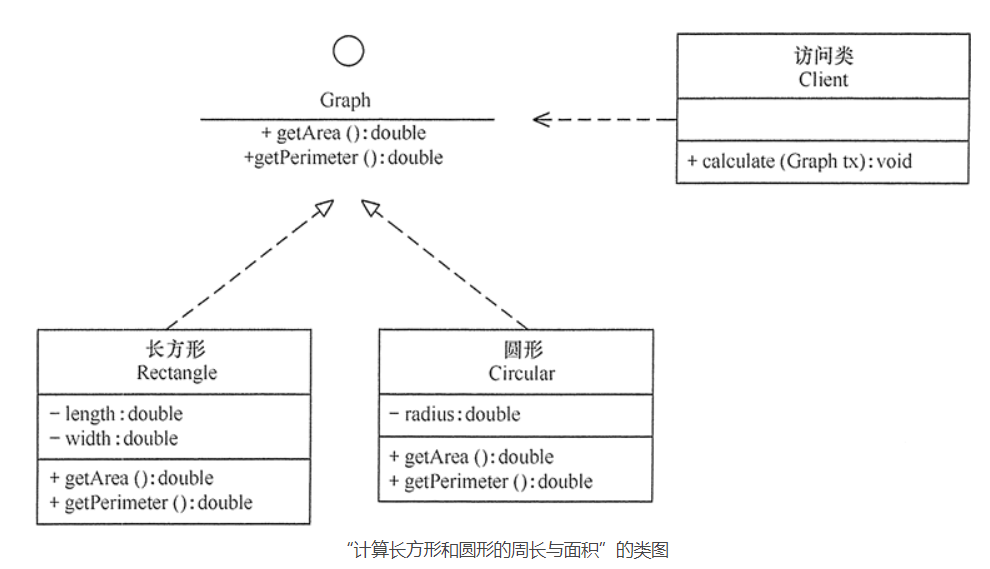

[toc]


# GOF的23种设计模式

参考文档

* **http://c.biancheng.net/view/1320.html**

GOF ：gang  of four

模式设计有两种分类方法

## 根据目的来分
根据模式是用来完成什么工作来划分，这种方式可分为创建型模式、结构型模式和行为型模式 3 种。  

1. 创建型模式：用于描述“怎样创建对象”，它的主要特点是“将对象的创建与使用分离”。GoF 中提供了单例、原型、工厂方法、抽象工厂、建造者等 5 种创建型模式。
2. 结构型模式：用于描述如何将类或对象按某种布局组成更大的结构，GoF 中提供了代理、适配器、桥接、装饰、外观、享元、组合等 7 种结构型模式。
3. 行为型模式：用于描述类或对象之间怎样相互协作共同完成单个对象都无法单独完成的任务，以及怎样分配职责。GoF 中提供了模板方法、策略、命令、职责链、状态、观察者、中介者、迭代器、访问者、备忘录、解释器等 11 种行为型模式。

## 根据作用范围来分

根据模式是主要用于类上还是主要用于对象上来分，这种方式可分为类模式和对象模式两种。

1. 类模式：用于处理类与子类之间的关系，这些关系通过继承来建立，是静态的，在编译时刻便确定下来了。GoF中的工厂方法、（类）适配器、模板方法、解释器属于该模式。
2. 对象模式：用于处理对象之间的关系，这些关系可以通过组合或聚合来实现，在运行时刻是可以变化的，更具动态性。GoF 中除了以上 4 种，其他的都是对象模式。

| 范围\目的 | 创建型模式                | 结构型模式                                  | 行为型模式                                               |
| --------- | ------------------------- | ------------------------------------------- | -------------------------------------------------------- |
| 类模式    | 工厂方法                  | (类）适配器                                 | 模板方法、解释器                                         |
| 对象模式  | 单例 原型 抽象工厂 建造者 | 代理 (对象）适配器 桥接 装饰 外观 享元 组合 | 策略 命令 职责链 状态 观察者 中介者 迭代器 访问者 备忘录 |

# UML类图之间关系

## 1. 类

在 UML 中，类使用包含类名、属性和操作且带有分隔线的矩形来表示。

(1) 类名（Name）是一个字符串，例如，Student。

(2) 属性（Attribute）是指类的特性，即类的成员变量。UML 按以下格式表示：

```
[可见性]属性名:类型[=默认值]
```

**“可见性”表示该属性对类外的元素是否可见，包括公有（Public）、私有（Private）、受保护（Protected）和朋友（Friendly）4 种，在类图中分别用符号+、-、#、~表示。**

|      学生       |
| :-------------: |
|    -no:long     |
| +display():void |

类图中，需注意以下几点：

- 抽象类或抽象方法用斜体表示
- 如果是接口，则在类名上方加 <<Interface>>
- 字段和方法返回值的数据类型非必需
- 静态类或静态方法加下划线

## 2. 接口

在 UML 中，接口使用一个带有名称的小圆圈来进行表示。


## 3. 类图



## 4. 依赖关系

依赖（Dependency）关系是一种使用关系，它是对象之间耦合度最弱的一种关联方式，是临时性的关联。在代码中，某个类的方法通过局部变量、方法的参数或者对静态方法的调用来访问另一个类（被依赖类）中的某些方法来完成一些职责。

**在 UML 类图中，依赖关系使用带箭头的虚线来表示，箭头从使用类指向被依赖的类。如下是人与手机的关系图，人通过手机的语音传送方法打电话。**


## 5. 关联关系

关联（Association）关系是对象之间的一种引用关系，用于表示一类对象与另一类对象之间的联系，如老师和学生、师傅和徒弟、丈夫和妻子等。关联关系是类与类之间最常用的一种关系，分为一般关联关系、聚合关系和组合关系。我们先介绍一般关联。

**关联可以是双向的，也可以是单向的。在 UML 类图中，双向的关联可以用带两个箭头或者没有箭头的实线来表示，单向的关联用带一个箭头的实线来表示，箭头从使用类指向被关联的类。也可以在关联线的两端标注角色名，代表两种不同的角色。**

在代码中通常将一个类的对象作为另一个类的成员变量来实现关联关系。如下是老师和学生的关系图，每个老师可以教多个学生，每个学生也可向多个老师学，他们是双向关联。


## 6. 聚合关系

聚合（Aggregation）关系是关联关系的一种，是强关联关系，是整体和部分之间的关系，是 has-a 的关系。

聚合关系也是通过成员对象来实现的，其中成员对象是整体对象的一部分，但是成员对象可以脱离整体对象而独立存在。例如，学校与老师的关系，学校包含老师，但如果学校停办了，老师依然存在。

在 UML 类图中，**聚合关系可以用带空心菱形的实线来表示**，菱形指向整体。如下是大学和教师的关系图。


```java
class Teacher(){
    private String name;
    public void teaching(){}
}
class University(){
    private List<Teachers> teas;
}
```

## 7.组合关系

组合（Composition）关系也是关联关系的一种，也表示类之间的整体与部分的关系，但它是一种更强烈的聚合关系，是 cxmtains-a 关系。

在组合关系中，整体对象可以控制部分对象的生命周期，一旦整体对象不存在，部分对象也将不存在，部分对象不能脱离整体对象而存在。例如，头和嘴的关系，没有了头，嘴也就不存在了。

**在 UML 类图中，组合关系用带实心菱形的实线来表示，菱形指向整体。如下是头和嘴的关系图**


```java
class Month(){
    public void eat(){
    
    }
}
class Head(){
    private Mouth mouth; 
}
```

## 8.泛化关系

泛化（Generalization）关系是对象之间耦合度最大的一种关系，表示一般与特殊的关系，**是父类与子类之间的关系**，是一种继承关系，是 is-a 的关系。

**在 UML 类图中，泛化关系用带空心三角箭头的实线来表示，箭头从子类指向父类**。在代码实现时，使用面向对象的继承机制来实现泛化关系。例如，Student 类和 Teacher 类都是 Person 类的子类，其类图如下所示。


```java
class Person(){
    private String name;
    private int age;
    public void speak(){}
}
    
class Student exytends Person(){
    private long studentNo;
    public void study{}
}
   
```

#### 6.实现关系

实现（Realization）关系是接口与实现类之间的关系。在这种关系中，类实现了接口，类中的操作实现了接口中所声明的所有的抽象操作。

**在 UML 类图中，实现关系使用带空心三角箭头的虚线来表示，箭头从实现类指向接口。例如，汽车和船实现了交通工具，其类图如下所示。**


```JAVA
interface Vehicle(){
    public void move(){}
}
class Car implements Vehicle(){
    public void move(){}
}
```


#  设计原则

设计模式原则

| 设计原则     | 一句话归纳                                                   | 目的                                       |
| ------------ | ------------------------------------------------------------ | ------------------------------------------ |
| 开闭原则     | 对扩展开放，对修改关闭                                       | 降低维护带来的新风险                       |
| 依赖倒置原则 | 高层不应该依赖低层，要面向接口编程                           | 更利于代码结构的升级扩展                   |
| 单一职责原则 | 一个类只干一件事，实现类要单一                               | 便于理解，提高代码的可读性                 |
| 接口隔离原则 | 一个接口只干一件事，接口要精简单一                           | 功能解耦，高聚合、低耦合                   |
| 迪米特法则   | 不该知道的不要知道，一个类应该保持对其它对象最少的了解，降低耦合度 | 只和朋友交流，不和陌生人说话，减少代码臃肿 |
| 里氏替换原则 | 不要破坏继承体系，子类重写方法功能发生改变，不应该影响父类方法的含义 | 防止继承泛滥                               |
| 合成复用原则 | 尽量使用组合或者聚合关系实现代码复用，少使用继承             | 降低代码耦合                               |

## 设计模式的目的

1. 代码可重复使用

## 1. 开闭原则

**软件实体应当对扩展开放，对修改关闭（Software entities should be open for extension，but closed for modification）**

开闭原则的含义是：当应用的需求改变时，在不修改软件实体的源代码或者二进制代码的前提下，可以扩展模块的功能，使其满足新的需求。

### 

### 作用

开闭原则是面向对象程序设计的终极目标，它使软件实体拥有一定的适应性和灵活性的同时具备稳定性和延续性。具体来说，其作用如下。

#### 1. 对软件测试的影响

软件遵守开闭原则的话，软件测试时只需要对扩展的代码进行测试就可以了，因为原有的测试代码仍然能够正常运行。

#### 2. 可以提高代码的可复用性

粒度越小，被复用的可能性就越大；在面向对象的程序设计中，根据原子和抽象编程可以提高代码的可复用性。

#### 3. 可以提高软件的可维护性

遵守开闭原则的软件，其稳定性高和延续性强，从而易于扩展和维护。

### 实现方法

可以通过“抽象约束、封装变化”来实现开闭原则，即通过接口或者抽象类为软件实体定义一个相对稳定的抽象层，而将相同的可变因素封装在相同的具体实现类中。

因为抽象灵活性好，适应性广，只要抽象的合理，可以基本保持软件架构的稳定。而软件中易变的细节可以从抽象派生来的实现类来进行扩展，当软件需要发生变化时，只需要根据需求重新派生一个实现类来扩展就可以了。

### 思考

所谓言多必失，所以为了满足开闭原则就尽量说一些空话（建立抽象类或接口），把具体实现的事情交给下面人去做（通过继承抽象类扩展功能）

### 实例 

Windows 的桌面主题设计

分析：Windows 的主题是桌面背景图片、窗口颜色和声音等元素的组合。用户可以根据自己的喜爱更换自己的桌面主题，也可以从网上下载新的主题。这些主题有共同的特点，可以为其定义一个抽象类（Abstract Subject），而每个具体的主题（Specific Subject）是其子类。用户窗体可以根据需要选择或者增加新的主题，而不需要修改原代码，所以它是满足开闭原则的，其类图如图 1 所示。


## 2. 里氏替换原则

里斯科夫:**继承必须确保超类所拥有的性质在子类中仍然成立**

里氏替换原则主要阐述了有关继承的一些原则，也就是什么时候应该使用继承，什么时候不应该使用继承，以及其中蕴含的原理。里氏替换原是继承复用的基础，它反映了基类与子类之间的关系，是对开闭原则的补充，是对实现抽象化的具体步骤的规范。

### 作用

里氏替换原则的主要作用如下。

1. 里氏替换原则是实现开闭原则的重要方式之一。
2. 它克服了继承中重写父类造成的可复用性变差的缺点。
3. 它是动作正确性的保证。即类的扩展不会给已有的系统引入新的错误，降低了代码出错的可能性。
4. 加强程序的健壮性，同时变更时可以做到非常好的兼容性，提高程序的维护性、可扩展性，降低需求变更时引入的风险。

### 实现方法

里氏替换原则通俗来讲就是：子类可以扩展父类的功能，但不能改变父类原有的功能。也就是说：子类继承父类时，除添加新的方法完成新增功能外，尽量不要重写父类的方法。

根据上述理解，对里氏替换原则的定义可以总结如下：

- 子类可以实现父类的抽象方法，但不能覆盖父类的非抽象方法
- 子类中可以增加自己特有的方法
- 当子类的方法重载父类的方法时，方法的前置条件（即方法的输入参数）要比父类的方法更宽松
- 当子类的方法实现父类的方法时（重写/重载或实现抽象方法），方法的后置条件（即方法的的输出/返回值）要比父类的方法更严格或相等


通过重写父类的方法来完成新的功能写起来虽然简单，但是整个继承体系的可复用性会比较差，特别是运用多态比较频繁时，程序运行出错的概率会非常大。

如果程序违背了里氏替换原则，则继承类的对象在基类出现的地方会出现运行错误。这时其修正方法是：取消原来的继承关系，重新设计它们之间的关系。

关于里氏替换原则的例子，最有名的是“正方形不是长方形”。当然，生活中也有很多类似的例子，例如，企鹅、鸵鸟和几维鸟从生物学的角度来划分，它们属于鸟类；但从类的继承关系来看，由于它们不能继承“鸟”会飞的功能，所以它们不能定义成“鸟”的子类。同样，由于“气球鱼”不会游泳，所以不能定义成“鱼”的子类；“玩具炮”炸不了敌人，所以不能定义成“炮”的子类等。

## 依赖倒置原则

依赖倒置原则的原始定义为：高层模块不应该依赖低层模块，两者都应该依赖其抽象；抽象不应该依赖细节，细节应该依赖抽象。其核心思想是：要面向接口编程，不要面向实现编程。

依赖倒置原则是实现开闭原则的重要途径之一，它降低了客户与实现模块之间的耦合。

由于在软件设计中，细节具有多变性，而抽象层则相对稳定，因此以抽象为基础搭建起来的架构要比以细节为基础搭建起来的架构要稳定得多。这里的抽象指的是接口或者抽象类，而细节是指具体的实现类。

使用接口或者抽象类的目的是制定好规范和契约，而不去涉及任何具体的操作，把展现细节的任务交给它们的实现类去完成。

### 作用

依赖倒置原则的主要作用如下。

- 依赖倒置原则可以降低类间的耦合性。
- 依赖倒置原则可以提高系统的稳定性。
- 依赖倒置原则可以减少并行开发引起的风险。
- 依赖倒置原则可以提高代码的可读性和可维护性。

### 实现方法

依赖倒置原则的目的是通过要面向接口的编程来降低类间的耦合性，所以我们在实际编程中只要遵循以下4点，就能在项目中满足这个规则。

1. 每个类尽量提供接口或抽象类，或者两者都具备。
2. 变量的声明类型尽量是接口或者是抽象类。
3. 任何类都不应该从具体类派生。
4. 使用继承时尽量遵循里氏替换原则。


## 单一职责原则

**一个类只负责一个职责**


* 降低类的复杂度，一个类只负责一个与职责
* 提高类的可读性，可维护性
* 降低变更带来的风险
* 通常情况下遵守单一职责原则，只有逻辑足够简单，才可以在代码中级别违反单依职责原则，只有方法足够简单，才可以在类级别违反单一职责原则

##  接口隔离原则

要为各个类建立它们需要的专用接口，而不要试图去建立一个很庞大的接口供所有依赖它的类去调用。

接口隔离原则和单一职责都是为了提高类的内聚性、降低它们之间的耦合性，体现了封装的思想，但两者是不同的：

- 单一职责原则注重的是职责，而接口隔离原则注重的是对接口依赖的隔离。
- 单一职责原则主要是约束类，它针对的是程序中的实现和细节；接口隔离原则主要约束接口，主要针对抽象和程序整体框架的构建。

1.  客户端不应该依赖他不需要的接口，寄一个接口对另一个类的应该建立在最小的接口上 
2. 

# 策略模式

定义了算法族，并分别封装起来，让它们之间可以相互替换，此模式让算法的变化独立于使用算法的客户

策略模式定义了一系列的算法，并将每一个算法封装起来，使它们可以相互替换。策略模式通常包含以下角色：

- 抽象策略（Strategy）类：定义了一个公共接口，各种不同的算法以不同的方式实现这个接口，环境角色使用这个接口调用不同的算法，一般使用接口或抽象类实现。
- 具体策略（Concrete Strategy）类：实现了抽象策略定义的接口，提供具体的算法实现。
- 环境（Context）类：持有一个策略类的引用，最终给客户端调用。


参考文章：

* https://mp.weixin.qq.com/s/VA1_dEBpWN33WorJ3jhTqw

## 应用场景

当系统出现了代码量比较大的逻辑判断情况时，为了提高代码的可读性，以及遵守设计原则

* 单一职责原则   因为一个类如果出现多个判断语句，就说明执行了多个职责，这违反了单一职责原则
* 开闭原则     如果把所有的逻辑判断都堆放在一个类中，每出现一种新情况就需要改写一次类（添加新的if语句处理业务），这违反了对修改关闭，对扩展开放的原则

## 解决方案

将每个if语句中的业务处理代码封装成一个新的类（也叫策略）

流程

1. 定义策略接口    在策略接口中声明**参数类型**以及**响应方法**
2. 实现相关的策略   具体实现接口中的方法
   1. 策略1
   2. 策略2
   3. 策略3
3. 建立策略工厂   用来根据传来的参数类型确定实例化哪个具体策略
4. 测试


# 适配者模式

适配器模式：将一个类的接口转换成客户希望的另外一个接口，使得原本由于接口不兼容而不能一起工作的那些类能一起工作。适配器模式包含以下主要角色：

- 目标（Target）接口：当前系统业务所期待的接口，它可以是抽象类或接口。
- 适配者（Adaptee）类：它是被访问和适配的现存组件库中的组件接口。
- 适配器（Adapter）类：它是一个转换器，通过继承或引用适配者的对象，把适配者接口转换成目标接口，让客户按目标接口的格式访问适配者。

# 设计模式二三事

原创 嘉凯 杨柳 [美团技术团队](javascript:void(0);) *2022-03-10 20:00*

收录于话题

\#金服平台2个

\#设计模式1个

\#开发技能1个

\#系统1个


- 引言
- 奖励的发放策略
- 任务模型的设计
- 活动的迭代重构
- 结语
- 参考资料
- 作者简介

## 引言

话说这是在程序员世界里一对师徒的对话：

“老师，我最近在写代码时总感觉自己的代码很不优雅，有什么办法能优化吗？”

“嗯，可以考虑通过教材系统学习，从注释、命名、方法和异常等多方面实现整洁代码。”

“然而，我想说的是，我的代码是符合各种编码规范的，但是从实现上却总是感觉不够简洁，而且总是需要反复修改！”学生小明叹气道。

老师看了看小明的代码说：“我明白了，这是系统设计上的缺陷。总结就是抽象不够、可读性低、不够健壮。”

“对对对，那怎么能迅速提高代码的可读性、健壮性、扩展性呢？”小明急不可耐地问道。

老师敲了敲小明的头：“不要太浮躁，没有什么方法能让你立刻成为系统设计专家。但是对于你的问题，我想**设计模式**可以帮到你。”

“设计模式？”小明不解。

“是的。”老师点了点头，“世上本没有路，走的人多了，便变成了路。在程序员的世界中，本没有设计模式，写代码是人多了，他们便总结出了一套能提高开发和维护效率的套路，这就是设计模式。设计模式不是什么教条或者范式，它可以说是一种在特定场景下普适且可复用的解决方案，是一种可以用于提高代码可读性、可扩展性、可维护性和可测性的最佳实践。”

“哦哦，我懂了，那我应该如何去学习呢？”

“不急，接下来我来带你慢慢了解设计模式。”

## 奖励的发放策略

第一天，老师问小明：“你知道活动营销吗？”

“这我知道，活动营销是指企业通过参与社会关注度高的已有活动，或整合有效的资源自主策划大型活动，从而迅速提高企业及其品牌的知名度、美誉度和影响力，常见的比如有抽奖、红包等。”

老师点点头：“是的。我们假设现在就要做一个营销，需要用户参与一个活动，然后完成一系列的任务，最后可以得到一些奖励作为回报。活动的奖励包含美团外卖、酒旅和美食等多种品类券，现在需要你帮忙设计一套奖励发放方案。”

因为之前有过类似的开发经验，拿到需求的小明二话不说开始了编写起了代码：

```java
// 奖励服务
class RewardService {
    // 外部服务
    private WaimaiService waimaiService;
    private HotelService hotelService;
    private FoodService foodService;
    // 使用对入参的条件判断进行发奖
    public void issueReward(String rewardType, Object ... params) {
        if ("Waimai".equals(rewardType)) {
            WaimaiRequest request = new WaimaiRequest();
            // 构建入参
            request.setWaimaiReq(params);
            waimaiService.issueWaimai(request);
        } else if ("Hotel".equals(rewardType)) {
            HotelRequest request = new HotelRequest();
            request.addHotelReq(params);
            hotelService.sendPrize(request);
        } else if ("Food".equals(rewardType)) {
            FoodRequest request = new FoodRequest(params);
            foodService.getCoupon(request);
        } else {
           throw new IllegalArgumentException("rewardType error!");
        }
    }
}
```

小明很快写好了Demo，然后发给老师看。

“假如我们即将接入新的打车券，这是否意味着你必须要修改这部分代码？”老师问道。

小明愣了一愣，没等反应过来老师又问：”假如后面美团外卖的发券接口发生了改变或者替换，这段逻辑是否必须要同步进行修改？”

小明陷入了思考之中，一时间没法回答。

经验丰富的老师一针见血地指出了这段设计的问题：“你这段代码有两个主要问题，一是不符合**开闭原则**，可以预见，如果后续新增品类券的话，需要直接修改主干代码，而我们提倡代码应该是对修改封闭的；二是不符合**迪米特法则**，发奖逻辑和各个下游接口高度耦合，这导致接口的改变将直接影响到代码的组织，使得代码的可维护性降低。”

小明恍然大悟：“那我将各个同下游接口交互的功能抽象成单独的服务，封装其参数组装及异常处理，使得发奖主逻辑与其解耦，是否就能更具备扩展性和可维护性？”

“这是个不错的思路。之前跟你介绍过设计模式，这个案例就可以使用**策略模式**和**适配器模式**来优化。”

小明借此机会学习了这两个设计模式。首先是策略模式：

> 策略模式定义了一系列的算法，并将每一个算法封装起来，使它们可以相互替换。策略模式通常包含以下角色：
>
> - 抽象策略（Strategy）类：定义了一个公共接口，各种不同的算法以不同的方式实现这个接口，环境角色使用这个接口调用不同的算法，一般使用接口或抽象类实现。
> - 具体策略（Concrete Strategy）类：实现了抽象策略定义的接口，提供具体的算法实现。
> - 环境（Context）类：持有一个策略类的引用，最终给客户端调用。

然后是适配器模式：

> 适配器模式：将一个类的接口转换成客户希望的另外一个接口，使得原本由于接口不兼容而不能一起工作的那些类能一起工作。适配器模式包含以下主要角色：
>
> - 目标（Target）接口：当前系统业务所期待的接口，它可以是抽象类或接口。
> - 适配者（Adaptee）类：它是被访问和适配的现存组件库中的组件接口。
> - 适配器（Adapter）类：它是一个转换器，通过继承或引用适配者的对象，把适配者接口转换成目标接口，让客户按目标接口的格式访问适配者。

结合优化思路，小明首先设计出了策略接口，并通过适配器的思想将各个下游接口类适配成策略类：

```java
// 策略接口
interface Strategy {
    void issue(Object ... params);
}
// 外卖策略
class Waimai implements Strategy {
   private WaimaiService waimaiService;
    @Override
    public void issue(Object... params) {
        WaimaiRequest request = new WaimaiRequest();
        // 构建入参
        request.setWaimaiReq(params);
        waimaiService.issueWaimai(request);
    }
}
// 酒旅策略
class Hotel implements Strategy {
   private HotelService hotelService;
    @Override
    public void issue(Object... params) {
        HotelRequest request = new HotelRequest();
        request.addHotelReq(params);
        hotelService.sendPrize(request);
    }
}
// 美食策略
class Food implements Strategy {
   private FoodService foodService;
    @Override
    public void issue(Object... params) {
        FoodRequest request = new FoodRequest(params);
        foodService.payCoupon(request);
    }
}
```

然后，小明创建策略模式的环境类，并供奖励服务调用：

```java
// 使用分支判断获取的策略上下文
class StrategyContext {
    public static Strategy getStrategy(String rewardType) {
        switch (rewardType) {
            case "Waimai":
                return new Waimai();
            case "Hotel":
                return new Hotel();
            case "Food":
                return new Food();
            default:
                throw new IllegalArgumentException("rewardType error!");
        }
    }
}
// 优化后的策略服务
class RewardService {
    public void issueReward(String rewardType, Object ... params) {
        Strategy strategy = StrategyContext.getStrategy(rewardType);
        strategy.issue(params);
    }
}
```

小明的代码经过优化后，虽然结构和设计上比之前要复杂不少，但考虑到健壮性和拓展性，还是非常值得的。

“看，我这次优化后的版本是不是很完美？”小明洋洋得意地说。

“耦合度确实降低了，但还能做的更好。”

“怎么做？”小明有点疑惑。

“我问你，策略类是有状态的模型吗？如果不是是否可以考虑做成单例的？”

“的确如此。”小明似乎明白了。

“还有一点，环境类的获取策略方法职责很明确，但是你依然没有做到完全对修改封闭。”

经过老师的点拨，小明很快也领悟到了要点：“那我可以将策略类单例化以减少开销，并实现自注册的功能彻底解决分支判断。”

小明列出单例模式的要点：

> 单例模式设计模式属于创建型模式，它提供了一种创建对象的最佳方式。
>
> 这种模式涉及到一个单一的类，该类负责创建自己的对象，同时确保只有单个对象被创建。这个类提供了一种访问其唯一的对象的方式，可以直接访问，不需要实例化该类的对象。

最终，小明在策略环境类中使用一个注册表来记录各个策略类的注册信息，并提供接口供策略类调用进行注册。同时使用**饿汉式单例模式**去优化策略类的设计：

```java
// 策略上下文，用于管理策略的注册和获取
class StrategyContext {
    private static final Map<String, Strategy> registerMap = new HashMap<>();
    // 注册策略
    public static void registerStrategy(String rewardType, Strategy strategy) {
        registerMap.putIfAbsent(rewardType, strategy);
    }
    // 获取策略
    public static Strategy getStrategy(String rewardType) {
        return registerMap.get(rewardType);
    }
}
// 抽象策略类
abstract class AbstractStrategy implements Strategy {
    // 类注册方法
    public void register() {
        StrategyContext.registerStrategy(getClass().getSimpleName(), this);
    }
}
// 单例外卖策略
class Waimai extends AbstractStrategy implements Strategy {
    private static final Waimai instance = new Waimai();
   private WaimaiService waimaiService;
    private Waimai() {
        register();
    }
    public static Waimai getInstance() {
        return instance;
    }
    @Override
    public void issue(Object... params) {
        WaimaiRequest request = new WaimaiRequest();
        // 构建入参
        request.setWaimaiReq(params);
        waimaiService.issueWaimai(request);
    }
}
// 单例酒旅策略
class Hotel extends AbstractStrategy implements Strategy {
   private static final Hotel instance = new Hotel();
   private HotelService hotelService;
    private Hotel() {
        register();
    }
    public static Hotel getInstance() {
        return instance;
    }
    @Override
    public void issue(Object... params) {
        HotelRequest request = new HotelRequest();
        request.addHotelReq(params);
        hotelService.sendPrize(request);
    }
}
// 单例美食策略
class Food extends AbstractStrategy implements Strategy {
   private static final Food instance = new Food();
   private FoodService foodService;
    private Food() {
        register();
    }
    public static Food getInstance() {
        return instance;
    }
    @Override
    public void issue(Object... params) {
        FoodRequest request = new FoodRequest(params);
        foodService.payCoupon(request);
    }
}
```

最终，小明设计完成的结构类图如下：

奖励发放策略_类图

如果使用了Spring框架，还可以利用Spring的Bean机制来代替上述的部分设计，直接使用`@Component`和`@PostConstruct`注解即可完成单例的创建和注册，代码会更加简洁。

至此，经过了多次讨论、反思和优化，小明终于得到了一套低耦合高内聚，同时符合开闭原则的设计。

“老师，我开始学会利用设计模式去解决已发现的问题。这次我做得怎么样？”

“合格。但是，依然要戒骄戒躁。”

## 任务模型的设计

“之前让你设计奖励发放策略你还记得吗？”老师忽然问道。

“当然记得。一个好的设计模式，能让工作事半功倍。”小明答道。

“嗯，那会提到了活动营销的组成部分，除了奖励之外，貌似还有任务吧。”

小明点了点头，老师接着说：“现在，我想让你去完成任务模型的设计。你需要重点关注状态的流转变更，以及状态变更后的消息通知。”

小明欣然接下了老师给的难题。他首先定义了一套任务状态的枚举和行为的枚举：

```java
// 任务状态枚举
@AllArgsConstructor
@Getter
enum TaskState {
    INIT("初始化"),
    ONGOING( "进行中"),
    PAUSED("暂停中"),
    FINISHED("已完成"),
    EXPIRED("已过期")
    ;
    private final String message;
}
// 行为枚举
@AllArgsConstructor
@Getter
enum ActionType {
    START(1, "开始"),
    STOP(2, "暂停"),
    ACHIEVE(3, "完成"),
    EXPIRE(4, "过期")
    ;
    private final int code;
    private final String message;
}
```

然后，小明对开始编写状态变更功能：

```java
class Task {
    private Long taskId;
    // 任务的默认状态为初始化
    private TaskState state = TaskState.INIT;
    // 活动服务
    private ActivityService activityService;
    // 任务管理器
    private TaskManager taskManager;
    // 使用条件分支进行任务更新
    public void updateState(ActionType actionType) {
        if (state == TaskState.INIT) {
            if (actionType == ActionType.START) {
                state = TaskState.ONGOING;
            }
        } else if (state == TaskState.ONGOING) {
            if (actionType == ActionType.ACHIEVE) {
                state = TaskState.FINISHED;
                // 任务完成后进对外部服务进行通知
                activityService.notifyFinished(taskId);
                taskManager.release(taskId);
            } else if (actionType == ActionType.STOP) {
                state = TaskState.PAUSED;
            } else if (actionType == ActionType.EXPIRE) {
                state = TaskState.EXPIRED;
            }
        } else if (state == TaskState.PAUSED) {
            if (actionType == ActionType.START) {
                state = TaskState.ONGOING;
            } else if (actionType == ActionType.EXPIRE) {
                state = TaskState.EXPIRED;
            }
        }
    }
}
```

在上述的实现中，小明在`updateState`方法中完成了2个重要的功能：

1. 接收不同的行为，然后更新当前任务的状态；
2. 当任务过期时，通知任务所属的活动和任务管理器。

诚然，随着小明的系统开发能力和代码质量意识的提升，他能够认识到这种功能设计存在缺陷。

“老师，我的代码还是和之前说的那样，不够优雅。”

“哦，你自己说说看有什么问题？”

“第一，方法中使用条件判断来控制语句，但是当条件复杂或者状态太多时，条件判断语句会过于臃肿，可读性差，且不具备扩展性，维护难度也大。且增加新的状态时要添加新的if-else语句，这违背了开闭原则，不利于程序的扩展。”

老师表示同意，小明接着说：“第二，任务类不够高内聚，它在通知实现中感知了其他领域或模块的模型，如活动和任务管理器，这样代码的耦合度太高，不利于扩展。”

老师赞赏地说道：“很好，你有意识能够自主发现代码问题所在，已经是很大的进步了。”

“那这个问题应该怎么去解决呢？”小明继续发问。

“这个同样可以通过设计模式去优化。首先是状态流转的控制可以使用**状态模式**，其次，任务完成时的通知可以用到**观察者模式**。”

收到指示后，小明马上去学习了状态模式的结构：

> 状态模式：对有状态的对象，把复杂的“判断逻辑”提取到不同的状态对象中，允许状态对象在其内部状态发生改变时改变其行为。状态模式包含以下主要角色：
>
> - 环境类（Context）角色：也称为上下文，它定义了客户端需要的接口，内部维护一个当前状态，并负责具体状态的切换。
> - 抽象状态（State）角色：定义一个接口，用以封装环境对象中的特定状态所对应的行为，可以有一个或多个行为。
> - 具体状态（Concrete State）角色：实现抽象状态所对应的行为，并且在需要的情况下进行状态切换。

根据状态模式的定义，小明将TaskState枚举类扩展成多个状态类，并具备完成状态的流转的能力；然后优化了任务类的实现：

```java
// 任务状态抽象接口
interface State {
    // 默认实现，不做任何处理
    default void update(Task task, ActionType actionType) {
        // do nothing
    }
}
// 任务初始状态
class TaskInit implements State {
    @Override
    public void update(Task task, ActionType actionType) {
        if  (actionType == ActionType.START) {
            task.setState(new TaskOngoing());
        }
    }
}
// 任务进行状态
class TaskOngoing implements State {
    private ActivityService activityService;
    private TaskManager taskManager; 
    @Override
    public void update(Task task, ActionType actionType) {
        if (actionType == ActionType.ACHIEVE) {
            task.setState(new TaskFinished());
            // 通知
            activityService.notifyFinished(taskId);
            taskManager.release(taskId);
        } else if (actionType == ActionType.STOP) {
            task.setState(new TaskPaused());
        } else if (actionType == ActionType.EXPIRE) {
            task.setState(new TaskExpired());
        }
    }
}
// 任务暂停状态
class TaskPaused implements State {
    @Override
    public void update(Task task, ActionType actionType) {
        if (actionType == ActionType.START) {
            task.setState(new TaskOngoing());
        } else if (actionType == ActionType.EXPIRE) {
            task.setState(new TaskExpired());
        }
    }
}
// 任务完成状态
class TaskFinished implements State {

}
// 任务过期状态
class TaskExpired implements State {

}
@Data
class Task {
    private Long taskId;
    // 初始化为初始态
    private State state = new TaskInit();
    // 更新状态
    public void updateState(ActionType actionType) {
        state.update(this, actionType);
    }
}
```

小明欣喜地看到，经过状态模式处理后的任务类的耦合度得到降低，符合开闭原则。状态模式的优点在于符合单一职责原则，状态类职责明确，有利于程序的扩展。但是这样设计的代价是状态类的数目增加了，因此状态流转逻辑越复杂、需要处理的动作越多，越有利于状态模式的应用。除此之外，状态类的自身对于开闭原则的支持并没有足够好，如果状态流转逻辑变化频繁，那么可能要慎重使用。

处理完状态后，小明又根据老师的指导使用**观察者模式**去优化任务完成时的通知：

> 观察者模式：指多个对象间存在一对多的依赖关系，当一个对象的状态发生改变时，所有依赖于它的对象都得到通知并被自动更新。这种模式有时又称作发布-订阅模式、模型-视图模式，它是对象行为型模式。观察者模式的主要角色如下。
>
> - 抽象主题（Subject）角色：也叫抽象目标类，它提供了一个用于保存观察者对象的聚集类和增加、删除观察者对象的方法，以及通知所有观察者的抽象方法。
> - 具体主题（Concrete Subject）角色：也叫具体目标类，它实现抽象目标中的通知方法，当具体主题的内部状态发生改变时，通知所有注册过的观察者对象。
> - 抽象观察者（Observer）角色：它是一个抽象类或接口，它包含了一个更新自己的抽象方法，当接到具体主题的更改通知时被调用。
> - 具体观察者（Concrete Observer）角色：实现抽象观察者中定义的抽象方法，以便在得到目标的更改通知时更新自身的状态。

小明首先设计好抽象目标和抽象观察者，然后将活动和任务管理器的接收通知功能定制成具体观察者：

```java
// 抽象观察者
interface Observer {
    void response(Long taskId); // 反应
}
// 抽象目标
abstract class Subject {
    protected List<Observer> observers = new ArrayList<Observer>();
    // 增加观察者方法
    public void add(Observer observer) {
        observers.add(observer);
    }
    // 删除观察者方法
    public void remove(Observer observer) {
        observers.remove(observer);
    }
    // 通知观察者方法
    public void notifyObserver(Long taskId) {
        for (Observer observer : observers) {
            observer.response(taskId);
        }
    }
}
// 活动观察者
class ActivityObserver implements Observer {
    private ActivityService activityService;
    @Override
    public void response(Long taskId) {
        activityService.notifyFinished(taskId);
    }
}
// 任务管理观察者
class TaskManageObserver implements Observer {
    private TaskManager taskManager;
    @Override
    public void response(Long taskId) {
        taskManager.release(taskId);
    }
}
```

最后，小明将任务进行状态类优化成使用通用的通知方法，并在任务初始态执行状态流转时定义任务进行态所需的观察者：

```java
// 任务进行状态
class TaskOngoing extends Subject implements State {  
    @Override
    public void update(Task task, ActionType actionType) {
        if (actionType == ActionType.ACHIEVE) {
            task.setState(new TaskFinished());
            // 通知
            notifyObserver(task.getTaskId());
        } else if (actionType == ActionType.STOP) {
            task.setState(new TaskPaused());
        } else if (actionType == ActionType.EXPIRE) {
            task.setState(new TaskExpired());
        }
    }
}
// 任务初始状态
class TaskInit implements State {
    @Override
    public void update(Task task, ActionType actionType) {
        if  (actionType == ActionType.START) {
            TaskOngoing taskOngoing = new TaskOngoing();
            taskOngoing.add(new ActivityObserver());
            taskOngoing.add(new TaskManageObserver());
            task.setState(taskOngoing);
        }
    }
}
```

最终，小明设计完成的结构类图如下：

任务模型设计_类图

通过观察者模式，小明让任务状态和通知方实现松耦合（实际上观察者模式还没能做到完全的解耦，如果要做进一步的解耦可以考虑学习并使用**发布-订阅模式**，这里也不再赘述）。

至此，小明成功使用状态模式设计出了高内聚、高扩展性、单一职责的任务的整个状态机实现，以及做到松耦合的、符合依赖倒置原则的任务状态变更通知方式。

“老师，我逐渐能意识到代码的设计缺陷，并学会利用较为复杂的设计模式做优化。”

“不错，再接再厉！”

## 活动的迭代重构

“小明，这次又有一个新的任务。”老师出现在正在认真阅读《设计模式》的小明的面前。

“好的。刚好我已经学习了设计模式的原理，终于可以派上用场了。”

“之前你设计开发了活动模型，现在我们需要在任务型活动的参与方法上增加一层风险控制。”

“OK。借此机会，我也想重构一下之前的设计。”

活动模型的特点在于其组成部分较多，小明原先的活动模型的构建方式是这样的：

```java
// 抽象活动接口
interface ActivityInterface {
   void participate(Long userId);
}
// 活动类
class Activity implements ActivityInterface {
    private String type;
    private Long id;
    private String name;
    private Integer scene;
    private String material;
      
    public Activity(String type) {
        this.type = type;
        // id的构建部分依赖于活动的type
        if ("period".equals(type)) {
            id = 0L;
        }
    }
    public Activity(String type, Long id) {
        this.type = type;
        this.id = id;
    }
    public Activity(String type, Long id, Integer scene) {
        this.type = type;
        this.id = id;
        this.scene = scene;
    }
    public Activity(String type, String name, Integer scene, String material) {
        this.type = type;
        this.scene = scene;
        this.material = material;
        // name的构建完全依赖于活动的type
        if ("period".equals(type)) {
            this.id = 0L;
            this.name = "period" + name;
        } else {
            this.name = "normal" + name;
        }
    }
    // 参与活动
   @Override
    public void participate(Long userId) {
        // do nothing
    }
}
// 任务型活动
class TaskActivity extends Activity {
    private Task task;
    public TaskActivity(String type, String name, Integer scene, String material, Task task) {
        super(type, name, scene, material);
        this.task = task;
    }
    // 参与任务型活动
    @Override
    public void participate(Long userId) {
        // 更新任务状态为进行中
        task.getState().update(task, ActionType.START);
    }
}
```

经过自主分析，小明发现活动的构造不够合理，主要问题表现在：

1. 活动的构造组件较多，导致可以组合的构造函数太多，尤其是在模型增加字段时还需要去修改构造函数；
2. 部分组件的构造存在一定的顺序关系，但是当前的实现没有体现顺序，导致构造逻辑比较混乱，并且存在部分重复的代码。

发现问题后，小明回忆自己的学习成果，马上想到可以使用创建型模式中的**建造者模式**去做重构：

> 建造者模式：指将一个复杂对象的构造与它的表示分离，使同样的构建过程可以创建不同的表示。它是将一个复杂的对象分解为多个简单的对象，然后一步一步构建而成。它将变与不变相分离，即产品的组成部分是不变的，但每一部分是可以灵活选择的。建造者模式的主要角色如下:
>
> 1. 产品角色（Product）：它是包含多个组成部件的复杂对象，由具体建造者来创建其各个零部件。
> 2. 抽象建造者（Builder）：它是一个包含创建产品各个子部件的抽象方法的接口，通常还包含一个返回复杂产品的方法 getResult()。
> 3. 具体建造者(Concrete Builder）：实现 Builder 接口，完成复杂产品的各个部件的具体创建方法。
> 4. 指挥者（Director）：它调用建造者对象中的部件构造与装配方法完成复杂对象的创建，在指挥者中不涉及具体产品的信息。

根据建造者模式的定义，上述活动的每个字段都是一个产品。于是，小明可以通过在活动里面实现静态的建造者类来简易地实现：

```java
// 活动类
class Activity implements ActivityInterface {
    protected String type;
    protected Long id;
    protected String name;
    protected Integer scene;
    protected String material;
    // 全参构造函数
   public Activity(String type, Long id, String name, Integer scene, String material) {
        this.type = type;
        this.id = id;
        this.name = name;
        this.scene = scene;
        this.material = material;
    }
    @Override
    public void participate(Long userId) {
        // do nothing
    }
    // 静态建造器类，使用奇异递归模板模式允许继承并返回继承建造器类
    public static class Builder<T extends Builder<T>> {
        protected String type;
        protected Long id;
        protected String name;
        protected Integer scene;
        protected String material;
        public T setType(String type) {
            this.type = type;
            return (T) this;
        }
        public T setId(Long id) {
            this.id = id;
            return (T) this;
        }
        public T setId() {
            if ("period".equals(this.type)) {
                this.id = 0L;
            }
            return (T) this;
        }
        public T setScene(Integer scene) {
            this.scene = scene;
            return (T) this;
        }
        public T setMaterial(String material) {
            this.material = material;
            return (T) this;
        }
        public T setName(String name) {
            if ("period".equals(this.type)) {
                this.name = "period" + name;
            } else {
                this.name = "normal" + name;
            }
            return (T) this;
        }
        public Activity build(){
            return new Activity(type, id, name, scene, material);
        }
    }
}
// 任务型活动
class TaskActivity extends Activity {
    protected Task task;
   // 全参构造函数
    public TaskActivity(String type, Long id, String name, Integer scene, String material, Task task) {
        super(type, id, name, scene, material);
        this.task = task;
    }
   // 参与任务型活动
    @Override
    public void participate(Long userId) {
        // 更新任务状态为进行中
        task.getState().update(task, ActionType.START);
    }
    // 继承建造器类
    public static class Builder extends Activity.Builder<Builder> {
        private Task task;
        public Builder setTask(Task task) {
            this.task = task;
            return this;
        }
        public TaskActivity build(){
            return new TaskActivity(type, id, name, scene, material, task);
        }
    }
}
```

小明发现，上面的建造器没有使用诸如抽象建造器类等完整的实现，但是基本是完成了活动各个组件的建造流程。使用建造器的模式下，可以先按顺序构建字段type，然后依次构建其他组件，最后使用build方法获取建造完成的活动。这种设计一方面封装性好，构建和表示分离；另一方面扩展性好，各个具体的建造者相互独立，有利于系统的解耦。可以说是一次比较有价值的重构。在实际的应用中，如果字段类型多，同时各个字段只需要简单的赋值，可以直接引用Lombok的@Builder注解来实现轻量的建造者。

重构完活动构建的设计后，小明开始对参加活动方法增加风控。最简单的方式肯定是直接修改目标方法：

```java
public void participate(Long userId) {
    // 对目标用户做风险控制，失败则抛出异常
    Risk.doControl(userId);
    // 更新任务状态为进行中
    task.state.update(task, ActionType.START);
}
```

但是考虑到，最好能尽可能避免对旧方法的直接修改，同时为方法增加风控，也是一类比较常见的功能新增，可能会在多处使用。

“老师，风险控制会出现在多种活动的参与方法中吗？”

“有这个可能性。有的活动需要风险控制，有的不需要。风控像是在适当的时候对参与这个方法的装饰。”

“对了，装饰器模式！”

小明马上想到用**装饰器模式**来完成设计：

> 装饰器模式的定义：指在不改变现有对象结构的情况下，动态地给该对象增加一些职责（即增加其额外功能）的模式，它属于对象结构型模式。装饰器模式主要包含以下角色：
>
> 1. 抽象构件（Component）角色：定义一个抽象接口以规范准备接收附加责任的对象。
> 2. 具体构件（ConcreteComponent）角色：实现抽象构件，通过装饰角色为其添加一些职责。
> 3. 抽象装饰（Decorator）角色：继承抽象构件，并包含具体构件的实例，可以通过其子类扩展具体构件的功能。
> 4. 具体装饰（ConcreteDecorator）角色：实现抽象装饰的相关方法，并给具体构件对象添加附加的责任。

小明使用了装饰器模式后，新的代码就变成了这样：

```java
// 抽象装饰角色
abstract class ActivityDecorator implements ActivityInterface {
    protected ActivityInterface activity;
    public ActivityDecorator(ActivityInterface activity) {
        this.activity = activity;
    }
    public abstract void participate(Long userId);
}
// 能够对活动做风险控制的包装类
class RiskControlDecorator extends ActivityDecorator {
    public RiskControlDecorator(ActivityInterface activity) {
        super(activity);
    }
    @Override
   public void participate(Long userId) {
        // 对目标用户做风险控制，失败则抛出异常
       Risk.doControl(userId);
        // 更新任务状态为进行中
        activity.participate(userId);
    }
}
```

最终，小明设计完成的结构类图如下：

活动迭代重构_类图

最终，小明通过自己的思考分析，结合学习的设计模式知识，完成了活动模型的重构和迭代。

“老师，我已经能做到自主分析功能特点，并合理应用设计模式去完成程序设计和代码重构了，实在太感谢您了。”

“设计模式作为一种软件设计的最佳实践，你已经很好地理解并应用于实践了，非常不错。但学海无涯，还需持续精进！”

## 结语

本文以三个实际场景为出发点，借助小明和老师两个虚拟的人物，试图以一种较为诙谐的“对话”方式来讲述设计模式的应用场景、优点和缺点。如果大家想要去系统性地了解设计模式，也可以通过市面上很多的教材进行学习，都介绍了经典的23种设计模式的结构和实现。不过，很多教材的内容即便配合了大量的示例，但有时也会让人感到费解，主要原因在于：一方面，很多案例比较脱离实际的应用场景；另一方面，部分设计模式显然更适用于大型复杂的结构设计，而当其应用到简单的场景时，仿佛让代码变得更加繁琐、冗余。因此，本文希望通过这种“对话+代码展示+结构类图”的方式，以一种更易懂的方式来介绍设计模式。

当然，本文只讲述了部分比较常见的设计模式，还有其他的设计模式，仍然需要同学们去研读经典著作，举一反三，学以致用。我们也希望通过学习设计模式能让更多的同学在系统设计能力上得到提升。

## 参考资料

- Gamma E. 设计模式: 可复用面向对象软件的基础 [M]. 机械工业出版社, 2007.
- 弗里曼. Head First 设计模式 [M]. 中国电力出版社, 2007.
- [oodesign.com](http://www.oodesign.com/)
- [java-design-patterns.com](http://java-design-patterns.com/)
- [**Java设计模式：23种设计模式全面解析**](http://c.biancheng.net/design_pattern/)

- 

# 2. 观察者模式

观察者模式定义了一系列对象之间的一对多关系，当一个对象改变状态，其他依赖者都会收到通知。

## 认识观察者模式

以报纸和杂志订阅为例

1. 报社的业务就是出版报纸
2. 向某家报社订阅报纸，只要有新报纸出版，就会送给订阅者。
3. 当不想看的时候，取消订阅，报社就不会再继续送
4. 只要报社还在，就一直有人订阅或取消订阅

**出版者+订阅者=观察者模式**


* 问：这和一对多的关系有何关联

利用观察者模式，主题是具有状态的对象，并且可以控制这些状态，也就是说，有一个具有状态的主题。另一方面，观察者使用这些状态，虽然这些状态并不属于它们。有许多的观察者，依赖主题来告诉他们状态何时改变了。这就产生一个关系：一个主题对多个观察者的关系

* 问：其间的依赖是如何产生的

因为主题是真正拥有数据的人，观察者是主题的依赖者，在数据变化时更新，这样比起许多对象控制同一份数据来，可以得到更干净的OO设计。

## 松耦合的威力

**当两个对象之间松耦合，它们依然可以交互，但是彼此不太清楚彼此的细节。**

观察者模式提供了一种对象设计，让主题和观察者之间松耦合。

## 气象站实例

### 项目需求

| 组成 | 气象站                 | WeatherData对象            | 布告板       |
| ---- | ---------------------- | -------------------------- | ------------ |
| 作用 | 获取气象数据的物理装置 | 追踪气象站数据并更新布告板 | 展示天气情况 |

这里WeatherData对象就是被观察者，布告板则是观察者。

### 方法表

| WeatherData对象                | 布告板              |
| ------------------------------ | ------------------- |
| 数据域、观察者列表             | 更新数据方法update  |
| 注册、移除、通知观察者的方法   | 展示数据方法display |
| 改变方法 measurementsChanged() |                     |
| 设置改变方法setMeasurements    |                     |

### 三个接口

```java
package service;
import service.Observer;
public interface Subject {
    public void registerObserver(Observer o);
    public void removeObserver(Observer o);
    public void notifyObserver();
    }
package service;

public interface Observer {
    public void update(float temp,float humidity,float pressure);
}
package service;

public interface DisplayElement {
    public void display();
}

```

### 两个类

```java
package model;

import service.Subject;

import java.util.ArrayList;
import service.Observer;

public class WeatherData implements Subject {
    private ArrayList observers;
    private float temprature;
    private float humidity;
    private float pressure;


    public WeatherData(){
        observers = new ArrayList();
    }


    public void registerObserver(Observer o) {
        observers.add(o);
    }

    public void removeObserver(Observer o) {
        int i= observers.indexOf(o);
        if(i>=0){
            observers.remove(i);
        }
    }


    public void notifyObserver() {
        for(int i=0;i<observers.size();i++){
            Observer observer = (Observer)observers.get(i);
            observer.update(temprature,humidity,pressure);
        }

    }

    public void measurementsChanged(){
        notifyObserver();
    }

    public void setMeasurements(float temprature,float humidity,float pressure) {
        this.temprature = temprature;
        this.humidity = humidity;
        this.pressure = pressure;
        measurementsChanged();
    }
}

```

```java
package model;

import controller.CurrentConditionsDisplay;
import model.WeatherData;

public class WeatherStation {
    public static void main(String[] args) {
        WeatherData weatherData = new WeatherData();
        CurrentConditionsDisplay currentConditionsDisplay = new CurrentConditionsDisplay(weatherData);
        weatherData.setMeasurements(80,65,30.4f);
        weatherData.setMeasurements(82,66,30.4f);
        weatherData.setMeasurements(83,75,29.4f);

    }
}
```

### 测试函数

```java
package controller;

import service.DisplayElement;
import service.Observer;
import service.Subject;

public class CurrentConditionsDisplay implements Observer, DisplayElement {
    private float temprature;
    private float humidity;
    private Subject weatherData;

    public CurrentConditionsDisplay(Subject weatherData) {
        this.weatherData = weatherData;
        weatherData.registerObserver(this);
    }


    public void update(float temp, float humidity, float pressure) {
        this.temprature = temp;
        this.humidity = humidity;
        display();

    }


    public void display() {
        System.out.println("Current condition"+temprature);
        System.out.println("Current F degree"+humidity);
    }

}
```

### 使用java内置Observer改写

首先把WeatherData改成使用java.util.Observable

改写了measurementsChanged方法，同时删去了对三个observer接口的实现

```java
package model;

import java.util.ArrayList;
import java.util.Observable;

import service.Observer;

public class WeatherData extends Observable {
    private ArrayList observers;
    private float temprature;
    private float humidity;
    private float pressure;


    public WeatherData(){
        observers = new ArrayList();
    }

    public void measurementsChanged(){
        setChanged();
        notifyObservers();
    }

    public void setMeasurements(float temprature,float humidity,float pressure) {
        this.temprature = temprature;
        this.humidity = humidity;
        this.pressure = pressure;
        measurementsChanged();
    }

    public float getTemprature() {
        return temprature;
    }

    public float getHumidity() {
        return humidity;
    }

    public float getPressure() {
        return pressure;
    }
}

```

* 在java自带的观察者类中，Observable表示可观察者，用来替代subject，即发送消息的一方
* observer则表示观察者，接收条件的一方

```java
package model;

import model.WeatherData;
//import service.DisplayElement;
import java.util.Observable;
import java.util.Observer;

public class CurrentConditionsDisplay implements Observer {
    Observable observable;
    private float temprature;
    private float humidity;


    public CurrentConditionsDisplay(Observable observable) {
        this.observable = observable;
        observable.addObserver(this);
       // weatherData.registerObserver(this);
    }
    public void update(Observable obs,Object arg) {
        if (obs instanceof WeatherData){
            WeatherData weatherData = (WeatherData)obs;
            this.temprature = weatherData.getTemprature();
            this.humidity = weatherData.getHumidity();
            display();
        }
    }
    public void display() {
        System.out.println("Current condition"+temprature+"   and Current F degree"+humidity);
        System.out.println();
    }

}
```


### 第二章要点

* 观察者模式定义了对象之间一对多的关系、
* 主题（也就是可观察者）用一个共同的接口来更新观察者
* 观察者和可观察者之间使用松耦合方式结合，可观察者不知道观察者的细节，只知道观察者实现了观察者接口
* 使用此模式时，可从被观察者处推（push）或拉（poll）数据，然而推的方式被认为更正确
* 有多个观察者时，不可以依赖特定的通知次序
* java有多种观察者模式的实现，包括了通用的java.util.Observable
* 要注意java.util.Observable
* 要注意java.util.Observable实现上所带来的一些问题
* 如果有必要的话，可以实现自己的Observable，这并不难
* Swing使用大量的观察者模式，许多GUI框架也是如此
* 此模式也被应用在许多地方，例如JavaBeans\RMI 


# 3. 装饰者模式

**本章可以称为给爱用继承的人一个全新的设计眼界**

我们即将再次探讨典型的继承滥用问题，你将在本章学到如何使用对象组合的方式，做到在运行时装饰类。

## 开放-关闭原则

* 类应该对扩展开放，对修改关闭

**我们的目标是允许类容易扩展，在不修改现有代码的情况下就可以搭配新的行为。这样的设计具有弹性可以应对改变，可以接受新的功能来应对改变的需求**

* 问：对扩展开放，对修改关闭听起来很矛盾，如何兼顾两者

有一些聪明的OO技巧，允许系统在不修改代码的情况下，进行功能的扩展，想想观察者模式。通过加入新的观察者，我们可以在任何时候扩展Subject，而且不需要向主题中添加代码。

* 问：如何将某件东西设计的可以扩展有禁止修改

许多模式是长期经验的实证，可通过提供扩展的方法保护代码免于被修改

* 如何让设计的每个部分都遵循开放-关闭原则

## 认识装饰者模式

以咖啡馆为例

以饮料为主题，然后在运行时以调料来“装饰”饮料，比方说，如果顾客想要摩卡和奶泡深焙咖啡，那么，要做的是

1. 拿一个深焙咖啡（DarkRoast）对象
2. 以摩卡（Mocha）对象装饰它
3. 以奶泡（Whip）对象装饰它
4. 调用cost（）方法，并依赖委托（delegate）将调理的价钱加上去

已知条件

* 装饰者和被装饰对象具有相同的超类型
* 可以用一个或多个装饰者包装一个对象
* 既然装饰者和被装饰者对象有相同的超类型，所以在任何需要原始对象（被包装的）的场合，可以用装饰过的对象替代它
* 装饰者可以在所委托被装饰者的行为之前与之后加上自己的行为，已达到特定的目的
* 对象可以在任何时候被装饰，所以可以在运行时动态地、不限量地用喜欢的装饰者来装饰对象

## 定义装饰者模式

装饰者模式动态地将责任附加到对象上，若要扩展功能，装饰者提供了比继承更有弹性的替代方案


## 装饰饮料


### 首先定义基类Beverage

```java
package s3decorator;

public abstract class Beverage {
    //饮料类
    String description = "Unknown Beverage";

    public String getDescription() {
        return description;
    }
    public abstract double cost();
}
```

### 实现调料抽象类，也就是装饰者类

```java
package s3decorator;

/**
 * @author: modige
 * @date: 2022/3/8 18:47
 * @description:调料抽象类，也就是装饰者类
 */
public abstract class CondimentDecorator extends Beverage{
//首先必须让Condiment Decorator 能够取代Beverage，所以将Condiment Decorator 扩展自Beverage类
    public abstract String getDescription();
    //所有的调料装饰者必须重新实现getDescription方法

}
```

### 实现一些饮料

包括

* 浓缩咖啡Espresso、

* 综合咖啡house blend  coffee、

* 深焙咖啡dark roast

  (分别在三个不同文件，此处放在一起)

```java
package s3decorator;

/**
 * @author: modige
 * @date: 2022/3/8 18:52
 * @description:
 */
public class Espresso extends Beverage {

    public Espresso(){
        description = "Espresso";//description继承自neverage
    }
    @Override
    public double cost(){
        return 1.99;
        //最后需要计算Espresso的价钱，现在不需要管调料的价钱，直接把Espresso的价格1.99返回即可
    }
}
public class HouseBlend extends Beverage {
    public HouseBlend (){
        description = "House Blend Coffee";

    }

    @Override
    public double cost() {
        return .89;
    }
}
public class DarkRoast extends Beverage{
    public DarkRoast(){
        description = "Dark Roast Coffee";
    }

    @Override
    public double cost() {
        return 1.05;
    }
}
```

### 写调料代码

CondimentDecorator的具体组件，也就是具体装饰者，包括

* Mocca
* Whip

```java
package s3decorator;

/**
 * @author: modige
 * @date: 2022/3/8 18:58
 * @description:具体装饰者
 */
public class Mocha extends CondimentDecorator {
    Beverage beverage ;
    /*
    * 要让Mocha能够引用一个Beverage，做法如下
    * 1. 用一个实例变量记录饮料，也就是被装饰者
    * 2. 想办法让被修饰者被记录到实例变量中这里的做法是
    *     把饮料当做是构造器的参数，再由构造器将此饮料
    *    记录在实例变量中
    *   * */
    public Mocha(Beverage beverage) {
        this.beverage = beverage;
    }

    public String getDescription() {
        return beverage.getDescription() + ",Mocha";
        /*
        * 希望不只是描述饮料如DarkRoast  而是完整地连
        * 调料都描述出来，所以首先利用委托的做法，得到
        * 一个叙述，然后再其上加上附加的叙述
        *
        * */

    }

    public double cost() {
        return.20 + beverage.cost();
    }
}
public class Whip extends CondimentDecorator{
    Beverage beverage ;
    public Whip(Beverage beverage){
        this.beverage = beverage;
    }
    public String getDescription(){
        return beverage.getDescription() + ",Whip";
    }
    public double cost(){
        return beverage.cost()+.20;
    }
}

```

## 真实世界的装饰者 Java I/O

## OO原则

* 封装变化
* 多用组合，少用继承
* 针对接口编程，不针对实现编程
* 为交互对象之间的松耦合设计而努力
* 对扩展开放，对修改关闭

## 第三章要点

* 继承术语扩展形式之一，但不见得是达到弹性设计的最佳方式
* 在设计中，应允许行为可以被扩展，而无需修改现有的代码
* 组合和委托可用于在运行时动态地加上新的行为
* 除了继承，装饰者模式也可以扩展行为
* 装饰者模式意味着一群装饰者类，这些类用来包装具体组件
* 装饰者类反映出被装饰的组件类型，
* 装饰者可以在被装饰者的行为前面加上自己的行为
* 可以用无数个装饰者包装一个组件
* 装饰者一般对组件的客户是透明的，除非客户程序依赖于组建的具体类型
* 装饰者会导致设计中出现许多小对象，如果过度使用，会让程序变得很复杂

# 4.工厂模式

**除了使用new操作符之外，还有更多制造对象的方法。你将了解到实例化这个活动不应该总是公开的进行，也会认识到初始化经常造成耦合问题。工厂模式可以从复杂的依赖中帮你脱困**

## new

**当看到new时就会想到具体**。当使用new时，的确是在实例化一个具体类，所以的确是实现，而不是接口。

## 定义简单工厂

简单工厂其实不是一个设计模式，反而像是一种编程习惯。有些开发人员的确是把这个编程习惯误认为是工厂模式。

有时要实例化一些具体类，究竟实例那个类要在运行时根据一些条件决定

```java
public Pizza createPizza(String type){
    Pizza pizza = null;
    if(type.equals("cheese")){
        pizza = new CheesePizza();
    }
    else if  (type.equals("pepperoni")){
        pizza = new PepperoniPizza();
    }
    else pizza = new VeggiePizza();
    return pizza;
}
```

一旦有变化或扩展，就必须重新打开这段代码进行检查和修改。通常这样修改过 的到吗将造成部分代码更难维护和更新，而且也更容易犯错。

## 简单工厂实例：披萨店

假设有一家披萨店

```java
 public Pizza orderPizza(){
        Pizza pizza = new Pizza();
         pizza = factory.createPizza(type);
        pizza.prepare();
        pizza.bake();
        pizza.cut();
        pizza.box();
        return pizza;
    }

```

**当需要更多披萨类型**就需要增加一些代码，来决定披萨类型

```java
 public Pizza orderPizza(){
        Pizza pizza ;
        if(type.equals("cheese")){
            pizza = new CheesePizza();
        }
        else if  (type.equals("pepperoni")){
            pizza = new PepperoniPizza();
        }
        else pizza = new VeggiePizza();
        pizza.prepare();
        pizza.bake();
        pizza.cut();
        pizza.box();
        return pizza;
    }
```

**但是压力来自增加更多的披萨**，if-else语句将不得不持续增大，**但可以发现，只有选择披萨类型的部分需要修改，制作部分则不需要**

于是可以继续封装代码


### 封装创建对象的代码

现在最好将创建对象封装到orderPizza之外，移到另一个对象中，由这个对象进行专职创建披萨

**我们称这个新对象为工厂**

工厂处理创建对象的细节， 一点有了SimplePizzaFactory，orderPizza()就变成此对象的客户，但需要披萨时，就叫披萨工厂做一个

### 建立一个简单的披萨工厂

披萨工厂为所有披萨封装创建对象的代码

```java
package s4factory;

import s4factory.pizza.CheesePizza;
import s4factory.pizza.PepperoniPizza;
import s4factory.pizza.Pizza;
import s4factory.pizza.VeggiePizza;

/**
 * @author: modige
 * @date: 2022/3/9 13:09
 * @description:建立一个简单披萨工厂，为所有披萨创建对象的代码
 */
public class SimplePizzaFactory {
    public Pizza createPizza(String type){
        Pizza pizza = null;
        if(type.equals("cheese")){
            pizza = new CheesePizza();
        }
        else if  (type.equals("pepperoni")){
            pizza = new PepperoniPizza();
        }
        else pizza = new VeggiePizza();
        return pizza;
    }


}
```

###  问答

* 这么做有什么好处似乎只是把问题搬到另一个对象罢了

​       


* 

### 重做PizzaStore类

```java
package s4factory;

import s4factory.pizza.Pizza;

/**
 * @author: modige
 * @date: 2022/3/9 13:30
 * @description:倚仗工厂创建披萨
 */
public class PizzaStore {
    //为PizzaStore加上一个对SimplePizzaFactory的引用
    SimplePizzaFactory factory;

    //PizzaStore的构造器需要一个工厂作为参数
    public PizzaStore(SimplePizzaFactory factory){
        this.factory = factory;
    }
    //而orderPizza()方法通过简单传入订单类型来使用
    // 工厂创建披萨
    public Pizza orderPizza(String type){
        Pizza pizza ;
        //把new操作符替换成工厂对象的创建方法，不再使用具体实例化
        pizza = factory.createPizza(type);
        pizza.prepare();
        pizza.bake();
        pizza.cut();
        pizza.box();
        return pizza;
    }
}
```

## 加盟披萨店


此时不光披萨的口味、调料有差异，连做法都出现了分歧。

### 给披萨店使用的框架

有个做法可以让披萨制作活动局限于PizzaStore类，而同时又能让这些加盟店依然可以自由地制作该区域的风味

所要做的事情就是把createPizza（）方法放回PizzaStore中，不过要把它设置为抽象方法，然后为，每个区域创建一个PizzaStore的子类

```java
public abstract class PizzaStore{
    public Pizza orderPizza(String type) {
        Pizza pizza;
        pizza = createPizza(type);
        pizza.prepare();
        pizza.bake();
        pizza.cut();
        pizza.box();
        return pizza;
    }
    abstract Pizza createPizza(String type);

}
```

现在已经有一个PizzaStore作为超类，让每个域类型都继承自这个PizzaStore，每个子类各自决定如何制造披萨

### 允许子类做决定

### 开一家披萨店

```java
package s4factory.store;

import s4factory.pizza.NYStyleCheesePizza;
import s4factory.pizza.NYStylePepperoniPizza;
import s4factory.pizza.NYStyleVeggiePizza;
import s4factory.pizza.Pizza;

/**
 * @author: modige
 * @date: 2022/3/9 14:30
 * @description:
 */
public class NYPizzaStore extends PizzaStore {
    //必须实现createPizza方法，因为在PizzaStore里他是抽象的
    Pizza createPizza(String item) {
        if (item.equals("cheese"))
            return new NYStyleCheesePizza();
        else if (item.equals("pepproni"))
            return new NYStylePepperoniPizza();
        else if (item.equals("veggie"))
            return new NYStyleVeggiePizza();
        else return null;


    }
}
```

##  声明一个工厂方法

```
public abstract class PizzaStore{
    public Pizza orderPizza(String type) {
        Pizza pizza;
        pizza = createPizza(type);
        pizza.prepare();
        pizza.bake();
        pizza.cut();
        pizza.box();
        return pizza;
    }
    protected abstract Pizza createPizza(String type);
    //现在实例化披萨的责任被移到一个方法中，此方法就如同一个工厂
    //工厂方法是抽象的，所以依赖子类来处理对象的创建
    //工厂方法必须返回一个产品
    //工厂方法将客户和实际创建具体代码的代码分隔开
    //工厂方法可能需要参数来指定所要的产品
    

}
```

### 如何利用工厂方法订购披萨

1. 获得披萨店的实例，分别实例化一个NYPizzaStore和一个ChicagoPizzaStore
2. 有了各自的PizzaStore，分别调用各自的orderPizza方法，并传入他们喜爱的类型
3. orderPizza调用createPizza创建披萨，createPizza会将创建好的披萨当做返回值
4. orderPizza并不知道真正创建的是哪一种披萨，只知道这是一个披萨

### 根据订单生产披萨

1. 首先需要一个纽约披萨店

   ```java
   PizzaStore nyPizzaStore = new NYPizzaStore(); 
   ```

2. 下订单

   ```java
   nyPizzaStore.orderPizza("cheese");
   ```

3. orderPizza方法调用createPizza方法

   ```java
   Pizza pizza = createPizza("cheese");
   ```

4. 最后，披萨必须经过处理才算完成orderPizza（）

   ```java
   pizza.prepare();
   pizza.bake();
   pizza.cut();
   pizza.box(); 
   ```

### 实现Pizza本身

```java
package s4factory.pizza;

import java.util.ArrayList;

/**
 * @author: modige
 * @date: 2022/3/9 13:11
 * @description:皮萨类
 */
//从一个抽象皮萨类开始，所有的具体披萨都必须派生自这个类
public abstract class Pizza {
    String name;
    String dough;
    String sauce;
    ArrayList toppings = new ArrayList();


    public void prepare() {
        System.out.println("preparing "+name);
        for (int i=0;i<toppings.size();i++){
            System.out.println(" "+toppings.get(i));
        }
    }

    public void bake() {
        System.out.println("bake for 25m ");

    }

    public void cut() {
        System.out.println("cutting into slices");

    }

    public void box() {
        System.out.println("placing in box");

    }

    public String getName() {
        return name;
    }
    //    public Pizza(String type) {
//        this.type = type;
//    }
}

```

### 定义一些Pizza子类

```java
package s4factory.pizza;

/**
 * @author: modige
 * @date: 2022/3/9 14:35
 * @description:
 */
public class NYStyleCheesePizza extends Pizza {

    public NYStyleCheesePizza() {
        name = "NY cheese ";
        dough = "Thin Crust Dough";
        sauce = "Marinara Sauce";
        toppings.add("grated reggiana cheese");
    }
}
```

### 测试方法

```java
package s4factory;

import s4factory.pizza.ChicagoStyleCheesePizza;
import s4factory.pizza.Pizza;
import s4factory.store.CCGPizzaStore;
import s4factory.store.NYPizzaStore;
import s4factory.store.PizzaStore;

/**
 * @author: modige
 * @date: 2022/3/9 15:11
 * @description:
 */
public class PizzaTestDrive {
    public static void main(String[] args) {
        PizzaStore nyStore = new NYPizzaStore();
        PizzaStore ccgStore = new CCGPizzaStore();

        Pizza pizza = nyStore.orderPizza("cheese");
        System.out.println("tom order a "+pizza.getName());

        pizza = ccgStore.orderPizza("cheese");
        System.out.println("androw order a "+ pizza.getName());

    }
}
```

## 认识工厂模式

所有工厂模式都用来封装对象的创建。工厂方法模式通过让子类决定该创建的对象是什么，来达到将对象创建的过程封装的目的


## 定义工厂方法模式

**工厂方法模式**定义了一个创建对象的接口，但由子类决定要实例化的类是哪一个，工厂方法让类把实例化延迟到子类。

# 单例模式

单例（Singleton）模式的定义：指一个类只有一个实例，且该类能自行创建这个实例的一种模式。例如，Windows 中只能打开一个任务管理器，这样可以避免因打开多个任务管理器窗口而造成内存资源的浪费，或出现各个窗口显示内容的不一致等错误。

在计算机系统中，还有 Windows 的回收站、操作系统中的文件系统、多线程中的线程池、显卡的驱动程序对象、打印机的后台处理服务、应用程序的日志对象、数据库的连接池、网站的计数器、Web 应用的配置对象、应用程序中的对话框、系统中的缓存等常常被设计成单例。

单例模式在现实生活中的应用也非常广泛，例如公司 CEO、部门经理等都属于单例模型。J2EE 标准中的 [Servlet](http://c.biancheng.net/servlet/)Context 和 ServletContextConfig、[Spring](http://c.biancheng.net/spring/) 框架应用中的 ApplicationContext、数据库中的连接池等也都是单例模式。

单例模式有 3 个特点：

1. 单例类只有一个实例对象；
2. 该单例对象必须由单例类自行创建；
3. 单例类对外提供一个访问该单例的全局访问点。

## 特点

**没有公开的构造器**

单例模式确保每个类只有一个实例，并提供一个全局访问点

## 单例模式的优点和缺点

单例模式的优点：

- 单例模式可以保证内存里只有一个实例，减少了内存的开销。
- 可以避免对资源的多重占用。
- 单例模式设置全局访问点，可以优化和共享资源的访问。


单例模式的缺点：

- 单例模式一般没有接口，扩展困难。如果要扩展，则除了修改原来的代码，没有第二种途径，违背开闭原则。
- 在并发测试中，单例模式不利于代码调试。在调试过程中，如果单例中的代码没有执行完，也不能模拟生成一个新的对象。
- 单例模式的功能代码通常写在一个类中，如果功能设计不合理，则很容易违背单一职责原则。

> 单例模式看起来非常简单，实现起来也非常简单。单例模式在面试中是一个高频面试题。希望大家能够认真学习，掌握单例模式，提升核心竞争力，给面试加分，顺利拿到 Offer。

## 单例模式的应用场景

对于 [Java](http://c.biancheng.net/java/) 来说，单例模式可以保证在一个 JVM 中只存在单一实例。单例模式的应用场景主要有以下几个方面。

- 需要频繁创建的一些类，使用单例可以降低系统的内存压力，减少 GC。
- 某类只要求生成一个对象的时候，如一个班中的班长、每个人的身份证号等。
- 某些类创建实例时占用资源较多，或实例化耗时较长，且经常使用。
- 某类需要频繁实例化，而创建的对象又频繁被销毁的时候，如多线程的线程池、网络连接池等。
- 频繁访问数据库或文件的对象。
- 对于一些控制硬件级别的操作，或者从系统上来讲应当是单一控制逻辑的操作，如果有多个实例，则系统会完全乱套。
- 当对象需要被共享的场合。由于单例模式只允许创建一个对象，共享该对象可以节省内存，并加快对象访问速度。如 Web 中的配置对象、数据库的连接池等。

## 单例模式的结构与实现

单例模式是[设计模式](http://c.biancheng.net/design_pattern/)中最简单的模式之一。通常，普通类的构造函数是公有的，外部类可以通过“new 构造函数()”来生成多个实例。但是，如果将类的构造函数设为私有的，外部类就无法调用该构造函数，也就无法生成多个实例。这时该类自身必须定义一个静态私有实例，并向外提供一个静态的公有函数用于创建或获取该静态私有实例。

下面来分析其基本结构和实现方法。

### 1. 单例模式的结构

单例模式的主要角色如下。

- 单例类：包含一个实例且能自行创建这个实例的类。
- 访问类：使用单例的类。


