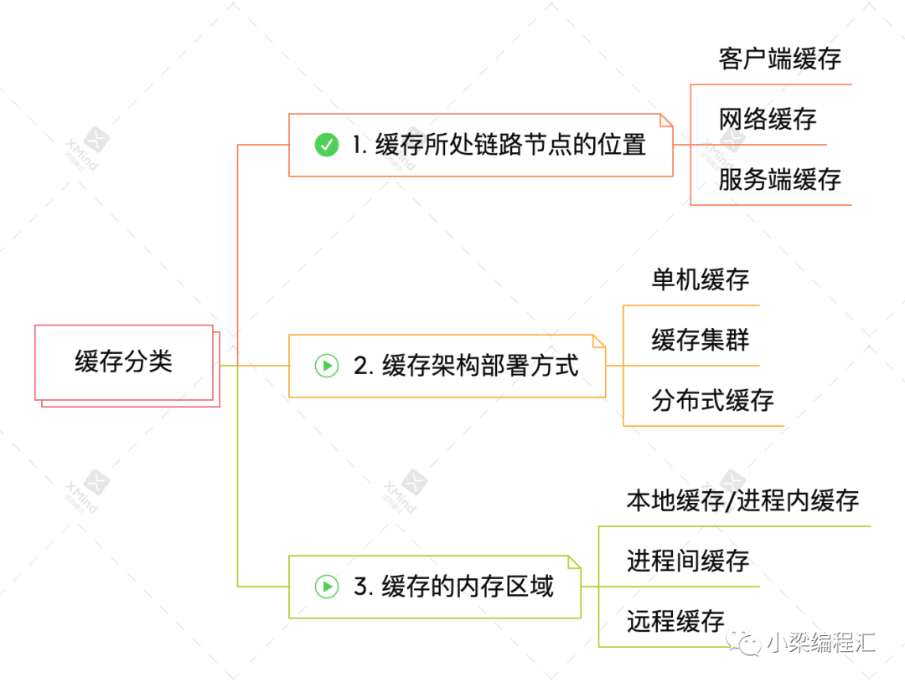
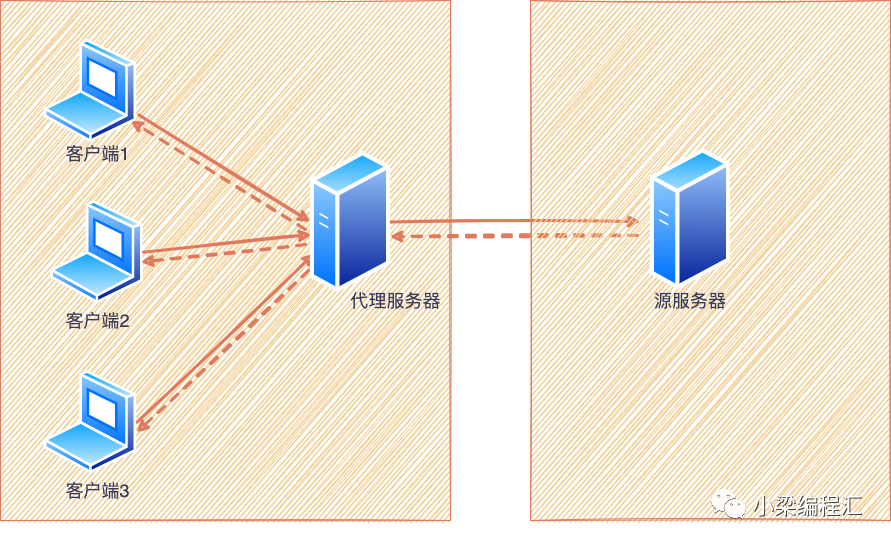
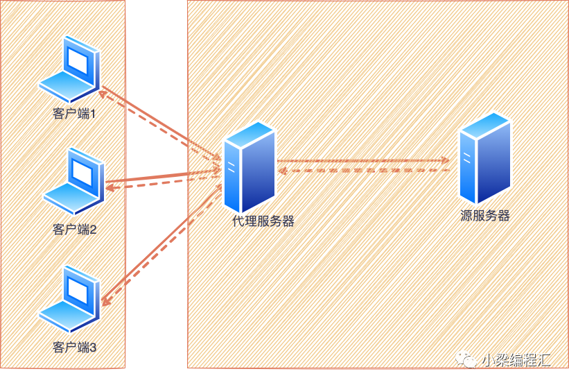
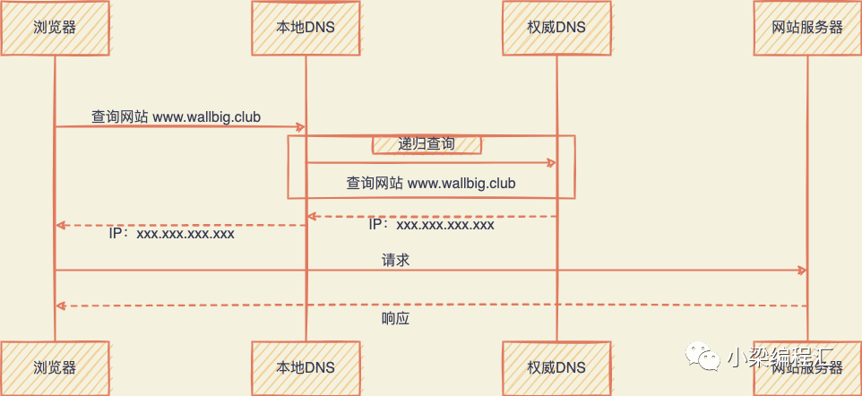
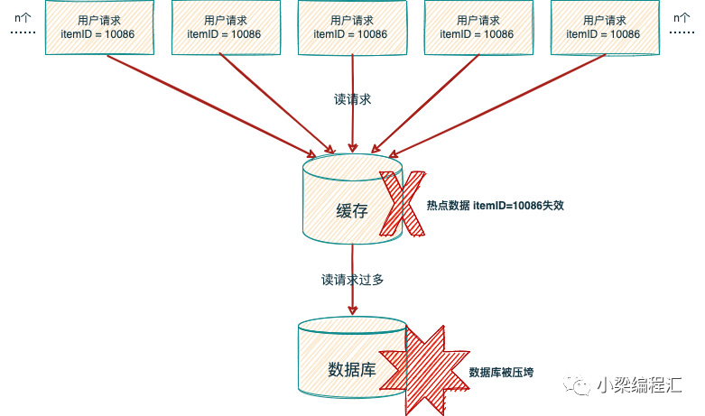
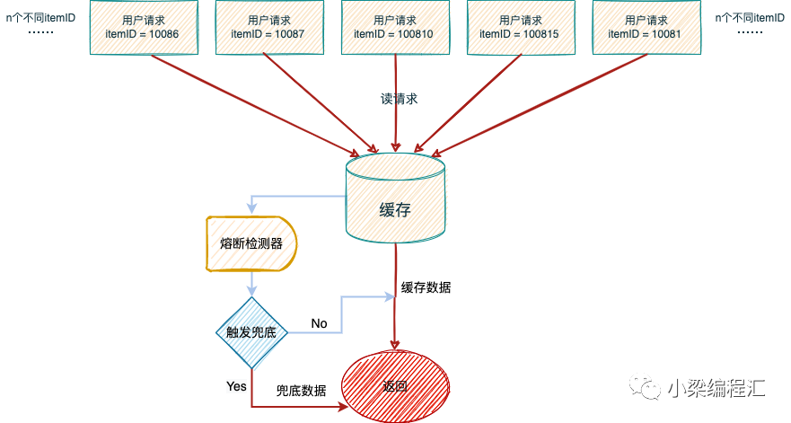
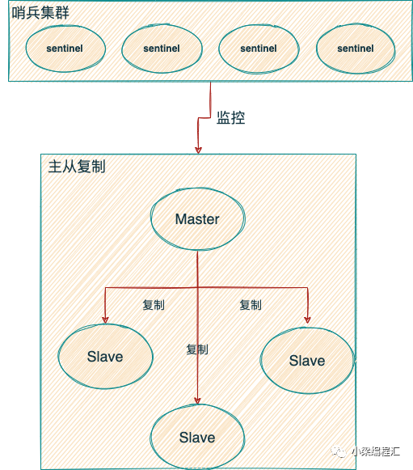
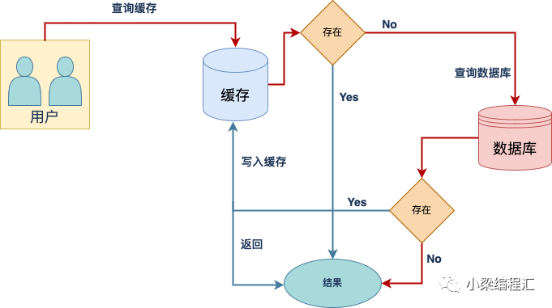
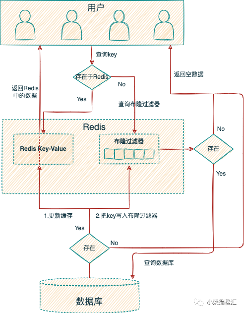

参考文档：

* [你管这破玩意叫缓存？](https://mp.weixin.qq.com/s/5QwQM1mf4UNrIdAHhc-KzQ)

## 1. 缓存是什么

```txt
缓存：一种存储数据的硬件或软件，通过它请求数据能够更快的响应。存储在缓存中的数据可能是先前计算的结果或别处数据的拷贝。
简而言之，缓存就是存储数据副本或计算结果的组件，以便后续能更快地访问
```

在计算中，缓存是一个高速数据存储层，其中存储了数据的子集，且通常是短暂性存储，这样日后再次请求该数据时，直接读缓存会比重新计算结果或读数据存储更快。**通过缓存，你可以高效地重用之前检索或计算的数据。**

缓存位于cpu

## 2. 为什么使用缓存

从定义上可以看出所谓缓存其实是其他数据的副本，使用缓存是为了更快地检索或计算数据。

**1）硬件层面：如CPU中的高速缓存**

在CPU访问数据和指令遵循**计算机系统的局部性原理**：

1. **时间局部性**：CPU 通常使用的许多数据会被多次使用。
2. **空间局部性**：CPU 使用的许多数据通常在物理上接近以前使用的数据。

<font style="color:red">使用高速缓存可以弥补CPU和内存之间的性能差异，减少 CPU 浪费计算时间等待内存数据。</font>

**2）软件层面**

1. 为缓解 CPU 压力而做缓存：比如把方法运行结果存储起来、把原本要实时计算的内容提前算好、把一些公用的数据进行复用，这可以节省 CPU 算力，顺带提升响应性能。
2. 为缓解 I/O 压力而做缓存：比如把原本对网络、磁盘等较慢介质的读写访问变为对内存等较快介质的访问，将原本对单点部件（如数据库）的读写访问变为到可扩缩组件（如缓存中间件）的访问，顺带提升响应性能。

**3）产品层面**

是否可以解决用户的痛点问题决定着用户会不会一开始尝试使用某款产品，是否有极致的用户体验影响用户会不会持续使用某款产品。在业务中使用缓存的目的就是通过**扩大系统吞吐量、减少时延和响应时间来优化用户体验**，适当的性能优化可以**提升体验，增强用户粘性**。

在现有的互联网应用中，**缓存的使用是一种能够提升服务快速响应的关键技术**，也是产品经理无暇顾及的非功能需求，需要在设计技术方案时对业务场景，具有一定的前瞻性评估后，决定在技术架构中是否需要引入缓存解决这种这种非功能需求。

## 3. 什么时候使用缓存（When）

* 读多写少
* 不要求一致性
* 时效要求越低
* 访问频率越高
* 对最终一致性和数据丢失有一定程度的容忍

缓存不是架构设计的必选项，也不是业务开发中的必要功能点，只有在业务出现性能瓶颈，进行优化性能的时候才需要考虑使用缓存来提升系统性能。并非所有的业务场景都适合用缓存，**读多写少、不要求一致性、时效要求越低、访问频率越高、对最终一致性和数据丢失有一定程度的容忍的场景才适合使用缓存**，缓存并不能解决所有的性能问题，倘若滥用缓存会带来额外的维护成本，使得系统架构更复杂更难以维护。

虽然缓存适用于各种各样的案例，但要充分利用缓存，需要进行一定的规划。所以在决定是否缓存一段数据时，请考虑以下问题：

- **使用缓存值是否安全？** 相同的数据在不同的上下文中可能有**不同的一致性要求**。例如电商系统中，在线结账期间，必须知道商品的确切价格，因此不适合使用缓存，但在其他页面上，价格晚几分钟更新不会给用户带来负面影响。
- **对于该数据而言，缓存是否高效？** 某些应用程序会生成不适合缓存的访问模式；例如，扫描频繁变化的大型数据集的键空间。在这种情况下，保持缓存更新可能会抵消缓存带来的所有优势。
- **数据结构是否适合缓存？**例如：以单条数据库记录形式缓存数据通常足以提供显著的性能优势。但有些时候，数据最好以多条记录组合在一起的格式进行缓存。缓存以简单的键值形式存储，因此您可能还需要以多种不同格式缓存数据记录，以便按记录中的不同属性进行访问。

另外把缓存当做存储来使用是一件极其致命的做法，这种错误的认识，将缓存引入系统的那一刻起就意味着已经让系统走上了危险的局面，**只有对缓存的使用边界有深刻的理解，才能尽可能减少引入缓存带来的副作用。**

## 4. 谁会使用缓存（Who）

其实缓存的思想随处可见，日常生活中人们都会有意无意地用到。比如你会把常看的书放到书桌上，这样你可以更快地拿到它们，而受限于桌面空间，不常看的书就要放在空间更大的书柜里了，等到要看的时候再从书柜里拿出来放到书桌上。这里的书桌其实就是一种缓存介质了。

对于程序员来说，缓存更是家常便饭了。有哪些程序员会用到缓存技术呢？

1）硬件开发工程师：比如CPU缓存、GPU缓存和数字信号处理器（DSP）缓存等。

2）软件开发工程师：

- 客户端开发：比如第4章节讲到的页面、浏览器、APP缓存技术都和客户端息息相关。
- 后端开发：比如服务端本地缓存、redis和memcached充当数据库缓存、静态页面缓存等。
- 分布式开发：现在分布式大行其道，分布式缓存必然是分布式开发中绕不开的一环，6.10节的分布式缓存也是我们要重点讲解的。
- 操作系统开发：操作系统内核负责管理磁盘缓存，比较典型的就有主存中的页面缓存技术。

## 5. 哪些地方会使用缓存（Where）



### 1. 客户端缓存

**HTTP 协议的无状态性决定了它必须依靠客户端缓存来解决网络传输效率上的缺陷**。由于每次请求都是独立的，服务端不保存此前请求的状态和资源，所以也不可避免地导致其携带有重复的数据，造成网络性能降低。HTTP 协议对此问题的解决方案便是客户端缓存。

常见的客户端缓存有如下几种：

##### 1) 页面缓存

页面缓存是指将静态页面获取页面中的部分元素缓存到本地，以便下次请求不需要重复资源文件，h5很好的支持的离线缓存的功能，具体实现可通过页面指定manifest文件，当浏览器访问一个带有manifest属性的文件时，会先从应用缓存中获取加载页面的资源文件，并通过检查机制处理缓存更新的问题。

##### 2) APP缓存

APP可以将内容缓存到内存或者本地数据库中，例如在一些开源的图片库中都具备缓存的技术特性，当图片等资源文件从远程服务器获取后会进行缓存，以便下一次不再进行重复请求，并可以减少用户的流量费用。

客户端缓存是前端性能优化的一个重要方向，毕竟客户端是距离“用户”最近的地方，是一个可以充分挖掘优化潜力的地方。

##### 3) 浏览器缓存

浏览器缓存通常会专门开辟内存空间以存储资源副本，当用户后退或者返回上一步操作时可以通过浏览器缓存快速的获取数据，减少页面加载时间和带宽使用。在 HTTP 从 1.0 到 1.1，再到 2.0 版本的每次演进中，逐步形成了现在被称为“状态缓存”、“强制缓存”（许多资料中简称为“强缓存”）和“协商缓存”的 HTTP 缓存机制。在HTTP 1.1中通过引入e-tag标签并结合expire、cache-control两个特性能够很好的支持浏览器缓存。

### 2. 网络缓存

**网络缓存位于客户端以及服务端中间，通过代理的方式解决数据请求的响应，降低数据请求的回源率**。回源率又分为以下两种：

- **回源流量比**：回源流量是代理服务器节点请求源服务器资源时产生流量。回源流量比=回源流量/（回源流量+用户请求访问的流量），比值越低，性能越好。
- **回源请求数比**：指代理服务器节点对于没有缓存、缓存过期（可缓存）和不可缓存的请求占全部请求记录的比例。

网络缓存常见的代理形式分为两种：web代理缓存、边缘缓存。

在介绍网络缓存之前我们先了解下前置知识----**两种服务器代理方式：正向代理、反向代理**。

**正向代理**其实就是：客户端通过代理服务器与源服务器进行非直接连接。客户端可以感知到代理服务器的存在，对源服务器透明（源服务器感知不到客户端的存在），如下图所示



通信时客户端和代理服务器要设置好代理协议，比如Socks协议或者是HTTP协议（可以设置4.1节浏览器缓存中的HTTP Header）。

那正向代理有什么作用呢？

- 提高访问速度：通常代理服务器都设置一个较大的缓冲区，当有外界的信息通过时，同时也将其保存到缓冲区中，当其他用户再访问相同的信息时， 则直接由缓冲区中取出信息，传给用户，以提高访问速度。
- 控制对内部资源的访问：如某大学FTP（前提是该代理地址在该资源的允许访问范围之内）使用教育网内地址段免费代理服务器，就可以用于对教育网开放的各类FTP下载上传，以及各类资料查询共享等服务。
- 过滤、调整内容：例如限制对特定计算机的访问、压缩请求包、改变请求包的语言格式等。
- 隐藏真实IP：通过代理服务器隐藏自己的IP，但更安全的方法是利用特定的工具创建代理链（如：Tor）。
- 突破网站的区域限制：通过代理服务器访问一些被限制的网站。

**反向代理**就是：客户端通过代理服务器与源服务器进行非直接连接。客户端只会得知反向代理的IP地址，而不知道在代理服务器后面的服务器集群的存在。如下图所示



反向代理有什么作用呢？

- 对于静态内容及短时间内有大量访问请求的动态内容提供缓存服务。
- 对客户端隐藏服务器（集群）的IP地址。
- 安全：作为应用层防火墙，为服务器提供基于Web的攻击行为（例如DoS/DDoS）的防护，更容易排查恶意软件等
- 为后端服务器（集群）统一提供加密和SSL加速（如SSL终端代理）。
- 负载均衡：若服务器集群中有机器负荷较高，反向代理通过URL重写，把请求转移到低负荷机器获取与所需相同的资源。**深入了解负载均衡强烈推荐看这篇干货：[老生常谈的负载均衡，你真的懂了吗?](https://mp.weixin.qq.com/s?__biz=MzkxMTMxNDA1MA==&mid=2247483960&idx=1&sn=807c8c93e29914f4fd631f9a6165052e&chksm=c11f5fd5f668d6c308d0a3b13d33412e2e9287c5cea07fa3f5c7090ea61ede4ddfea68d31b95&mpshare=1&scene=21&srcid=0223TlVA7PpLQmSWJW5Fti4d&sharer_sharetime=1645600481119&sharer_shareid=a59397e2b8303f63a1693e139a09e528&version=4.0.0.90428&platform=mac#wechat_redirect)**
- 对一些内容进行压缩，以节约带宽或为带宽不佳的网络提供正常服务。
- 提供HTTP访问认证。

介绍完2种服务器代理形式后，我们来说下两种网络缓存形式。

**1）web代理缓存：**web代理缓存通常是指正向代理，会将资源文件和热点数据放在代理服务器上，当新的请求到来时，如果在代理服务器上能获取数据，则不需要重复请求到应用服务器上。

**2）边缘缓存：**和正向代理一样，反向代理同样可以用于缓存，例如nginx就提供了缓存的功能。进一步，如果这些反向代理服务器能够做到和用户请求来自同一个网络，那么获取资源的速度进一步提升，这类的反向代理服务器可以称之为边缘缓存。常见的边缘缓存就是内容分发网络（Content Delivery Network），简称CDN。可以将图片等静态资源文件放到CDN上。

### CDN

```
如果把某个互联网系统比喻为一家跨国企业，那内容分发网络就是它遍布世界各地的分销机构，如果现在有客户要买一块 CPU，那订机票飞到美国加州英特尔总部肯定是不合适的，到本地电脑城找个装机店铺才是普遍的做法，在此场景中，内容分发网络就相当于电脑城里的本地经销商。
```

那CDN的主要工作过程有哪些呢？主要包括路由解析、内容分发、负载均衡、CDN的利用场景。

**一、路由解析**

一次没有内容分发网络参与的DNS域名解析过程如下：

无论是使用浏览器抑或是在程序代码中访问某个网址域名，比如以`www.wallbig.club.cn`为例，如果没有缓存的话，都会先经过 DNS 服务器的解析翻译，找到域名对应的 IP 地址才能开始通信，这项操作是操作系统自动完成的，一般不需要用户程序的介入。不过，DNS 服务器并不是一次性地将“`www.wallbig.club.cn`”直接解析成 IP 地址，需要经历一个递归的过程。首先 DNS 会将域名还原为“`www.wallbig.club.cn.`”，注意最后多了一个点“`.`”，它是“`.root`”的含义。早期的域名必须带有这个点才能被 DNS 正确解析，如今几乎所有的操作系统、DNS 服务器都可以自动补上结尾的点号，然后开始如下解析步骤：

1. 客户端先检查本地的 DNS 缓存，查看是否存在并且是存活着的该域名的地址记录。DNS 是以存活时间（Time to Live，TTL）来衡量缓存的有效情况的，所以，如果某个域名改变了 IP 地址，DNS 服务器并没有任何机制去通知缓存了该地址的机器去更新或者失效掉缓存，只能依靠 TTL 超期后的重新获取来保证一致性。后续每一级 DNS 查询的过程都会有类似的缓存查询操作。
2. 客户端将地址发送给本机操作系统中配置的本地 DNS（Local DNS），这个本地 DNS 服务器可以由用户手工设置，也可以在 DHCP 分配时或者在拨号时从 PPP 服务器中自动获取到。
3. 本地 DNS 收到查询请求后，会按照“是否有www.wallbig.club.cn的权威服务器”→“是否有wallbig.club.cn的权威服务器”→“是否有club.cn的权威服务器”→“是否有cn的权威服务器”的顺序，依次查询自己的地址记录，如果都没有查询到，就会一直找到最后点号代表的根域名服务器为止。这个步骤里涉及了两个重要名词：

- **权威域名服务器**（Authoritative DNS）：是指负责翻译特定域名的 DNS 服务器，“权威”意味着这个域名应该翻译出怎样的结果是由它来决定的。DNS 翻译域名时无需像查电话本一样刻板地一对一翻译，根据来访机器、网络链路、服务内容等各种信息，可以玩出很多花样，权威 DNS 的也有很多灵活应用，后面也会讲到。
- **根域名服务器**（Root DNS）是指固定的、无需查询的顶级域名（Top-Level Domain）服务器，可以默认为它们已内置在操作系统代码之中。全世界一共有 13 组根域名服务器（注意并不是 13 台，每一组根域名都通过任播的方式建立了一大群镜像，根据维基百科的数据，迄今已经超过 1000 台根域名服务器的镜像了）。13 这个数字是由于 DNS 主要采用 UDP 传输协议（在需要稳定性保证的时候也可以采用 TCP）来进行数据交换，未分片的 UDP 数据包在 IPv4 下最大有效值为 512 字节，最多可以存放 13 组地址记录，由此而来的限制。

1. 现在假设本地 DNS 是全新的，上面不存在任何域名的权威服务器记录，所以当 DNS 查询请求按步骤 3 的顺序一直查到根域名服务器之后，它将会得到“`cn`的权威服务器”的地址记录，然后通过“`cn`的权威服务器”，得到“`club.cn`的权威服务器”的地址记录，以此类推，最后找到能够解释`www.wallbig.club.cn`的权威服务器地址。

2. 通过“`www.wallbig.club.cn`的权威服务器”，查询`www.wallbig.club.cn`的地址记录，地址记录并不一定就是指 IP 地址，在 RFC 规范中有定义的地址记录类型已经多达数十种，比如 IPv4 下的 IP 地址为 A 记录，IPv6 下的 AAAA 记录、主机别名 CNAME 记录，等等。

   下面画个图，方便大家理解这个解析过程：



前面提到过，每种记录类型中还可以包括多条记录，以一个域名下配置多条不同的 A 记录为例，此时权威服务器可以根据自己的策略来进行选择，**典型的应用是智能线路：根据访问者所处的不同地区（比如华北、华南、东北）、不同服务商（比如电信、联通、移动）等因素来确定返回最合适的 A 记录，将访问者路由到最合适的数据中心，达到智能加速的目的。**

那如果有CDN参与的话，路由解析的具体工作过程又是哪样的呢？

1. 架设好“`wallbig.club`”的服务器后，将服务器的 IP 地址在你的 CDN 服务商上注册为“源站”，注册后你会得到一个 CNAME，即本例中的“`wallbig.club.cdn.dnsv1.com.`”。
2. 将得到的 CNAME 在你购买域名的 DNS 服务商上注册为一条 CNAME 记录。
3. 当第一位用户来访你的站点时，将首先发生一次未命中缓存的 DNS 查询，域名服务商解析出 CNAME 后，返回给本地 DNS，至此之后链路解析的主导权就开始由内容分发网络的调度服务接管了。
4. 本地 DNS 查询 CNAME 时，由于能解析该 CNAME 的权威服务器只有 CDN 服务商所架设的权威 DNS，这个 DNS 服务将根据一定的均衡策略和参数，如拓扑结构、容量、时延等，在全国各地能提供服务的 CDN 缓存节点中挑选一个最适合的，将它的 IP 代替源站的 IP 地址，返回给本地 DNS。
5. 浏览器从本地 DNS 拿到 IP 地址，将该 IP 当作源站服务器来进行访问，此时该 IP 的 CDN 节点上可能有，也可能没有缓存过源站的资源，这点将在下面的**“内容分发”**小节讨论。
6. 经过内容分发后的 CDN 节点，就有能力代替源站向用户提供所请求的资源。

为了读者更生动地理解以上步骤，我画个时序图，建议和上面的图对比来看：


DNS 系统多级分流的设计使得 DNS 系统能够经受住全球网络流量不间断的冲击，但也并非全无缺点。典型的问题是响应速度，当极端情况（各级服务器均无缓存）下的域名解析可能导致每个域名都必须递归多次才能查询到结果，显著影响传输的响应速度。

专门有一种被称为“DNS 预取”（DNS Prefetching）的前端优化手段用来避免这类问题：如果网站后续要使用来自于其他域的资源，那就在网页加载时生成一个 link 请求，促使浏览器提前对该域名进行预解释，比如下面代码所示：

```
1<link rel="dns-prefetch" href="//domain.not-wallbig.club">
```

而另一种可能更严重的缺陷是 DNS 的分级查询意味着每一级都有可能受到中间人攻击的威胁，产生被劫持的风险。要攻陷位于递归链条顶层的（比如根域名服务器，cn 权威服务器）服务器和链路是非常困难的，它们都有很专业的安全防护措施。但很多位于递归链底层或者来自本地运营商的 Local DNS 服务器的安全防护则相对松懈，甚至不少地区的运营商自己就会主动进行劫持，专门返回一个错的 IP，通过在这个 IP 上代理用户请求，以便给特定类型的资源（主要是 HTML）注入广告，以此牟利。

为此，最近几年出现了另一种新的 DNS 工作模式：HTTPDNS（也称为 DNS over HTTPS，DoH）。它将原本的 DNS 解析服务开放为一个基于 HTTPS 协议的查询服务，替代基于 UDP 传输协议的 DNS 域名解析，通过程序代替操作系统直接从权威 DNS 或者可靠的 Local DNS 获取解析数据，从而绕过传统 Local DNS。这种做法的好处是完全免去了“中间商赚差价”的环节，不再惧怕底层的域名劫持，能够有效避免 Local DNS 不可靠导致的域名生效缓慢、来源 IP 不准确、产生的智能线路切换错误等问题。

**二、内容分发**

在 DNS 服务器的协助下，无论是对用户还是服务器，内容分发网络都可以是完全透明的，在两者都不知情的情况下，由 CDN 的缓存节点接管了用户向服务器发出的资源请求。后面随之而来的问题是缓存节点中必须有用户想要请求的资源副本，才可能代替源站来响应用户请求。这里面又包括了两个子问题：“如何获取源站资源”和“如何管理（更新）资源”。

CDN 获取源站资源的过程被称为“内容分发”，“内容分发网络”的名字正是由此而来，可见这是 CDN 的核心价值。目前主要有以下两种主流的内容分发方式：

- **主动分发**（Push）：分发由源站主动发起，将内容从源站或者其他资源库推送到用户边缘的各个 CDN 缓存节点上。这个推送的操作没有什么业界标准可循，可以采用任何传输方式（HTTP、FTP、P2P，等等）、任何推送策略（满足特定条件、定时、人工，等等）、任何推送时间，只要与后面说的更新策略相匹配即可。由于主动分发通常需要源站、CDN 服务双方提供程序 API 接口层面的配合，所以它对源站并不是透明的，只对用户一侧单向透明。主动分发一般用于网站要预载大量资源的场景。比如双十一之前一段时间内，淘宝、京东等各个网络商城就会开始把未来活动中所需用到的资源推送到 CDN 缓存节点中，特别常用的资源甚至会直接缓存到你的手机 APP 的存储空间或者浏览器的localStorage上。
- **被动回源**（Pull）：被动回源由用户访问所触发全自动、双向透明的资源缓存过程。当某个资源首次被用户请求的时候，CDN 缓存节点发现自己没有该资源，就会实时从源站中获取，这时资源的响应时间可粗略认为是资源从源站到 CDN 缓存节点的时间，再加上资源从 CDN 发送到用户的时间之和。因此，被动回源的首次访问通常是比较慢的（但由于 CDN 的网络条件一般远高于普通用户，并不一定就会比用户直接访问源站更慢），不适合应用于数据量较大的资源。被动回源的优点是可以做到完全的双向透明，不需要源站在程序上做任何的配合，使用起来非常方便。这种分发方式是小型站点使用 CDN 服务的主流选择，如果不是自建 CDN，而是购买阿里云、腾讯云的 CDN 服务的站点，多数采用的就是这种方式。

对于“CDN 如何管理（更新）资源”这个问题，同样没有统一的标准可言，尽管在 HTTP 协议中，关于缓存的 Header 定义中确实是有对 CDN 这类共享缓存的一些指引性参数，比如“浏览器”小节HTTP header参数Cache-Control的 s-maxage，但是否要遵循，完全取决于 CDN 本身的实现策略。

现在，最常见的做法是超时被动失效与手工主动失效相结合。超时失效是指给予缓存资源一定的生存期，超过了生存期就在下次请求时重新被动回源一次。而手工失效是指 CDN 服务商一般会提供给程序调用来失效缓存的接口，在网站更新时，由持续集成的流水线自动调用该接口来实现缓存更新。

**三、负载均衡**

负载均衡就是以统一的接口对外提供服务，但构建和调度服务集群对用户保持透明。**深入了解负载均衡强烈推荐看这篇干货：[老生常谈的负载均衡，你真的懂了吗?](https://mp.weixin.qq.com/s?__biz=MzkxMTMxNDA1MA==&mid=2247483960&idx=1&sn=807c8c93e29914f4fd631f9a6165052e&chksm=c11f5fd5f668d6c308d0a3b13d33412e2e9287c5cea07fa3f5c7090ea61ede4ddfea68d31b95&mpshare=1&scene=21&srcid=0223TlVA7PpLQmSWJW5Fti4d&sharer_sharetime=1645600481119&sharer_shareid=a59397e2b8303f63a1693e139a09e528&version=4.0.0.90428&platform=mac#wechat_redirect)**

**四、CDN的应用场景**

- 加速静态资源：这是 CDN 最普遍的应用场景。
- 安全防御：CDN 在广义上可以视作网站的堡垒机，源站只对 CDN 提供服务，由 CDN 来对外界其他用户服务，这样恶意攻击者就不容易直接威胁源站。CDN 对某些攻击手段的防御，如对DDoS 攻击的防御尤其有效。但需注意，将安全都寄托在 CDN 上本身是不安全的，一旦源站真实 IP 被泄漏，就会面临很高的风险。
- 协议升级：不少 CDN 提供商都同时对接（代售 CA 的）SSL 证书服务，可以实现源站是 HTTP 协议的，而对外开放的网站是基于 HTTPS 的。同理，可以实现源站到 CDN 是 HTTP/1.x 协议，CDN 提供的外部服务是 HTTP/2 或 HTTP/3 协议、实现源站是基于 IPv4 网络的，CDN 提供的外部服务支持 IPv6 网络，等等。
- 状态缓存：CDN 不仅可以缓存源站的资源，还可以缓存源站的状态，比如源站的 301/302 转向就可以缓存起来让客户端直接跳转、还可以通过 CDN 开启HSTS、可以通过 CDN 进行OCSP 装订加速 SSL 证书访问等。有一些情况下甚至可以配置 CDN 对任意状态码（比如 404）进行一定时间的缓存，以减轻源站压力，但这个操作应当慎重，在网站状态发生改变时去及时刷新缓存。
- 修改资源：CDN 可以在返回资源给用户的时候修改它的任何内容，以实现不同的目的。比如，可以对源站未压缩的资源自动压缩并修改 Content-Encoding，以节省用户的网络带宽消耗、可以对源站未启用客户端缓存的内容加上缓存 Header，自动启用客户端缓存，可以修改CORS的相关 Header，将源站不支持跨域的资源提供跨域能力等。
- 访问控制：CDN 可以实现 IP 黑/白名单功能，根据不同的来访 IP 提供不同的响应结果，根据 IP 的访问流量来实现 QoS 控制、根据 HTTP 的 Referer 来实现防盗链等。
- 注入功能：CDN 可以在不修改源站代码的前提下，为源站注入各种功能。

###  **3. 服务端缓存**

服务端缓存主要是为了**减少CPU/IO、数据库以及下游服务接口的压力**，这也是实际编程中最常用的手段。

除减少数据库的压力外，缓存返回数据的响应速度比数据库要快。另外，尽可能不调用外部接口，因为外部接口无论 WebSocket、WebService，还是 HTTP，其响应速度都是不可控的。如果外部接口响应时间过长，也会影响自身性能。

服务端缓存大致分为以下几种：

- 容器缓存，如Nginx、Tomcat 等。
- 中间件缓存，如MongoDB、Elasticsearch、Redis、ZooKeeper、Kafka 等。
- 页面静态化缓存，如FreeMaker、Thymeleaf 等。
- 文件管理，如FastDFS 等。

## 6. 缓存必知必会

### 6.1 缓存击穿

缓存击穿是一个**失效**的热点Key被并发集中访问，导致请求全部打在数据库上。图如下



**解决方案：**

1. **热点key缓存不失效：**对热点key可以设置**永不过期**。
2. **使用互斥锁或堵塞队列：**这样可以控制数据库的线程访问数，减小数据库的压力，但也会让系统吞吐率有所下降。实现流程如下：

- 阻塞当前 Key 的请求
- 从后端存储恢复数据
- 在Key 对应的Value 还未恢复的过程中， 如果有其他请求继续获取该 Key， 同样阻塞该请求
- 当key 从后端恢复后，依次唤醒该 Key 对应阻塞的请求

用堵塞队列来实现的话可以参考Golang官方库**singleflight**

3. 热点数据由代码来手动管理，缓存击穿是仅针对热点数据被自动失效才引发的问题，对于这类数据，可以直接由开发者通过代码来有计划地完成更新、失效，避免由缓存策略来自动管理。

### 6.2 缓存雪崩

某个时刻热点数据出现大规模的缓存失效，大量的请求全部打到数据库，导致数据库瞬时压力过载从而拒绝服务甚至是宕机。


 

**分析：**造成缓存雪崩的关键在于在同一时间大规模的key失效。诱因可能是

1. 大量热点数据设置了相同或相近的过期时间。
2. 缓存组件不可用，比如redis宕机了。

**解决方案：**

1. **打散缓存失效时间**：主要是通过对key的TTL增加随机数去尽量规避，过期时间则需要根据业务场景去设置。

2. **使用多级缓存**：这里有个github开源库:hybridcache可以借鉴下

3. **兜底逻辑使用熔断机制**。防止过多请求同时打到DB。

   在触发熔断机制后返回预先配置好的兜底数据，减少过多请求压倒DB导致服务不可用。



4. **组件高可用：**

- 对于redis这样的缓存组件，可以搭建Redis集群（集群模式或哨兵模式），提高Redis的可用性，尽量规避单点故障导致缓存雪崩。



- `Redis`基于一个`Master`主节点多`Slave`从节点的模式和`Redis`持久化机制，将一份数据保持在多个实例中，从而实现**增加副本冗余量**，又使用哨兵机制实现主备切换， 在`master`故障时，自动检测，将某个`slave`切换为`master`，最终实现`Redis`高可用
- 提高数据库的容灾能力，可以使用分库分表，读写分离的策略。

### 6.3 缓存穿透

缓存穿透是指用户查询**数据库没有的数据**，缓存中自然也不会有。那先查缓存再查数据相当于进行了两次无效操作。大量的无效请求将给数据库带来极大的访问压力，甚至导致其过载拒绝服务。下图中**红色箭头**标出了每一次用户请求到来都会经过的两次无效查询。



**分析：**造成缓存穿透的原因可能是

1. 空数据查询(黑客攻击)，空数据查询通常指攻击者伪造大量不存在的数据进行访问（比如不存在的商品信息、用户信息）
2. 缓存污染（网络爬虫），缓存污染通常指在遍历数据等情况下冷数据把热数据驱逐出内存，导致**缓存了大量冷数据而热数据被驱逐**。

**解决方案：**

1. 对于空数据查询：

   **1）使用布隆过滤器高效判断key是否存在**，流程如如下



虽然不能完全避免数据穿透的现象，但已经可以将99%的穿透查询给屏蔽在Redis层了，极大的降低了底层数据库的压力，减少了资源浪费（布隆过滤器用bitmap实现）。如果想拥有更高的空间利用率和更小的误判，替代的方案是使用布谷鸟过滤器。

由于布隆过滤器存在“误报”和“漏报”，而且实现也比较复杂，对于空数据查询其实还有一种简单粗暴的策略：

**2）缓存空值**，流程图如下：

.png)

1. 当碰到查询结果为空的key时，放一个空值到缓存中，下次再访问就知道此key是无效的，避免无效查询数据库。但这样花费额外的空间来存储空值。
2. 对于缓存污染：关键点是**能识别出只访问一次或者访问次数很少的数据**。然后使用淘汰策略去删除冷数据。

### 6.4 缓存预热

缓存预热是指系统上线后，提前将热点数据加载到缓存系统。避免在用户请求的时候，先查询数据库，然后再将数据缓存的问题，在线上高并发访问时可以提高数据访问速度和减小数据库压力。

**解决方案：**

1. 对于单点缓存

- 写个缓存刷新页面，上线时手工操作。
- 数据量不大时，可以在程序启动时加载。
- 用定时器定时刷新缓存，或者模拟用户触发。

1. 对于分布式缓存系统，如Redis

- 写程序或脚本往缓存中加载热点数据。
- 使用缓存预热框架。

### 6.5 缓存降级

缓存降级是指当访问量剧增、服务出现问题（如响应时间慢或不响应）或非核心服务影响到核心流程的性能时，即使是有损部分其他服务，仍然需要保证主服务可用。可以将其他次要服务的数据进行缓存降级，从而提升主服务的稳定性。降级的目的是保证核心服务可用，即使是有损的。而且有些服务是无法降级的（如加入购物车、结算）。

以参考日志级别设置预案：

（1）一般：比如有些服务偶尔因为网络抖动或者服务正在上线而超时，可以自动降级；

（2）警告：有些服务在一段时间内成功率有波动（如在95~100%之间），可以自动降级或人工降级， 并发送告警；

（3）错误：比如可用率低于90%，或者数据库连接池被打爆了，或者访问量突然猛增到系统能承受的最大阀值，此时可以根据情况自动降级或者人工降级；

（4）严重错误：比如因为特殊原因数据错误了，此时需要紧急人工降级。

服务降级的目的，是为了防止Redis服务故障，导致数据库跟着一起发生雪崩问题。因此，对于不重要的缓存数据，可以采取服务降级策略，例如一个比较常见的做法就是，Redis出现问题，不去数据库查询，而是直接返回默认值给用户。

### 6.6 缓存更新模式

#### 1. Cache-Aside模式

Cache-Aside是最常用的一种缓存更新模式，其逻辑如下：

- **失效**：应用程序先从cache取数据，没有得到，则从数据库中取数据，成功后，放到缓存中。（图1）
- **命中**：应用程序从cache中取数据，取到后返回。（图1）
- **更新**：先把数据存到数据库中，成功后，再让缓存失效。（图2）

.png)

**注意，Cache-Aside更新操作是先更新数据库，成功后，让缓存失效**。

如果是**先删除缓存，然后再更新数据库**，会有什么影响呢？

我们可以思考一下，假设有两个并发操作，一个是更新操作，另一个是查询操作，更新操作删除缓存后，查询操作没有命中缓存，先把老数据读出来后放到缓存中，然后更新操作更新了数据库。于是，在缓存中的数据还是老的数据，导致缓存中的数据是脏的，而且还一直这样脏下去了。

那么Cache-Aside是否会出现上面提到的问题呢？

我们可以脑补一下，假如有两个并发操作：查询和更新，首先，没有了删除cache数据的操作了，而是先更新了数据库中的数据，此时，缓存依然有效，所以，并发的查询操作拿的是没有更新的数据，但是，更新操作马上让缓存的失效了，后续的查询操作再把数据从数据库中拉出来。就不会出现后续的查询操作一直都在取老的数据的问题。

这是标准的design pattern，包括Facebook的论文《Scaling Memcache at Facebook》也使用了这个策略。为什么不是写完数据库后更新缓存？你可以看一下Quora上的这个问答《Why does Facebook use delete to remove the key-value pair in Memcached instead of updating the Memcached during write request to the backend?》，主要是怕两个并发的写操作导致脏数据。

那么，是不是Cache Aside这个就不会有并发问题了？不是的，比如，一个是读操作，但是没有命中缓存，然后就到数据库中取数据，此时来了一个写操作，写完数据库后，让缓存失效，然后，之前的那个读操作再把老的数据放进去，所以，会造成脏数据。

这种case理论上会出现，不过，实际上出现的概率可能非常低，因为这个条件需要发生在读缓存时缓存失效，而且并发着有一个写操作。而实际上数据库的写操作会比读操作慢得多，而且还要锁表，而读操作必需在写操作前进入数据库操作，而又要晚于写操作更新缓存，所有的这些条件都具备的概率基本并不大。

**所以，这也就是Quora上的那个答案里说的，要么通过2PC或是Paxos协议保证一致性，要么就是拼命的降低并发时脏数据的概率，而Facebook使用了这个降低概率的玩法，因为2PC太慢，而Paxos太复杂。当然，最好还是为缓存设置上过期时间。**

#### 2. Read/Write Through模式

在上面的Cache Aside中，应用代码需要维护两个数据存储，一个是缓存（Cache），一个是数据库（Repository）。所以，应用程序代码比较复杂。而Read/Write Through是把更新数据库（Repository）的操作由缓存服务自己代理，对于应用层来说，就简单很多了。**可以理解为，应用认为后端就是一个单一的存储，而存储自己维护自己的Cache。**

##### 2.1 Read-Through模式

Read-Through策略是当缓存失效时（过期或LRU换出），**缓存服务自己**从数据库加载丢失的数据，填充缓存并将其返回给应用程序。

.png)

Cache-Aside 和 Read-Through策略都是**延迟加载数据**，也就是说，只有在第一次读取时才加载数据。

Read-Though和Cache-Aside的区别：

1. Cache-Aside策略是应用程序负责从数据库中获取数据并填充到缓存。此逻辑在Read-Though中通常由库或独立缓存服务提供支持
2. 与Cache-Aside 不同，Read-Through cache 中的数据模型不能与数据库中的数据模型不同。

##### 2.2 Write-Through模式

Write Through 套路和Read Through相仿，不过是在更新数据时发生。当有数据更新的时候，如果没有命中缓存，直接更新数据库，然后返回。如果命中了缓存，则更新缓存，然后再由Cache自己更新数据库（这是一个同步操作）。

.png)

就其本身而言，Write-Through似乎没有太大作用，而且它会引入额外的写入延迟，因为数据首先写入缓存，然后写入主数据库。它一般和Read-Though配对使用，这样可以获得数据一致性保证而且免于应用程序和缓存失效、更新、集群管理等复杂的问题。

DynamoDB Accelerator (DAX) 是通读/直写缓存的一个很好的例子。它连接 DynamoDB 和你的应用程序。对 DynamoDB 的读取和写入可以通过 DAX 完成。

#### 3. Write Behind Caching模式

Write Behind也叫 Write Back。**其实Linux文件系统的Page Cache算法用的也是这个，所以说底层的东西很多时候是相通。**

Write Behind的思想是：在更新数据时，只更新缓存，不更新数据库，而我们的缓存会异步地批量更新数据库。

Write Behind的优势有：

1. **直接操作内存，数据的I/O操作速度极快。**
2. **更新数据库时可以异步更新，可以合并对同一数据的多次操作，性能强悍**。

事物总有两面性，Write Behind的不足有：

1. **数据不能保证强一直性，而且可能会丢失。**比如在Linux/Unix系统下突然关机会导致数据丢失。
2. **实现逻辑比较复杂。因为需要监视哪些数据发生被更新了，并且在适当的时机持久化这些数据。**比如操作系统的Write Behind会在仅当这个cache需要失效的时候，才会被真正持久起来，比如，内存不够了，或是进程退出了等情况，这又叫lazy write

没有完美的方案，只有合适的方案。我们基本上不可能做出一个没有缺陷的设计，软件设计从来都是取舍Trade-Off。比如算法设计中的时间换空间、空间换时间，有时候软件的强一致性和高性能不可兼得，高可用和高性能会有冲突等。

缓存更新这个章节，我们都没有考虑缓存（Cache）和持久层（Repository）的整体事务的问题。比如，更新Cache成功，更新数据库失败了怎么吗？对于事务、分布式事务这个庞大的话题，大家如果有兴趣的话欢迎私信我，后续我再出几篇文章来分析、总结和归纳下。

### 6.7 缓存数据库更新一致性问题

1. 概念介绍

- 双写一致性:更新数据库后保证redis缓存同步更新

1. 读操作执行过程:

- 命中:读操作先查询cache,命中则直接返回缓存数据
- 失效:读操作先查询cache,cache失效或过期导致未命中,则从数据库中读,写到缓存后返回

1. 写操作执行过程:

   3.1 写操作更新缓存(更新缓存:先更新数据库还是缓存?)

- 先更新数据库后更新缓存

A线程更新数据库后还没更新缓存时,B线程覆盖掉A的数据库值,然后A后写入缓存覆盖掉B的缓存值,导致数据不一致

- 先更新缓存后更新数据库

更新缓存成功,但是更新数据库失败导致数据不一致

3.2 写操作删除缓存(删除缓存:先删还是后删缓存?)

- 先写数据库后删缓存(facebook的缓存)

写入数据库未删缓存之前的缓存命中会是旧值(数据不一致时间很短)

A线程的缓存未命中读取数据库旧值后B线程写入数据库并删除缓存(这里没有删除掉缓存,因为缓存不存在,如果存在A线程不可能缓存未命中),之后A线程才把旧值写入缓存导致数据不一致(概率小:读操作必需在写操作前进入数据库操作，而又要晚于写操作更新缓存,但是读操作时间比写操作时间快很多)

- 先删缓存后写数据库

A线程删掉缓存后未写入数据库之前,B线程读取数据旧值,A线程写入数据后,B更新缓存,导致数据不一致性

解决办法:**延时双删，延时双删策略会在写库前后删除缓存中的数据，并且给缓存数据设置合理的过期时间，从而可以保证最终一致性**。**写流程具体如下**：

1. 先删除缓存，再写数据库
2. 休眠一段时间（比如500ms）
3. 再次删除缓存

.png)

这里为什么会休眠一段时间呢？这里主要是防止：在写请求删除缓存但还未成功写入数据库后，读请求可能将旧值加载到缓存。

**读流程：**先读缓存，当缓存未命中，再从数据库中读取，然后再写入缓存。

延时双删虽然解决了上述讨论的缓存对数据库不一致的问题，但这种策略存在以下问题：

1. 休眠一段时间可能会对性能造成影响
2. 在第二次缓存删除失败后，会导致数据不一致，需要业务方实现重试机制。

**休眠时间需要业务方设置(难点在时间怎么设置),并且要大于一次读操作时间,才能在旧值加载到就缓存之后二次顺利删掉缓存。**

### 6.8 缓存过期

缓存过期是个很复杂的问题。没有解决这一问题的“灵丹妙药”，但有几个简单的策略可供参考：

- **始终对所有缓存键设置生存时间 (TTL)**，但Write-Through缓存更新策略(6.6节中有讲到)除外。可以将生存时间设置成很长的时间，例如数小时，甚至数天。这种方法能够捕获应用程序错误，例如在更新底层数据库时，忘记更新或删除给定的缓存键。最终，缓存键会自动过期并刷新。
- **对于频繁更改的数据，只需设置较短的 TTL (几秒钟) 即可**。例如评论、排行榜、活动流等，不要添加Write-Through缓存或复杂的过期逻辑。如果某条数据库查询在生产环境中被大量访问，只需改动几行代码就能为此查询添加 TTL 为 5 秒的缓存键。在你评估更优雅的解决方案时让你的应用程序保持正常运行。
- Ruby on Rails 团队研究出了一种更新的模式 - 俄罗斯套娃缓存。在这种模式下，嵌套记录通过其自有缓存键进行管理，顶层资源就是这些缓存键的集合。假设您有一个包含用户、文章和评论的新闻网页。在这种方法中，他们中的每个都是自己的缓存键，页面则分别查询每个键。
- **若不确定缓存键是否会在数据库更新时受到影响，只需删除此缓存键**。如果你使用的是延迟更新策略(Cache-Aside、Write-Through)会在需要时刷新此键。

有关缓存过期和俄罗斯套娃缓存的详细介绍，请参阅 Basecamp Signal vs Noise 博客文章“俄罗斯套娃”缓存的性能影响。

还可以使用另一种模式以在下游服务不可用时一定程度提高服务的弹性，也就是使用两个 TTL：一个软 TTL 和一个硬 TTL。客户端将尝试根据软 TTL 刷新缓存项，但如果下游服务不可用或因其他原因未响应请求，则将继续使用现有的缓存数据，直至达到硬 TTL

### 6.9 缓存淘汰

缓存回收策略可以分为：

- **基于时间**：当某缓存超过生存时间时，则进行缓存回收。或者当某缓存最后被访问后超过某时间仍然没有被访问，则进行缓存回收。
- **基于空间**：当缓存超过某大小时，则进行缓存回收。
- **基于容量**：当缓存超过某存储条数时，则进行缓存回收。

缓存淘汰算法有：

- **FIFO**（First In First Out）：优先淘汰最早进入被缓存的数据。FIFO 实现十分简单，但一般来说它并不是优秀的淘汰策略，越是频繁被用到的数据，往往会越早被存入缓存之中。如果采用这种淘汰策略，很可能会大幅降低缓存的命中率。
- **LRU**（Least Recent Used）：优先淘汰最久未被使用访问过的数据。LRU 通常会采用 HashMap加双端链表的双重结构来实现（如 LinkedHashMap），以 HashMap 来提供访问接口，保证常量时间复杂度的读取性能，以 LinkedList 的链表元素顺序来表示数据的时间顺序，每次缓存命中时把返回对象调整到 LinkedList 开头，每次缓存淘汰时从链表末端开始清理数据。对大多数的缓存场景来说，LRU 都明显要比 FIFO 策略合理，**尤其适合用来处理短时间内频繁访问的热点对象**。但相反，它的问题是如果一些热点数据在系统中经常被频繁访问，但最近一段时间因为某种原因未被访问过，此时这些热点数据依然要面临淘汰的命运，LRU 依然可能错误淘汰价值更高的数据。
- **LFU**（Least Frequently Used）：优先淘汰最不经常使用的数据。LFU 会给每个数据添加一个访问计数器，每访问一次就加 1，需要淘汰时就清理计数器数值最小的那批数据。LFU 可以解决上面 LRU 中热点数据间隔一段时间不访问就被淘汰的问题，但同时它又引入了两个新的问题，首先是需要对每个缓存的数据专门去维护一个计数器，每次访问都要更新，多线程并发更新要加锁就会带来高昂的开销；另一个问题是不便于处理随时间变化的热度变化，譬如某个曾经频繁访问的数据现在不需要了，它也很难自动被清理出缓存。

缓存淘汰策略直接影响缓存的命中率，没有一种策略是完美的、能够满足全部系统所需的。不过，随着淘汰算法的发展，近年来的确出现了许多相对性能要更好的，也更为复杂的新算法。以 LFU 分支为例，针对它存在的两个问题，近年来提出的 TinyLFU 和 W-TinyLFU 算法就往往会有更好的效果。

- **TinyLFU**（Tiny Least Frequently Used）：TinyLFU 是 LFU 的改进版本。为了缓解 LFU 每次访问都要修改计数器所带来的性能负担，TinyLFU 会首先采用 Sketch 对访问数据进行分析，所谓 Sketch 是统计学上的概念，指用少量的样本数据来估计全体数据的特征，这种做法显然牺牲了一定程度的准确性，但是只要样本数据与全体数据具有相同的概率分布，Sketch 得出的结论仍不失为一种高效与准确之间权衡的有效结论。借助Count–Min Sketch算法（可视为布隆过滤器的一种等价变种结构），TinyLFU 可以用相对小得多的记录频率和空间来近似地找出缓存中的低价值数据。为了解决 LFU 不便于处理随时间变化的热度变化问题，TinyLFU 采用了基于“滑动时间窗”的热度衰减算法，简单理解就是每隔一段时间，便会把计数器的数值减半，以此解决“旧热点”数据难以清除的问题。
- **W-TinyLFU**（Windows-TinyLFU）：W-TinyLFU 又是 TinyLFU 的改进版本。TinyLFU 在实现减少计数器维护频率的同时，也带来了无法很好地应对稀疏突发访问的问题，所谓稀疏突发访问是指有一些绝对频率较小，但突发访问频率很高的数据，譬如某些运维性质的任务，也许一天、一周只会在特定时间运行一次，其余时间都不会用到，此时 TinyLFU 就很难让这类元素通过 Sketch 的过滤，因为它们无法在运行期间积累到足够高的频率。应对短时间的突发访问是 LRU 的强项，W-TinyLFU 就结合了 LRU 和 LFU 两者的优点，从整体上看是它是 LFU 策略，从局部实现上看又是 LRU 策略。具体做法是将新记录暂时放入一个名为 Window Cache 的前端 LRU 缓存里面，让这些对象可以在 Window Cache 中累积热度，如果能通过 TinyLFU 的过滤器，再进入名为 Main Cache 的主缓存中存储，主缓存根据数据的访问频繁程度分为不同的段（LFU 策略，实际上 W-TinyLFU 只分了两段），但单独某一段局部来看又是基于 LRU 策略去实现的（称为 Segmented LRU）。每当前一段缓存满了之后，会将低价值数据淘汰到后一段中去存储，直至最后一段也满了之后，该数据就彻底清理出缓存。

另外还有两种高级淘汰策略ARC（Adaptive Replacement Cache）、LIRS（Low Inter-Reference Recency Set）,大家有兴趣可以再深入阅读，对其他缓存淘汰策略感兴趣的读者也可以参考维基百科中对Cache Replacement Policies的介绍。

### 6.10 分布式缓存

相比起缓存数据在进程内存中读写的速度，一旦涉及网络访问，由网络传输、数据复制、序列化和反序列化等操作所导致的延迟要比内存访问高得多，所以对分布式缓存来说，处理与网络有相关的操作是对吞吐量影响更大的因素，往往也是比淘汰策略、扩展功能更重要的关注点，这决定了尽管也有 Ehcache、Infinispan 这类能同时支持分布式部署和进程内嵌部署的缓存方案，但通常进程内缓存和分布式缓存选型时会有完全不同的候选对象及考察点。我们决定使用哪种分布式缓存前，首先必须确认自己需求是什么？

- 从访问的角度来说，如果是频繁更新但甚少读取的数据，通常是不会有人把它拿去做缓存的，因为这样做没有收益。对于甚少更新但频繁读取的数据，理论上更适合做复制式缓存；对于更新和读取都较为频繁的数据，理论上就更适合做集中式缓存。笔者简要介绍这两种分布式缓存形式的差别与代表性产品：
- **复制式缓存**：复制式缓存可以看作是“能够支持分布式的进程内缓存”，它的工作原理与 Session 复制类似。缓存中所有数据在分布式集群的每个节点里面都存在有一份副本，读取数据时无须网络访问，直接从当前节点的进程内存中返回，理论上可以做到与进程内缓存一样高的读取性能；当数据发生变化时，就必须遵循复制协议，将变更同步到集群的每个节点中，复制性能随着节点的增加呈现平方级下降，变更数据的代价十分高昂。
  复制式缓存的代表是JBossCache，这是 JBoss 针对企业级集群设计的缓存方案，支持 JTA 事务，依靠 JGroup 进行集群节点间数据同步。以 JBossCache 为典型的复制式缓存曾有一段短暂的兴盛期，但今天基本上已经很难再见到使用这种缓存形式的大型信息系统了，JBossCache 被淘汰的主要原因是写入性能实在差到不堪入目的程度，它在小规模集群中同步数据尚算差强人意，但在大规模集群下，很容易就因网络同步的速度跟不上写入速度，进而导致在内存中累计大量待重发对象，最终引发 OutOfMemory 崩溃。如果对 JBossCache 没有足够了解的话，稍有不慎就要被埋进坑里。
  为了缓解复制式同步的写入效率问题，JBossCache 的继任者Infinispan提供了另一种分布式同步模式（这种同步模式的名字就叫做“分布式”），允许用户配置数据需要复制的副本数量，譬如集群中有八个节点，可以要求每个数据只保存四份副本，此时，缓存的总容量相当于是传统复制模式的一倍，如果要访问的数据在本地缓存中没有存储，Infinispan 完全有能力感知网络的拓扑结构，知道应该到哪些节点中寻找数据。
- **集中式缓存**：集中式缓存是目前分布式缓存的主流形式，集中式缓存的读、写都需要网络访问，其好处是不会随着集群节点数量的增加而产生额外的负担，其坏处自然是读、写都不再可能达到进程内缓存那样的高性能。
  集中式缓存还有一个必须提到的关键特点，它与使用缓存的应用分处在独立的进程空间中，其好处是它能够为异构语言提供服务，譬如用 C 语言编写的Memcached完全可以毫无障碍地为 Java 语言编写的应用提供缓存服务；但其坏处是如果要缓存对象等复杂类型的话，基本上就只能靠序列化来支撑具体语言的类型系统（支持 Hash 类型的缓存，可以部分模拟对象类型），不仅有序列化的成本，还很容易导致传输成本也显著增加。举个例子，假设某个有 100 个字段的大对象变更了其中 1 个字段的值，通常缓存也不得不把整个对象所有内容重新序列化传输出去才能实现更新，因此，一般集中式缓存更提倡直接缓存原始数据类型而不是对象。相比之下，JBossCache 通过它的字节码自审（Introspection）功能和树状存储结构（TreeCache），做到了自动跟踪、处理对象的部分变动，用户修改了对象中哪些字段的数据，缓存就只会同步对象中真正变更那部分数据。
  如今Redis广为流行，基本上已经打败了 Memcached 及其他集中式缓存框架，成为集中式缓存的首选，甚至可以说成为了分布式缓存的实质上的首选，几乎到了不必管读取、写入哪种操作更频繁，都可以无脑上 Redis 的程度。也因如此，之前说到哪些数据适合用复制式缓存、哪些数据适合集中式缓存时，笔者都在开头加了个拗口的“理论上”。尽管 Redis 最初设计的本意是 NoSQL 数据库而不是专门用来做缓存的，可今天它确实已经成为许多分布式系统中无可或缺的基础设施，广泛用作缓存的实现方案。
- 从数据一致性角度说，缓存本身也有集群部署的需求，理论上你应该认真考虑一下是否能接受不同节点取到的缓存数据有可能存在差异。譬如刚刚放入缓存中的数据，另外一个节点马上访问发现未能读到；刚刚更新缓存中的数据，另外一个节点访问在短时间内读取到的仍是旧的数据，等等。根据分布式缓存集群是否能保证数据一致性，可以将它分为 AP 和 CP 两种类型。此处又一次出现了“理论上”，是因为我们实际开发中通常不太会把追求强一致性的数据使用缓存来处理，可以这样做，但是没必要（可类比 MESI 等缓存一致性协议）。譬如，Redis 集群就是典型的 AP 式，有着高性能高可用等特点，却并不保证强一致性。而能够保证强一致性的 ZooKeeper、Doozerd、Etcd 等分布式协调框架，通常不会有人将它们当为“缓存框架”来使用，这些分布式协调框架的吞吐量相对 Redis 来说是非常有限的。不过 ZooKeeper、Doozerd、Etcd 倒是常与 Redis 和其他分布式缓存搭配工作，用来实现其中的通知、协调、队列、分布式锁等功能。

分布式缓存与进程内缓存各有所长，也有各有局限，它们是互补而非竞争的关系，如有需要，完全可以同时把进程内缓存和分布式缓存互相搭配，构成透明多级缓存（Transparent Multilevel Cache，TMC），如图 4-14 所示。先不考虑“透明”的话，多级缓存是很好理解的，使用进程内缓存做一级缓存，分布式缓存做二级缓存，如果能在一级缓存中查询到结果就直接返回，否则便到二级缓存中去查询，再将二级缓存中的结果回填到一级缓存，以后再访问该数据就没有网络请求了。如果二级缓存也查询不到，就发起对最终数据源的查询，将结果回填到一、二级缓存中去。

尽管多级缓存结合了进程内缓存和分布式缓存的优点，但它的代码侵入性较大，需要由开发者承担多次查询、多次回填的工作，也不便于管理，如超时、刷新等策略都要设置多遍，数据更新更是麻烦，很容易会出现各个节点的一级缓存、以及二级缓存里数据互相不一致的问题。必须“透明”地解决以上问题，多级缓存才具有实用的价值。一种常见的设计原则是变更以分布式缓存中的数据为准，访问以进程内缓存的数据优先。大致做法是当数据发生变动时，在集群内发送推送通知（简单点的话可采用 Redis 的 PUB/SUB，求严谨的话引入 ZooKeeper 或 Etcd 来处理），让各个节点的一级缓存自动失效掉相应数据。当访问缓存时，提供统一封装好的一、二级缓存联合查询接口，接口外部是只查询一次，接口内部自动实现优先查询一级缓存，未获取到数据再自动查询二级缓存的逻辑。

**附加解释下CAP定理：**CAP是分布式计算领域所公认的著名定理。其描述了一个分布式的系统中，涉及共享数据问题时，以下三个特性最多只能同时满足其中两个：

- **一致性**（**C**onsistency）：代表数据在任何时刻、任何分布式节点中所看到的都是符合预期的。
- **可用性**（**A**vailability）：代表系统不间断地提供服务的能力，理解可用性要先理解与其密切相关两个指标：可靠性（Reliability）和可维护性（Serviceability）。可靠性使用平均无故障时间（Mean Time Between Failure，MTBF）来度量；可维护性使用平均可修复时间（Mean Time To Repair，MTTR）来度量。可用性衡量系统可以正常使用的时间与总时间之比，其表征为：A=MTBF/（MTBF+MTTR），即可用性是由可靠性和可维护性计算得出的比例值，譬如 99.9999%可用，即代表平均年故障修复时间为 32 秒。
- **分区容忍性**（**P**artition Tolerance）：代表分布式环境中部分节点因网络原因而彼此失联后，即与其他节点形成“网络分区”时，系统仍能正确地提供服务的能力。

## 7. 如何设计缓存（How）

在进行缓存结构设计的时候，需要考虑的点有很多：

**1）对缓存带来的价值持怀疑态度：**从成本、延迟和可用性等方面来评估引入缓存的合理性，并仔细评估引入缓存带来的额外风险和收益。

**2）业务流量量级评估：**对于低并发低流量的应用而言，引入缓存并不会带来性能的显著提升，反而会带来应用的复杂度以及极高的运维成本。也不是任何数据都需要使用缓存，比如图片视频等文件使用分布式文件系统更合适而不是缓存。因此，在引入缓存前，需要对当前业务的流量进行评估，在**高并发大流量的业务场景中引入缓存相对而言收益会更高**；

**3）缓存组件选型：**缓存应用有很多如Redis、Memcached以及tair等等，针对每一种分布式缓存应用的优缺点以及适用范围、内存效率、运维成本甚至团队开发人员的知识结构都需要了解，才能做好技术选型；

**4）缓存相关指标评估：**在引入缓存前，需要着重评估value大小、峰值QPS、缓存内存空间、缓存命中率、过期时间、过期淘汰策略、读写更新策略、key值分布路由策略、数据一致性方案等多个因素，要做到心中有数；

**5）缓存高可用架构：**分布式缓存要高可用，比如缓存的集群设计、主从同步方案的设计等等，只有缓存足够可靠，才能服务于业务系统，为业务带来价值；

**6）完善的监控平台：**当缓存投入生产环境后，需要有一套监控系统能够显式的观测缓存系统的运行情况，才能更早的发现问题，同时对于预估不足的非预期热点数据，也需要热点发现系统去解决非预期的热点数据缓存问题。

**7）缓存最近访问原则：**将缓存数据放在离用户最近的地方，无疑会极大的提升响应的速度，这也是多级缓存设计的核心思想。

**8）考虑缓存数据的安全问题**。包括加密、与外部缓存队列通信时的传输安全性以及缓存投毒攻击和侧信道攻击的影响。

## 引用

coolshell:缓存更新的套路
亚马逊缓存最佳实践
wikipedia:<Cache (computing)>
凤凰架构:透明多级分流系统
FaceBook论文:《Scaling Memcache at Facebook》
Golang官方库:singleflight
Github开源库:hybridcache
wikipedia:<Adaptive Replacement Cache>
wikipedia:<Low Inter-Reference Recency Set>
wikipedia:<Cache Replacement Policies>