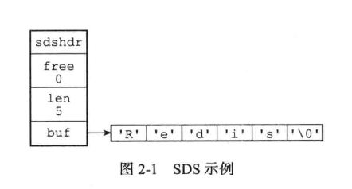

# 源码

## HashMap

| JDK版本 | 实现方式             | 节点数>=8     | 节点数<=6     |
| ------- | -------------------- | ------------- | ------------- |
| 1.8以前 | 数组+单向链表        | 数组+单向链表 | 数组+单向链表 |
| 1.8以后 | 数组+单向链表+红黑树 | 数组+红黑树   | 数组+单向链表 |

### 重要变量

| 变量名              | 变量解释         | 值    |
| ------------------- | ---------------- | ----- |
| TREEIFY_THRESHOLD   | 变为红黑树临界值 | 8     |
| UNTREEIFY_THRESHOLD | 变为链表临界值   | 6     |
| MIN_TREEIFY_CAPACI  | 红黑树最小长度   | 64    |
| MAXIMUM_CAPACITY    | HashMap最大容量  | 1<<30 |
| DEFAULT_LOAD_FACTOR | 默认负载因子，   | 0.75f |
|                     |                  |       |

### 构造函数四个

* 无参构造，使用默认参数

* ```
  HashMap(int initialCapacity, float loadFactor)
  ```

* ```
   HashMap(int initialCapacity)
  ```

* ```
  HashMap(Map<? extends K, ? extends V> m)
  ```

* 实际上链表转为红黑树的阈值取决于 TREEIFY_THRESHOLD  * DEFAULT_LOAD_FACTOR

### 方法

1. hash()得到hash值

   ```java
   //null默人是0 
   static final int hash(Object key) {
           int h;
           return (key == null) ? 0 : (h = key.hashCode()) ^ (h >>> 16);
       //返回键的hashcode高16位与低16位的异或值
       //主要从性能、哈希碰撞角度考虑，减少系统开销，不会造成因为高位没有参与下标计算从而引起的碰撞。
       }
   ```

2. 插入方法 put

   ```java
   public V put(K key, V value) {
       return putVal(hash(key), key, value, false, true);
   }
   //
   final V putVal(int hash, K key, V value, boolean onlyIfAbsent,
                  boolean evict) {
       Node<K,V>[] tab; Node<K,V> p; int n, i;
       //
       if ((tab = table) == null || (n = tab.length) == 0)
           n = (tab = resize()).length;
       if ((p = tab[i = (n - 1) & hash]) == null)
           tab[i] = newNode(hash, key, value, null);
       else {
           Node<K,V> e; K k;
           if (p.hash == hash &&
               ((k = p.key) == key || (key != null && key.equals(k))))
               e = p;
           else if (p instanceof TreeNode)
               e = ((TreeNode<K,V>)p).putTreeVal(this, tab, hash, key, value);
           else {
               for (int binCount = 0; ; ++binCount) {
                   if ((e = p.next) == null) {
                       p.next = newNode(hash, key, value, null);
                       if (binCount >= TREEIFY_THRESHOLD - 1) // -1 for 1st
                           treeifyBin(tab, hash);
                       break;
                   }
                   if (e.hash == hash &&
                       ((k = e.key) == key || (key != null && key.equals(k))))
                       break;
                   p = e;
               }
           }
           if (e != null) { // existing mapping for key
               V oldValue = e.value;
               if (!onlyIfAbsent || oldValue == null)
                   e.value = value;
               afterNodeAccess(e);
               return oldValue;
           }
       }
       ++modCount;
       if (++size > threshold)
           resize();
       afterNodeInsertion(evict);
       return null;
   }
   
   ```

   * 当桶数组 table 为空时，通过扩容的方式初始化 table
   * 计算key在tab数组的索引`i = (n - 1) & hash]`,n为数组长度。（n-1）&hash等价于hash%n
   * 数组中对应位置结点不存在则生成新节点，并放入数组
   * 否则，生成新节点
   * 查找要插入的键值对是否已经存在，存在的话根据条件判断是否用新值替换旧值
   * 如果不存在，则将键值对链入链表中，并根据链表长度决定是否将链表转为红黑树
   * 判断键值对数量是否大于阈值，大于的话则进行扩容操作

3. **查找方法** get

   * 得到key的hash值
   * 定位key对应的数组索引
   * 判断数组对应索引的第一个结点是否满足条件，是则返回结点
   * 如果first是树节点，使用红黑树查找方法，返回结点
   * 否则在链表中查找对应结点 
   * 从结点中取出value返回

### 扩容

当频繁发生碰撞时，说明数组长度（桶数量太少），先考虑调用resize()方法进行扩容


* 

# 设计模式

## 常用设计模式

单例、工厂、策略、观察者


# Redis

## 基本数据结构底层、使用场景

### String



简单动态字符串

* 常数复杂度获取字符串长度
* 杜绝缓存区溢出 修改之前判断长度
* 减少修改字符串长度时带来的内存重分配次数
* 二进制安全
* 兼容部分C语言字符串函数

### ZSet

##### 一、使用ziplist。

1. 前提：保存元素数量小于128，并且每个元素长度小于64字节
    （这两个参数可以通过zset-max-ziplist-entries 选项和 zset-max-ziplist-value 进行修改）
2. ziplist原理：
    压缩列表（ziplist）是Redis为了节省内存而开发的，是由一系列特殊编码的**连续内存块组成的顺序型数据结构**，一个压缩列表可以包含任意多个节点（entry），每个节点可以保存一个字节数组或者一个整数值。


作者：AnyL8023
链接：https://www.jianshu.com/p/360627bd04e5
来源：简书
著作权归作者所有。商业转载请联系作者获得授权，非商业转载请注明出处。

## 红黑树与跳表

##  [redis](https://www.nowcoder.com/jump/super-jump/word?word=redis)为什么可以承载那么高的并发量

Redis 对于 I/O 多路复用模块的设计非常简洁，通过宏保证了 I/O 多路复用模块在不同平台上都有着优异的性能，将不同的 I/O 多路复用函数封装成相同的 API 提供给上层使用。

整个模块使 Redis 能以单进程运行的同时服务成千上万个文件描述符，避免了由于多进程应用的引入导致代码实现复杂度的提升，减少了出错的可能性。


作者：IT架构师luke
链接：https://zhuanlan.zhihu.com/p/343253559
来源：知乎
著作权归作者所有。商业转载请联系作者获得授权，非商业转载请注明出处。

## 多路复用比阻塞的区别在哪里

* [彻底理解 IO 多路复用实现机制](https://juejin.cn/post/6882984260672847879)

### 什么是IO多路复用？

- IO 多路复用是一种同步IO模型，实现一个线程可以监视多个文件句柄；
- 一旦某个文件句柄就绪，就能够通知应用程序进行相应的读写操作；
- 没有文件句柄就绪就会阻塞应用程序，交出CPU。

> 多路是指网络连接，复用指的是同一个线程

|                      | **select**                                         | **poll**                                         | **epoll**                                                    |
| -------------------- | -------------------------------------------------- | ------------------------------------------------ | ------------------------------------------------------------ |
| 操作方式             | 遍历                                               | 遍历                                             | 回调                                                         |
| 数据结构             | bitmap                                             | 数组                                             | 红黑树                                                       |
| 最大连接数           | 1024（x86）或 2048（x64）                          | 无上限                                           | 无上限                                                       |
| 最大支持文件描述符数 | 一般有最大值限制                                   | 65535                                            | 65535                                                        |
| fd拷贝               | 每次调用select，都需要把fd集合从用户态拷贝到内核态 | 每次调用poll，都需要把fd集合从用户态拷贝到内核态 | fd首次调用epoll_ctl拷贝，每次调用epoll_wait不拷贝            |
| 工作模式             | LT                                                 | LT                                               | 支持ET高效模式                                               |
| 工作效率             | 每次调用都进行线性遍历，时间复杂度为O(n)           | 每次调用都进行线性遍历，时间复杂度为O(n)         | 事件通知方式，每当fd就绪，系统注册的回调函数就会被调用，将就绪fd放到readyList里面，时间复杂度O(1) |
